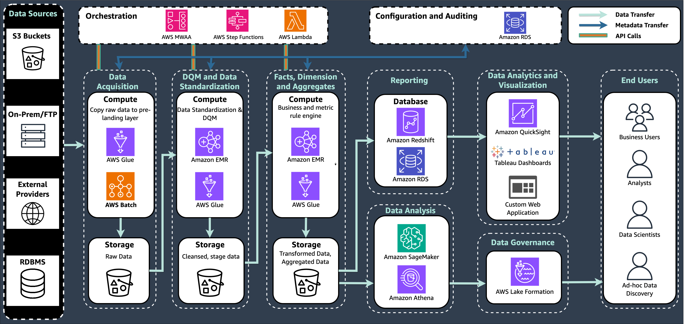

# LS-S04 Commercial and medical

affairs

Medical affairs and commercial teams serve distinct yet complementary roles in life
sciences companies. The commercial team drives success through sales, marketing, and business
development. Medical affairs maintains scientific integrity through clinical support,
regulatory adherence, and scientific communications. Medical affairs also serves as a critical
bridge between clinical development and commercialization, maintaining scientific integrity
and regulatory adherence in commercial activities. By sharing their perspectives and
knowledge, these teams can develop a more nuanced view of the landscape, enabling them to make
informed decisions about product development, marketing strategies, and customer engagement.

## Use cases

- **LS-S04-UC01 Real world evidence collection and
  management:** Real world evidence (RWE) has become a critical tool for the
  life science industry to navigate the changing healthcare landscape and address the
  increasing scrutiny on drug pricing and reimbursement. By using diverse data sources
  such as electronic health records, insurance claims, wearable devices, and social media,
  RWE provides a more comprehensive view of a drug's performance in real-world settings,
  beyond the controlled environment of clinical trials. This approach not only
  demonstrates a drug's effectiveness and safety but also supports pricing strategies and
  negotiations with payers, potentially leading to better formulary positioning and
  optimal reimbursement rates in an increasingly value-based healthcare system.
- **LS-S04-UC02 Adverse event detection and reporting:** Life
  sciences companies have a responsibility to monitor adverse events during clinical
  trials and post-market approval, as part of their regulatory obligations around
  pharmacovigilance. These companies receive unstructured adverse event reports in the
  form of free text and notes during both clinical trials and post-market surveillance.
  This manual processing approach is resource-intensive and costly. By implementing
  automation solutions, companies aim to streamline the intake and analysis of adverse
  event information, significantly reduce human intervention, maintain regulatory
  adherence, and lower operational costs while improving the accuracy of safety reporting.
- **LS-S04-UC03 Omnichannel personalized content assembly and campaign
  optimization:** Traditional, uniform marketing struggles to effectively reach
  and engage modern HCPs and patients. Personalization is no longer optional but
  necessary. The omnichannel approach represents a unified approach to stakeholder
  communication that combines multiple channels to deliver customized content effectively.
  The approach understands healthcare professional preferences, enabling personalized
  content delivery through a centralized repository of product and clinical information.
  From the medical affairs perspective, it enables efficient distribution of scientific
  content and management of key opinion leader relationships, while supporting medical
  science liaisons in their real-time interactions with healthcare professionals. By
  fostering collaboration between commercial and medical teams, it improves scientific
  accuracy in customer-facing materials while using medical insights to inform commercial
  strategies. This framework assists to identify unmet medical needs, treatment patterns,
  and emerging scientific questions, continuously refining engagement strategies. This
  integrated approach streamlines communication, enhances engagement effectiveness, and
  provides consistent messaging across touchpoints while maintaining adherence to industry
  regulations.
- **LS-S04-UC04 Regulatory adherence:** Organizations must
  maintain robust systems for material review, medical information dissemination, and
  field activities, while setting clear boundaries between medical and commercial
  functions. Success requires integrated approaches to risk management, including
  monitoring programs, issue detection, and corrective action plans, supported by
  appropriate technology solutions and documentation systems. The framework must also
  adapt to emerging challenges in digital health, social media, and virtual engagement
  models. Essential elements include clear policies and procedures, regular training,
  strong documentation practices, and effective monitoring systems, each of which
  contributes to a culture of compliance-alignment. This landscape continues to evolve
  with new regulations, changing business models, and technological advances, requiring
  organizations to maintain agility in their approaches while consistently adhering to
  global requirements and industry best practices. The ultimate goal is to balance
  effective stakeholder engagement and business growth with unwavering commitment to
  regulatory adherence and patient safety.

## Reference architecture

