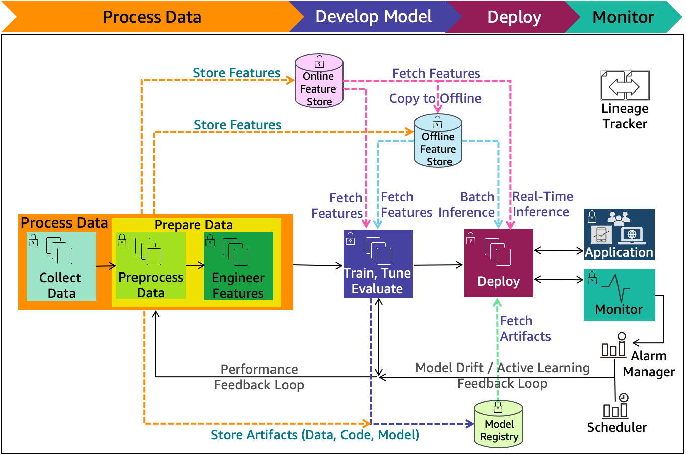
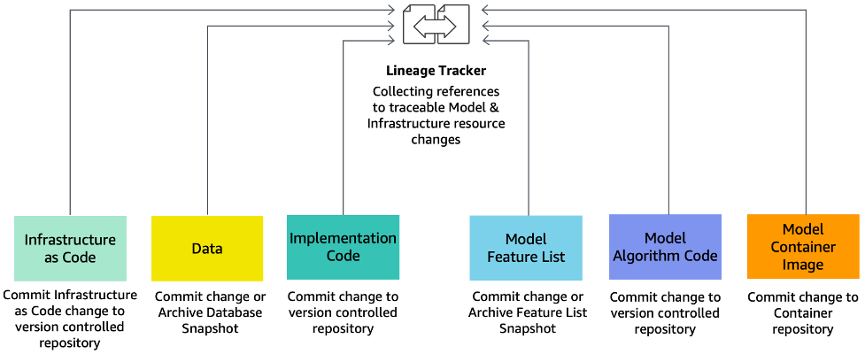

# ML lifecycle architecture

diagram

Figure 3 shows the ML lifecycle phases with the _data
processing phase_ (for example, Process Data) expanded
into a _data collection sub-phase_ (Collect Data)
and a _data preparation sub-phase_ (Pre-process
Data and Engineer Features). These sub-phases are discussed in more
detail in this section.

_Figure 3: Lifecycle data with data processing sub-phases included_

Figure 4 illustrates the details of the ML lifecycle phases that
occur following the problem framing phase and shows how the
data-processing sub-phases interact with the subsequent phases, that
is, the _model development phase_, the
_model deployment phase_, and the _model
monitoring phase_.

The model development phase includes training, tuning, and
evaluation. The model deployment phase includes the staging
environment for model validation for security and robustness.
Monitoring is key in timely detection and mitigation of drifts.
Feedback loops across the ML lifecycle phases are key enablers for
monitoring. Feature stores (both online and offline) provide
consistent and reusable features across model development and
deployment phases. The model registry enables the version control
and lineage tracking for model and data components. This figure also
emphasizes the lineage tracking and its components that are
discussed in this section in more detail.

The cloud agnostic architecture diagrams in this paper provide
high-level best practices with the following assumptions:

- All concepts presented here are cloud and technology agnostic.
- Solid black lines are indicative of process flow.
- Dashed color lines are indicative of input and output flow.
- Architecture diagram components are color-coded for ease of
  communication across this document.

_Figure 4: ML lifecycle with detailed phases and extended components_

The components of the sub-phases of the ML lifecycle shown in Figure
4 are as follows:

- **Online/offline feature store:**
  Reduces duplication and the need to rerun feature engineering
  code across teams and projects. An online store with low-latency
  retrieval capabilities is ideal for real-time inference. On the
  other hand, an offline store is designed for maintaining a history
  of feature values and is suited for training and batch scoring.
- **Model registry:** A repository
  for storing ML model artifacts including trained model and
  related metadata (such as data, code, and model). It enables the
  tracking of the lineage of ML models as it can act as a version
  control system.
- **Performance feedback loop:**
  Informs the iterative data preparation phase based on the
  evaluation of the model during the model development phase.
- **Model drift feedback loop:**
  Informs the iterative data preparation phase based on the
  evaluation of the model during the production deployment phase.
- **Alarm manager:** Receives
  alerts from the model monitoring system. It then publishes
  notifications to the services that can deliver alerts to target
  applications. The model update re-training pipeline is one such
  target application.
- **Scheduler:** Initiates a model
  re-training at business-defined intervals.
- **Lineage tracker:** Enables
  reproducible machine learning experiences. It enables the
  re-creation of the ML environment at a specific point in time,
  reflecting the versions of resources and environments at that
  time.

The ML lineage tracker collects references to traceable data, model,
and infrastructure resource changes. It consists of the following
components:

- System architecture (infrastructure as code to address
  environment drift)
- Data (metadata, values, and features)
- Model (algorithm, features, parameters, and hyperparameters)
- Code (implementation, modeling, and pipeline)

The lineage tracker collects changed references through alternative
iterations of ML lifecycle phases. Alternative algorithms and
feature lists are evaluated as experiments for final production
deployment.

Figure 5 includes machine learning components and their information
that the lineage tracker collects across different releases. The
collected information enables going back to a specific point-in-time
release and re-creating it.

_Figure 5: Lineage tracker_

Lineage tracker components include:

- **Infrastructure as code (IaC):**
  Modeling, provisioning, and managing cloud computing resources
  (compute, storage, network, and application services) can be
  automated using infrastructure as code. Cloud computing takes
  advantage of virtualization to enable the on-demand provisioning
  of resources. IaC avoids configuration drift through automation,
  while increasing the speed and agility of infrastructure
  deployments. IaC code changes are committed to
  version-controlled repository.
- **Data:** Store data schemes and
  metadata in version control systems. Store the data in a storage
  media, such as a data lake. The location or link to the data can
  be in a configuration file and stored in code version control
  media.
- **Implementation code:** Changes
  to implementation code can be stored as point-in-time using
  version control media.
- **Model feature list:** A
  _feature store_, discussed earlier in this
  section (Figure 4), maintains the details of the features as
  well as their previous versions for any point-in-time changes.
- **Model algorithm code:** Changes
  to model algorithm code at specific points-in-time can be stored
  in version control media.
- **Model container image:**
  Versions of model container images for specific point-in-time
  changes can be stored in container repositories managed by
  container registry.
