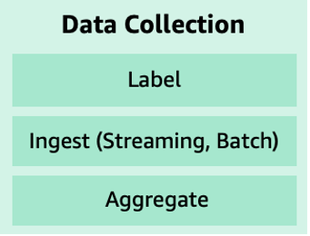
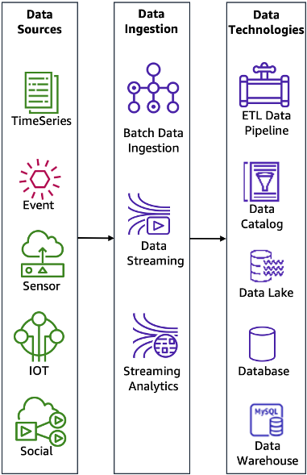

# Data collection

Important steps in the ML lifecycle are to identify the data needed,
followed by the evaluation of the various means available for
collecting that data to train your model.

_Figure 7: Main components of data collection_

- **Label:** _Labeled data_ is a group of samples that have been tagged with one or more labels. If labels are missing, then some effort is required to label it (either manual or automated).
- **Ingest and aggregate:** Data collection includes ingesting and aggregating data from multiple data sources.

_Figure 8: Data sources, data ingestion, and data technologies_

The sub-components of the _ingest and aggregate_ component (shown in Figure 8) are as follows:

- **Data sources:** Data sources include time-series, events, sensors, IoT devices, and social networks, depending on the nature of the use case. You can enrich your data sources by using the geospatial capability of Amazon SageMaker AI to access a range of geospatial data sources from AWS (for example, Amazon Location Service), open-source datasets (for example, [Open Data on AWS](https://aws.amazon.com/opendata/ "https://aws.amazon.com/opendata/")), or your own proprietary data including from third-party providers (such as Planet Labs). To learn more about the geospatial capability in Amazon SageMaker AI, visit [Geospatial ML with Amazon SageMaker AI](https://aws.amazon.com/sagemaker/geospatial/ "https://aws.amazon.com/sagemaker/geospatial/").
- **Data ingestion:** Data ingestion processes and technologies capture and store data on storage media. Data ingestion can occur in real-time using streaming technologies or historical mode using batch technologies.
- **Data technologies:** Data storage technologies vary from transactional (SQL) databases, to data lakes and data warehouses to form a lake house with marketplace governance across teams and partners. Extract, transform, and load (ETL) pipeline technology automates and orchestrates the data movement and transformations across cloud services and resources. A lake house enables storing and analyzing structured and unstructured data.
