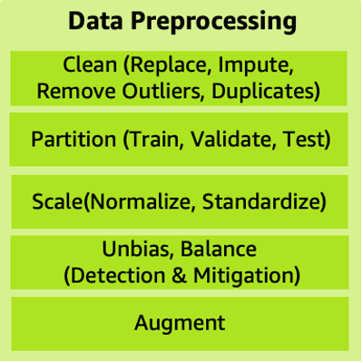

# Data preprocessing

Data preprocessing puts data into the right shape and quality for
training. There are many data preprocessing strategies including:
data cleaning, balancing, replacing, imputing, partitioning,
scaling, augmenting, and unbiasing.

_Figure 9: Data preprocessing main components_

The data preprocessing strategies listed in Figure 9 can be
expanded as the following:

- **Clean (replace, impute, remove outliers
  and duplicates):** Remove outliers and duplicates,
  replace inaccurate or irrelevant data, and correct missing data
  using imputation techniques that will minimize bias as part of
  data cleaning.
- **Partition:** To block ML models
  from overfitting and to evaluate a trained model accurately,
  randomly split data into train, validate, and test sets. Data
  leakage can happen when information from hold-out test dataset
  leaks into the training data. One way to avoid data leakage is
  to remove duplicates before splitting the data.
- **Scale (normalize,
  standardize):** Normalization is a scaling technique in
  machine learning that is applied during data preparation to
  change the values of numeric columns in the dataset to use a
  common scale. This technique assists to verify that each feature
  of the machine learning model has equal feature importance when
  they have different ranges. Normalized numeric features will
  have values in the range of [0,1]. Standardized numeric features
  will have a mean of 0 and standard deviation of 1.
  Standardization assists in handling outliers.
- **Unbias, balance (detection and
  mitigation):** Detecting and mitigating bias assists to
  avoid inaccurate model results. Biases are imbalances in the
  accuracy of predictions across different groups, such as age or
  income bracket. Biases can come from the data or algorithm used
  to train your model.
- **Augment:** Data augmentation
  increases the amount of data artificially by synthesizing new
  data from existing data. Data augmentation can assist to
  regularize and reduce overfitting.
