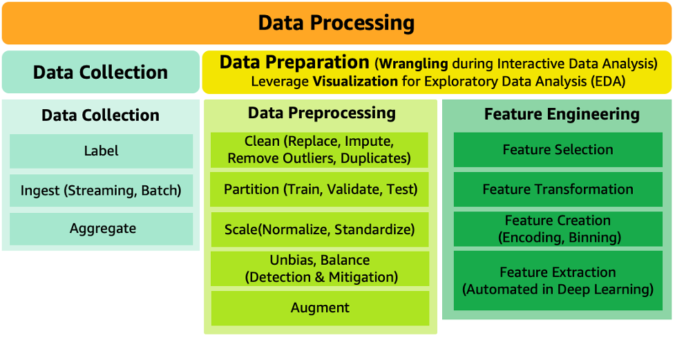

# Data processing

In ML workloads, the data (inputs and corresponding desired output)
serves important functions including:

- Defining the goal of the system: the output representation and
  the relationship of each output to each input, by means of the
  input and output pairs.
- Training the algorithm that associates inputs to outputs.
- Measuring the performance of the model against changes in data
  distribution or data drift.
- Building a baseline dataset to capture data drift.

As shown in Figure 6, data processing consists of data collection
and data preparation. Data preparation includes data preprocessing
and feature engineering. It mainly uses data wrangling for
interactive data analysis and data visualization for exploratory
data analysis (EDA). EDA focuses on understanding data, sanity
checks, and validation of data quality. 

It is important to note that the same sequence of data processing
steps that is applied to the training data needs to also be applied
to the inference requests.

_Figure 6: Data processing components_

###### Sub-phases

- [Data collection](data-collection.md "data-collection.md")
- [Data preparation](data-preparation.md "data-preparation.md")
