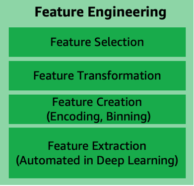

# Feature engineering

Every unique attribute of the data is considered a
_feature_ (also known as an
_attribute_). For example, when designing a
solution for predicting customer churn, the data used typically
includes features such as customer location, age, income level, and
recent purchases.

_Figure 10: Feature engineering main components_

Feature engineering is a process to select and transform variables
when creating a predictive model using machine learning or
statistical modeling. Feature engineering typically includes feature
creation, feature transformation, feature extraction, and feature
selection as listed in Figure 10. With deep learning, feature
engineering is automated as part of the algorithm learning.

- _Feature creation_ refers to the creation of
  new features from existing data to assist with better
  predictions. Examples of feature creation include
  one-hot-encoding, binning, splitting, and calculated features.
- _Feature transformation and imputation_
  include steps for replacing missing features or features that
  are not valid. Some techniques include forming Cartesian
  products of features, non-linear transformations (such as
  binning numeric variables into categories), and creating
  domain-specific features.
- _Feature extraction_ involves reducing the
  amount of data to be processed using dimensionality reduction
  techniques. These techniques include Principal Components
  Analysis (PCA), Independent Component Analysis (ICA), and Linear
  Discriminant Analysis (LDA). This reduces the amount of memory
  and computing power required, while still accurately maintaining
  original data characteristics.
- _Feature selection_ is the process of
  selecting a subset of extracted features. This is the subset
  that is relevant and contributes to minimizing the error rate of
  a trained model. Feature importance score and correlation matrix
  can be factors in selecting the most relevant features for model
  training.
