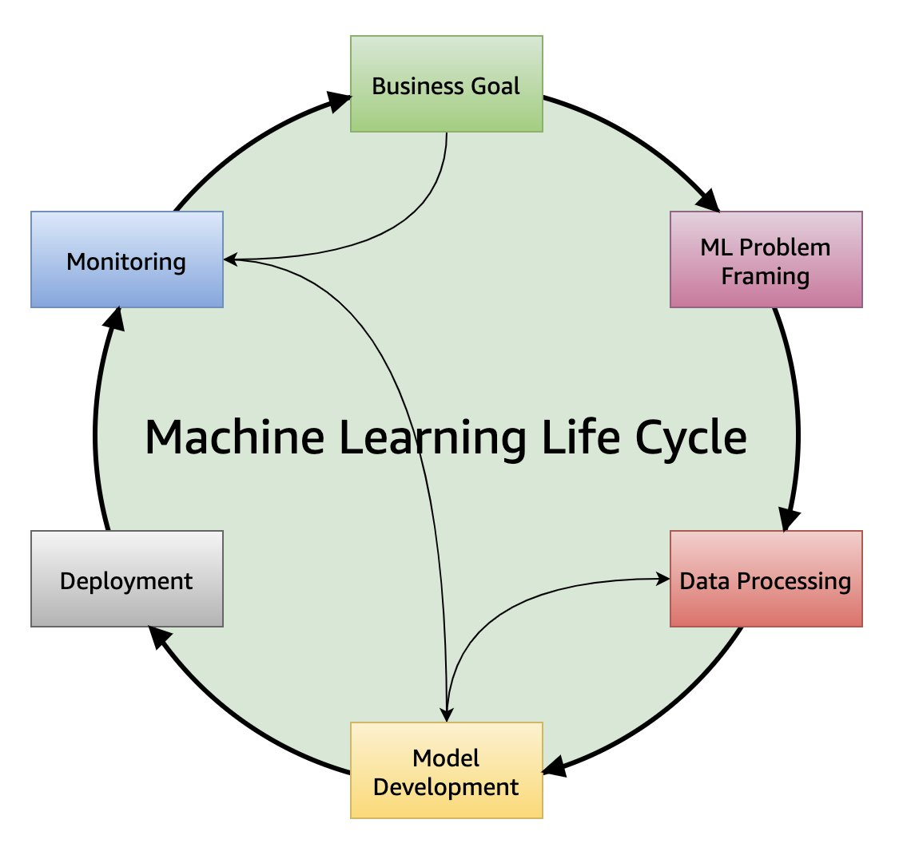

# Well-Architected machine learning

lifecycle

The ML lifecycle is the cyclic iterative process with instructions
and best practices to use across defined phases while developing an
ML workload. The ML lifecycle adds clarity and structure for making
a machine learning project successful. The end-to-end machine
learning lifecycle process illustrated in Figure 1 includes the
following phases:

- Business goal identification
- ML problem framing
- Data processing (data collection, data preprocessing, feature
  engineering)
- Model development (training, tuning, evaluation)
- Model deployment (inference, prediction)
- Model monitoring

The phases of the ML lifecycle are not necessarily sequential in
nature and can have feedback loops, a few of which are illustrated
in Figure 1, to interrupt the cycle across the lifecycle phases.

_Figure 1: Machine learning lifecycle_

The following is a quick introduction to each phase, which will be
expanded upon later in this paper.

**Business goal**

An organization considering ML should have a clear idea of the
problem, and the business value to be gained by solving that
problem. You must be able to measure business value against specific
business objectives and success criteria.

**ML problem framing**

In this phase, the business problem is framed as a machine learning
problem: what is observed and what should be predicted (known as a
label or target variable). Determining what to predict and how
performance and error metrics must be optimized is a key step in
this phase.

**Data processing**

Training an accurate ML model requires data processing to convert
data into a usable format. Data processing steps include collecting
data, preparing data, and feature engineering that is the process of
creating, transforming, extracting, and selecting variables from
data.

**Model development**

Model development consists of model building, training, tuning, and
evaluation. Model building includes creating a CI/CD pipeline that
automates the build, train and release to staging and production
environments.

**Deployment**

After a model is trained, tuned, evaluated and validated, you can
deploy the model into production. You can then make predictions and
inferences against the model.

**Monitoring**

Model monitoring system verifies your model is maintaining a desired
level of performance through early detection and mitigation.
