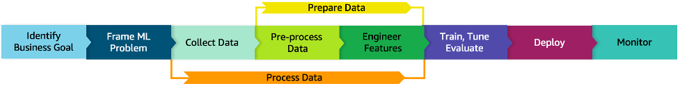

# Well-Architected machine learning

The six phases for the ML lifecycle referenced in this lens are
illustrated in Figure 2 in a sequence.

_Figure 2: Machine learning lifecycle_

The following sections describe Well-Architected machine
learning for each of the lifecycle phases.

###### Lifecycle phases

- [Business goal identification](business-goal-identification.md "business-goal-identification.md")
- [ML problem framing](ml-problem-framing.md "ml-problem-framing.md")
- [ML lifecycle architecture
  diagram](architecture-diagram.md "architecture-diagram.md")
- [Data processing](data-processing.md "data-processing.md")
- [Model
  development](model-development.md "model-development.md")
- [Deployment](deployment.md "deployment.md")
- [Monitoring](monitoring.md "monitoring.md")
