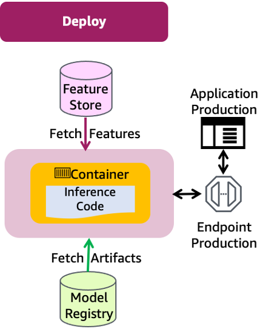
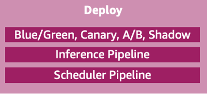
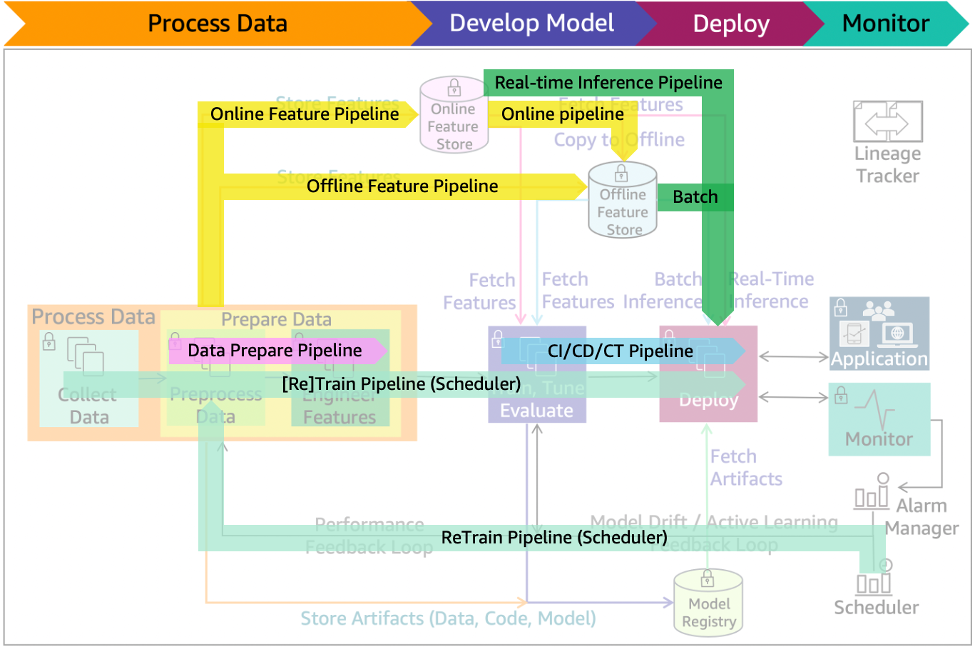

# ML lifecycle phase - Deployment

After you have trained, tuned, and evaluated your model, you can
deploy it into production and make predictions against this
deployed model. Amazon SageMaker AI Studio can convert notebook code
to production-ready jobs without the need to manage the underlying
infrastructure. Be sure to use a governance process. Controlling
deployments through automation combined with manual or automated
quality gates ensures that changes can be effectively validated
with dependent systems prior to deployment to production. 

_Figure 15 – Deployment architecture diagram_

Figure 15 illustrates the deployment phase of the ML lifecycle in
production. An application sends request payloads to a production
endpoint to make inference against the model. Model artifacts are
fetched from the model registry, features are retrieved from the
feature store, and the inference code container is obtained from
the container repository. 

_Figure 16: Deployment main components_

Figure 16 lists key components of production deployment including:

- **Blue/green, canary, A/B, shadow
  deployment/testing** - Deployment and testing
  strategies that reduce downtime and risks when releasing a new
  or updated version.
  - The **blue/green**
    deployment technique provides two identical production
    environments (initially
    **blue** is the existing
    infrastructure and
    **green** is an identical
    infrastructure for testing). Once testing is done on the
    **green** environment, live
    application traffic is directed to it from the
    **blue** environment. Then
    the roles of the blue/green environments are switched.
  - With a **canary**
    deployment, a new release is deployed to a small group of
    users while other users continue to use the previous
    version. Once you’re satisfied with the new release, you
    can gradually roll it out to all users.
  - **A/B** testing strategy
    enables deploying changes to a model. Direct a defined
    portion of traffic to the new model. Direct the remaining
    traffic to the old model. A/B testing is similar to canary
    testing, but has larger user groups and a longer time
    scale, typically days or even weeks.
  - With **shadow** deployment
    strategy, the new version is available alongside the old
    version. The input data is run through both versions. The
    older version is used for servicing the production
    application and the new one is used for testing and
    analysis.

- **Inference pipeline** - Figure
  17 shows the inference pipeline that automates capturing of
  the prepared data, performing predictions and post-processing
  for real-time or batch inferences.
- **Scheduler pipeline** -
  Deployed model is representative of the latest data patterns.
  When configured as shown in Figure 17, re-training at
  intervals can minimize the risk of data and concept drifts. A
  scheduler can initiate a re-training at business defined
  intervals. Data preparation, CI/CD/CT, and feature pipelines
  will also be active during this process.

_Figure 17: ML lifecycle with scheduler re-train, and batch/real-time inference
pipelines_

###### Best practices

- [Operational excellence pillar – Best practices](operational-excellence-pillar-for-model-deployment-to-production-best-practices.md "operational-excellence-pillar-for-model-deployment-to-production-best-practices.md")
- [Security pillar - Best practices](security-pillar-for-model-deployment-to-production-best-practices.md "security-pillar-for-model-deployment-to-production-best-practices.md")
- [Reliability pillar – Best practices](reliability-pillar-for-model-deployment-to-production-best-practices.md "reliability-pillar-for-model-deployment-to-production-best-practices.md")
- [Performance efficiency pillar – Best practices](performance-efficiency-pillar-for-model-deployment-to-production-best-practices.md "performance-efficiency-pillar-for-model-deployment-to-production-best-practices.md")
- [Cost optimization pillar - Best practices](cost-optimization-pillar-for-model-deployment-to-production-best-practices.md "cost-optimization-pillar-for-model-deployment-to-production-best-practices.md")
- [Sustainability pillar - Best practices](sustainability-pillar-for-model-deployment-to-production-best-practices.md "sustainability-pillar-for-model-deployment-to-production-best-practices.md")
