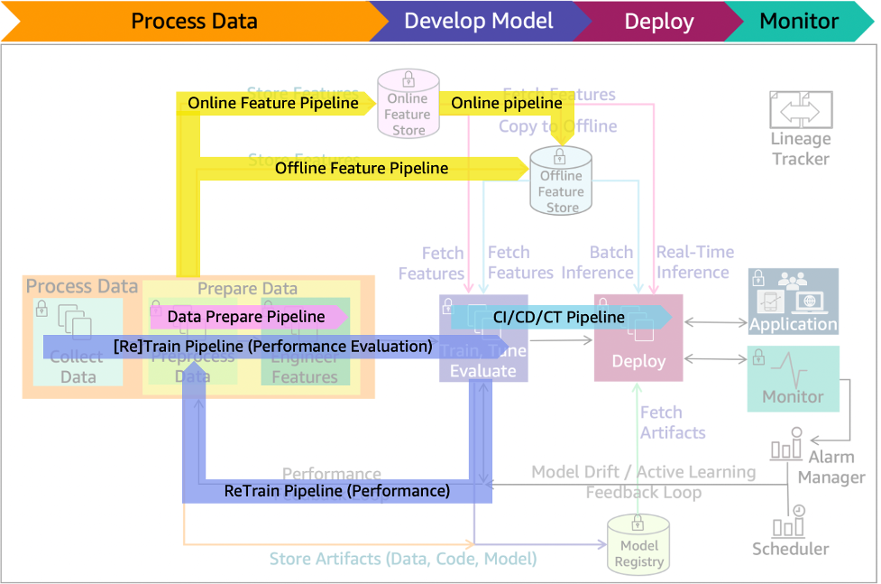

# Model evaluation

After the model has been trained, evaluate it for its
performance and success metrics. You might want to generate
multiple models using different methods and evaluate the
effectiveness of each model. You also might evaluate whether your
model must be
[more
sensitive than specific, or more specific than sensitive](https://en.wikipedia.org/wiki/Sensitivity_and_specificity "https://en.wikipedia.org/wiki/Sensitivity_and_specificity").
For multiclass models, determine error rates for each class
separately.

You can evaluate your model using historical data (offline
evaluation) or live data (online evaluation). In offline
evaluation, the trained model is evaluated with a portion of the
dataset that has been set aside as a *holdout
set*. This holdout data is never used for model
training or validation-it’s only used to evaluate errors in the
final model. The holdout data annotations must have high assigned
label correctness for the evaluation to make sense. Allocate
additional resources to verify the correctness of the holdout
data.

Based on the evaluation results, you might fine-tune the data,
the algorithm, or both. When you fine-tune the data, you apply
the concepts of data cleansing, preparation and feature
engineering.

_Figure 14: ML lifecycle with performance evaluation pipeline
added_

Figure 14 includes the model performance evaluation, the
_data prepare_ and CI/CD/CT pipelines that
fine-tune data and/or algorithm, re-training, and evaluation of
model results.
