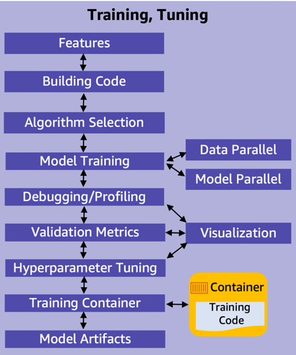
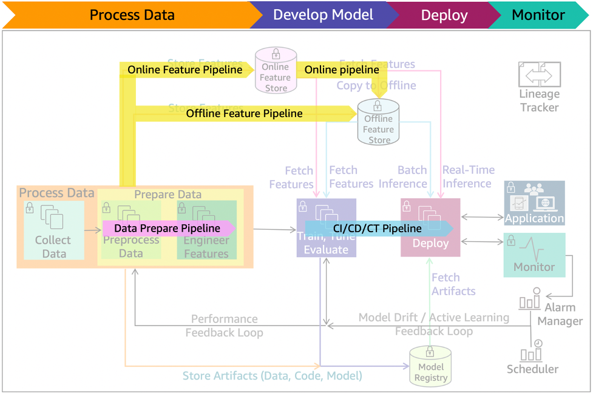

# Model training and

tuning

In this phase, you select a machine learning algorithm that is
appropriate for your problem and then train the ML model. You
provide the algorithm with the training data, set an objective
metric for the ML model to optimize on, and set the hyperparameters
to optimize the training process.

_Figure 11: ML model training and tuning main components_

Model training, tuning, and evaluation require prepared data and
engineered features. The following are the main activities in this
stage, as listed in Figure 11:

- **Features:** Features are
  selected as part of the data processing after data quality is
  assured
- **Building code:** Model
  development includes building the algorithm and its supporting
  code. The code-building process should support version control
  and continuous build, test, and integration through a pipeline.
- **Algorithm selection:**
  Selecting the right algorithm involves running many experiments
  with parameter tuning across available options. Factors to
  consider when evaluating each option can include success
  metrics, model explainability, and compute requirements
  (training/prediction time and memory requirements).
- **Model training (data parallel, model
  parallel):** The process of training a ML model
  involves providing the algorithm with training data to learn
  from. Distributed training enables splitting large models and
  training datasets across compute instances to reduce training
  time significantly. Model parallelism and data parallelism are
  techniques to achieve distributed training.
- **Model parallelism** is the
  process of splitting a model up between multiple instances or
  nodes.
- **Data parallelism** is the
  process of splitting the training set in mini-batches evenly
  distributed across nodes. Thus, each node only trains the model
  on a fraction of the total dataset.
- **Debugging or profiling:** A
  machine learning training job can have problems including:
  system bottlenecks, overfitting, saturated activation functions,
  and vanishing gradients. These problems can compromise model
  performance. A debugger provides visibility into the ML training
  process through monitoring, recording, and analyzing data. It
  captures the state of a training job at periodic intervals.
- **Validation metrics:**
  Typically, a training algorithm computes several metrics such as
  loss and prediction accuracy. These metrics determine if the
  model is learning and generalizing well for making predictions
  on unseen data. Metrics reported by the algorithm depend on the
  business problem and the ML technique used. For example, a
  _confusion matrix_ is one of the metrics used
  for classification models, and Root Mean Squared Error (RMSE) is
  one of the metrics for regression models.
- **Hyperparameter tuning:**
  Settings that can be tuned to control the behavior of the ML
  algorithm are referred to as
  _hyperparameters_. The number and type of
  hyperparameters in ML algorithms are specific to each model.
  Examples of commonly used hyperparameters include: learning
  rate, number of epochs, hidden layers, hidden units and
  activation functions. Hyperparameter tuning, or optimization, is
  the process of choosing the optimal hyperparameters for an
  algorithm.
- **Training code container:**
  Create container images with your training code and its entire
  dependency stack. This will enable the training and deployment
  of models quickly and reliably at scale.
- **Model artifacts:** Model
  artifacts are the outputs that results from training a model.
  They typically consist of trained parameters, a model definition
  that describes how to compute inferences, and other metadata.
- **Visualization:** Enables
  exploring and understanding data during metrics validation,
  debugging, profiling, and hyperparameter tuning.

_Figure 12: ML lifecycle with pre-production pipelines_

Figure 12 shows the pre-production pipelines. The _data
prepare_ pipeline automates data preparation tasks. The
feature pipeline automates the storing, fetching, and copying of the
features into and from online/offline store. The CI/CD/CT pipeline
automates the build, train, and release to staging and production
environments.
