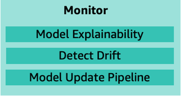
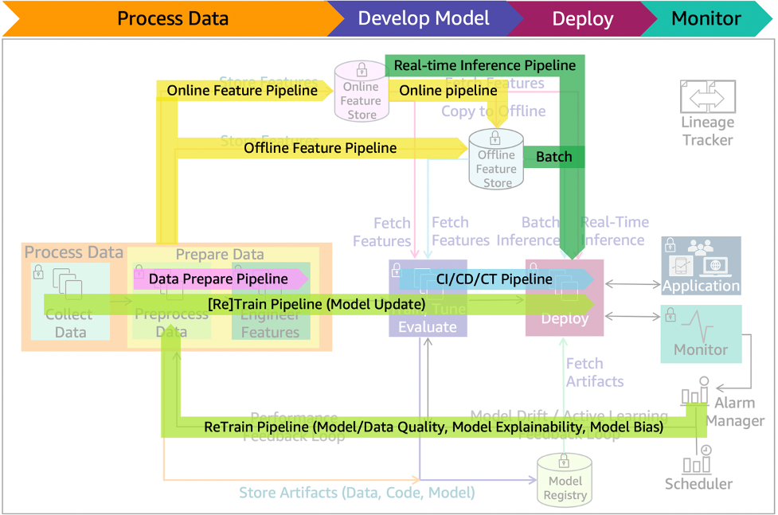

# Monitoring

The model monitoring system must capture data, compare that data to the training set,
define rules to detect issues, and send alerts. This process repeats on a defined schedule, when
initiated by an event, or when initiated by human intervention. The issues detected in the
monitoring phase include: data quality, model quality, bias drift, and feature attribution
drift. 

_Figure 17: Post-deployment monitoring main components_

Figure 17 lists key components of monitoring, including:

- **Model explainability:** Monitoring system uses
  _explainability_ to evaluate the soundness of the model and if the
  predictions can be trusted.
- **Detect drift:** Monitoring system detects data and concept
  drifts, initiates an alert, and sends it to the alarm manager system. Data drift is
  significant changes to the data distribution compared to the data used for training. Concept
  drift is when the properties of the target variables change. Data drift can result in model
  performance degradation.
- **Model update pipeline:** If the alarm manager identifies
  violations, it launches the model update pipeline for a re-train. This can be seen in Figure

18. The _Data prepare_, _CI/CD/CT_, and
    _Feature_ pipelines will also be active during this process.

_Figure 18: ML lifecycle with model update, retrain, and batch or real-time inference pipelines_
