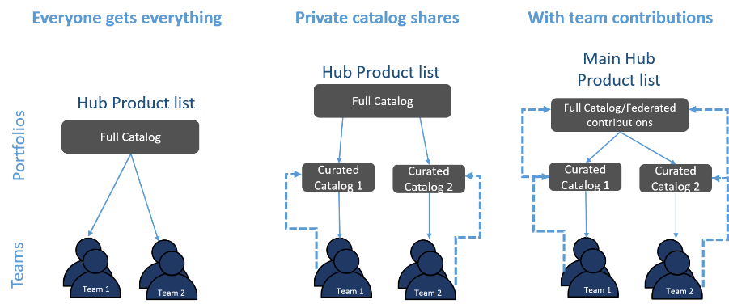

# Implementation priorities

## Implement a hub and spoke catalog model

In order to plan for scale, having the ability to reuse infrastructure as code templates
across your environments, Regions, and accounts is a base requirement. The hub and spoke
model for the distribution of infrastructure as code templates should be implemented
alongside the templates sourced from AWS Partners. This will provide for administrative
isolation between workloads, while also allowing for an expedited reuse of templates.

However, planning a centralized hub (catalog) for all templates might also slow down
agility by adding unnecessary bottlenecks if not carefully implemented. Incorporating the
concept of a federated hub and spoke architecture, allows for disparate builder teams to
create and manage their own catalog repository (increasing their agility), while at the same
time providing a mechanism for them to contribute to broader reuse by sharing their
templates in the main hub catalog as well.

This distributed model is an effective mechanism for scale, as it allows builder teams
to contribute to the broader repositories any innovations or new use cases, while still
following the governance model of approvals in the main hub. Planning what shared resources
to put in a central catalog (for instance, either Private Marketplace, or Service Catalog), how
builders can contribute and have their templates reviewed for the central catalog, as well
as how the central catalog can be curated for specific use by each builder team will be
important.

Depending on your requirements, you may elect to implement more than one version of the
hub and spoke model. For example, for templates that are regulated or have strict enterprise
requirements, the deviation from the approved template may not be allowed for higher-level
environments. In this case, a mix of the restricted catalog distribution might be necessary
for higher environments, where a team contribution approach would make sense for lower-level
environments.

_Distribution models for catalog sharing_

## Curate templates for reuse

Once you have codified your solutions as infrastructure as code templates and defined
your hub and spoke model, you will need to define two categories of templates for each of
your spoke accounts: _Provisioned/Enforced_ and _Available to
Consume_. _Provisioned/Enforced_ are a set of templates that
will be provisioned directly from the management account into each member account as
foundational capabilities. _Available to Consume_ are a set available for
builders to browse and self-service provision.

For example, templates can be provisioned directly to spoke accounts through stacks,
stack sets, Lambda functions, or Step Functions. Alternatively, you can distribute a
self-service curated assortment to the spoke accounts using Service Catalog. Curating templates that
are specific for your builders without overloading a catalog with all available templates
can allow for faster discovery and reuse of primary templates.

## Apply default parameters for reuse

Implement infrastructure as code templates that allow default parameters to be pre-selected
for use by your builders. This enables them to align to governance without having to evaluate the
details of each parameter option. Where possible, set default values for parameters, sparing end
users (builder teams) the need to choose or possibly make incorrect choices. This approach exposes
only what is needed for setup. For example, Service Catalog implements this with a constraint capability that
allows for a choice of parameters to vary based on the builder team. This is done so that it is
pre-configured when the builder team self-service provisions a template.

## Implement a lifecycle management and version distribution system

Maintain infrastructure as code template versions throughout their development lifecycle.
This is done for the templates, and the services provisioned from the templates. Using the hub and
spoke model you implemented for your catalog, you can define if a forced update is required at a spoke level,
or if concurrent versions should be available for self-service provisioning, and which versions need to be
marked for obsolescence. Using a hub and spoke catalog will also help allow the audit and distribution of
new versions as required.

## Identify a robust tagging strategy

Tags are key-value textual metadata that can be applied to most resources,
and area critical component for successfully implementing your environments in a scalable,
efficient manner. Tags are most commonly used for:

- Organizing resources in the AWS Management Console
- Allocating costs
- Business-related metadata
- Enabling automation and operations support (for example,
  backups, and the ongoing management of environments)
- Indicating resource risk profiles and compliance requirements
  (for example, regulatory, and data privacy)

[Centralizing
your tags into an enforced library](../../../organizations/latest/userguide/orgs_manage_policies_tag-policies.md "../../../organizations/latest/userguide/orgs_manage_policies_tag-policies.md") of metadata will help you expedite their proper
application while provisioning and updating resources. Adding tagging policies in your
controls functions can help supplement this enforcement. AWS Resource Groups and the
Resource Groups Tagging API enable programmatic control of tags. This makes it easier to
centrally manage, search, and filter tags and resources. In addition, Service Catalog provides a
TagOption library where the tag-option key-value pairs are stored. The TagOption library
makes it easier to enforce a consistent taxonomy, the proper tagging of resources, and
defines user-selectable options. Meaning, with only a defined set of choices available,
misconfigured or tags in error are less likely to occur.

As the catalog is curated for the hub and spoke model, these tags can also be used as
required parameter values and enforced with constraints on your templates. In addition, with
the TagOption library from Service Catalog, you can deactivate TagOptions and retain their associations
to portfolios or products, and reactivate when needed. This approach not only helps maintain
library integrity, it also allows you to manage TagOptions that might be used
intermittently, or under special circumstances. With Service Catalog TagOptions, auto-tags are also
built into each product and portfolio.

## Manage entitlements

You should enable controls that allow only authorized users and workloads to consume a license
within vendor-defined limits. This helps reduce the risk of costly audits and
unexpected licensing tune-ups.

Use [AWS License Manager](https://aws.amazon.com/license-manager/ "https://aws.amazon.com/license-manager/") to manage software licenses from vendors,
such as Microsoft, SAP, Oracle, and IBM, across your AWS and
on-premises environments. This service allows you to define rules
based on your licensing agreements to prevent license violations.
You can set notification alerts along with license rules to help
ensure that you are meeting license requirements.
[Managed
entitlements](https://aws.amazon.com/marketplace/features/managed-entitlements/ "https://aws.amazon.com/marketplace/features/managed-entitlements/") enable you to distribute, activate, and track
software license entitlements acquired in AWS Marketplace through AWS License Manager.

## Enable Private Marketplace

Private Marketplace serves as a curated catalog of purchased
products (software, data, and professional services) and should be
implemented in a hub and spoke pattern (management-member) such
that spoke accounts are limited to subscribing to only the
approved software. This product governance is done to control
software costs and streamline legal and contractual reviews.
Create a Private Marketplace at the management account level to
serve as the primary hub.

For the member accounts, determine
whether the software can operate centrally as a shared service, or
is required to be available in individual accounts. If the
software is required in a set of member accounts, you will need to
individually subscribe and associate the software you’ve curated
in the Private Marketplace to enable use and self-service
provisioning. Once an association is completed, an account is
governed by the Private Marketplace. The users in the member
accounts will be limited to the software that is curated in their
specific Private Marketplace experience. After the subscription is
set for the member accounts, the same catalog distribution
capabilities can be used to provision self-service products (for
example, using Service Catalog).

## Integrate with procurement systems

Complement your existing procurement processes, with integration
to AWS Marketplace. This is done by extending your procurement
systems (Coupa or SAP Ariba) to Private Marketplace so your users
can use the existing procurement and approval processes to obtain
software. Create the appropriate IAM-managed permissions, use AWS Marketplace to generate the necessary information to configure
your procurement solution, and finally configure your procurement
solution to complete the integration. For example, you can
[set
up a punchout](../../../marketplace/latest/buyerguide/procurement-system-integration-setup.md "../../../marketplace/latest/buyerguide/procurement-system-integration-setup.md"), attach purchase orders to your AWS invoices,
and then align your procurement processes to use the standard
provisioning solutions.
