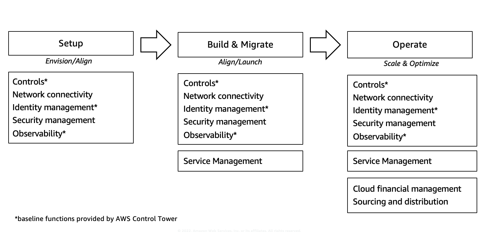

# Journey to cloud-ready environments

A cornerstone of a successful, cost-efficient, secure, and compliant cloud strategy is to
emphasize proactive management and governance. Incorporating best practices from the M&G
Guide helps you grow with AWS, whether you are in the setup, migrate, or operate phase of
the cloud journey. The progression along that journey includes the adoption of management and
governance capabilities as you mature. The three phases of a typical cloud journey are
described in the following sections.

Customer use case examples for this guide include those that are just getting started with
AWS, those that are considering an expansion into a multi-account experience, or those that
are planning an expansion, such as the launch of new applications or a data center
migration.

## Setup

Getting started with AWS, you should configure identity
management, logging, monitoring, observability, network
connectivity to on-premises, and integrate security capabilities
to their existing solutions. Gain a head-start on these
capabilities by using AWS Control Tower to provision a landing
zone embedded with controls. This is extended with
basic network isolation, a base set of identities, and extending
incident management and security capabilities to the new
environments.  In this phase, you begin building cloud-ready
environments tuned to your enterprise needs. This lets you scale
your management and governance functions alongside your workloads.

## Build and migrate

In this phase, you want to extend and enhance your management and
governance functions. This includes, extending network isolation
boundaries, configuring further environment and workload-based
controls, tuning change and incident management,
and updating your observability to accommodate
application-specific insights. Whether you are using a migration
factory to quickly and efficiently migrate applications or
workloads, or you are beginning to build out larger sets of
applications or workloads, you should also add integration to your
service management capabilities and enhance your security
management tooling.

## Operate

Evolving interoperability of the management and governance
functions give you greater operational efficiency as you continue
migrating, building, or modernizing your workloads. This phase
typically includes the addition of full sourcing and distribution
functions for your infrastructure templates or software solutions.
Proactively using financial insights spanning across your
workloads, accounts, and environments also position you for
accelerating innovation activities.

_Journey to AWS environments_
