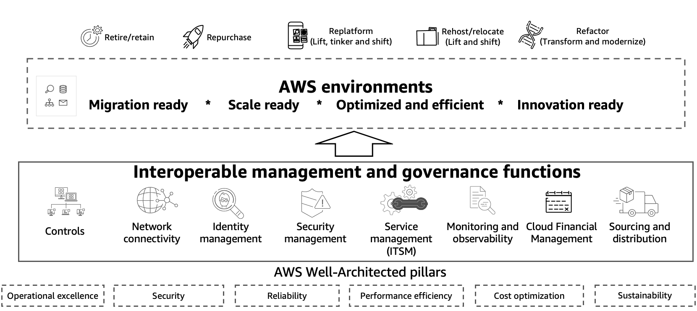

# Management and Governance Cloud Environment Guide

Publication date: **November 22, 2021** ([Document history](document-history.md "document-history.md"))

Customers of every size and industry type are moving to the cloud to
increase their security, agility, cost efficiency, scalability, and
ability to deploy more easily. Many customers are asking for our
guidance to help them ensure their AWS environments meet those
requirements. The Amazon Web Services (AWS) Well-Architected
Management and Governance Cloud Environment Guide (M&G Guide) provides clear
guidance for you to follow. This guidance includes answers to key
questions, recommended guardrails, and identifying AWS services and
solutions from AWS Partners to help you build development, test, and
production workloads at scale regardless of the stage of cloud
adoption you are in. This document can be read in its entirety or by
individual section depending on the focus of the reader.

The
[AWS Cloud Adoption Framework (AWS CAF)](https://aws.amazon.com/professional-services/CAF/ "https://aws.amazon.com/professional-services/CAF/") helps you develop and run
efficient and effective plans for your cloud adoption journey
focused on people and processes. The M&G Guide builds on the CAF
principles, offering prescriptive guidance with a focus on the
technology. Cerner Corporation, a global health platform and
technology company, completed an initiative in collaboration with
AWS Professional Services to re-shape their cloud capabilities to
support a growing, diverse, and global customer base:

######

“Cerner has been operating about 50–100 accounts in AWS for years,
but our strategy was very decentralized with regard to governance.
We have business drivers to enable HITRUST compliance, which we
combined with many other frameworks to create our Cerner Controls
Framework (for example, compliance requirements). These requirements
drove us to rethink how we applied governance principles in our
cloud operating model through centralized governance. We could have
moved faster and delivered value to our business in a more
deliberate way had the AWS Management & Governance Cloud Environment Guide been
available at the time. Every section would have created value for us
as it really plants a flag in the ground to help distill AWS Best
Practices from all the various people and places into a clear
starting point. "

- Eric Wright, Senior Director Cloud Engineering, Cerner Corporation

- Phil Brown, Director & Principal Engineer Cloud Engineering,
  Cerner Corporation

Based on our experiences from thousands of successful migrations,
the M&G Guide helps decision makers, cloud, networking, and
security architects configure their AWS environments to prepare for
scale and evaluate if their environment is configured properly. The
M&G Guide includes the following:

- Description of each of the management and governance functions.
- Information on how the functions interact and interoperate with
  each other to provide efficient management and governance.
- Detailed implementation priorities helping you to know what
  steps to take, and in what order.
- Recommended AWS services for each function.
- AWS Partner solutions available in
  [AWS Marketplace](https://aws.amazon.com/marketplace "https://aws.amazon.com/marketplace") that support multi-account environments and
  work with
  [AWS Control Tower](https://aws.amazon.com/controltower "https://aws.amazon.com/controltower").
- Implementation guidance as architectural diagrams, guides, and
  product videos.
- Aligned offerings and delivery kits from
  [AWS Professional Services](https://aws.amazon.com/professional-services/ "https://aws.amazon.com/professional-services/").
- Turnkey complementary solutions and consulting services from
  [Built
  on Control Tower - AWS Partners](https://aws.amazon.com/controltower/partners/ "https://aws.amazon.com/controltower/partners/").

_How to prepare AWS environments_
