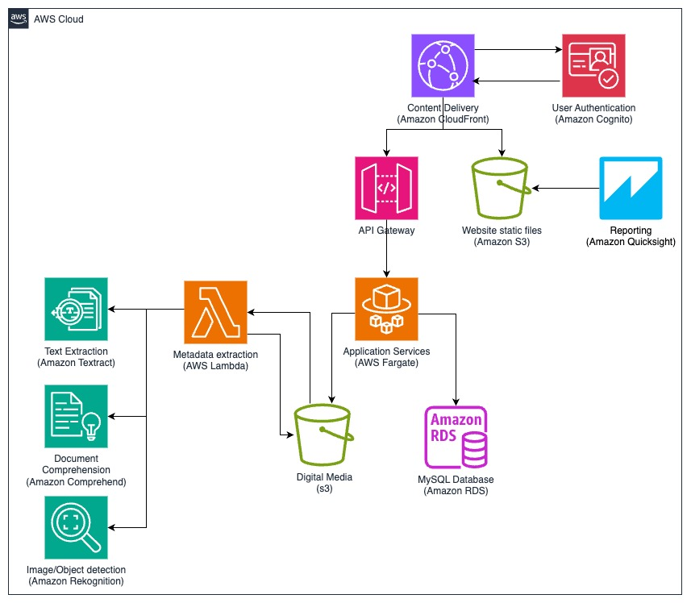

# Scenario: Digital archive solution

The following example explains a digital archive solution scenario, its requirements,
relevant Māori data considerations, and how to apply the AWS Well-Architected Pillars.

A local iwi organisation has engaged a software development company to develop and present
a high-level solution for a digital archive solution. The iwi is digitising their current
archive of documents and images, as well as creating recordings of their oral history. They are
also generating new digital content such as videos and photos that they want to preserve. The
archive is difficult to manage at present, as it is stored in different places, including
personal cell phones, online storage services, and external hard drives. This makes it difficult
to find content, and there are concerns regarding the potential for data loss.

The following are requirements for the solution.

1. We want to be able to have a place where we can upload digital taonga like videos,
   documents (including emails and digital scans of paper documents), and photos.
2. We want our information managers to be able to easily organise, manage, and access
   content to support iwi business and information requests from members, as well as other iwi
   or hapū organisations.
3. We want to be able to restrict access to content to different groups of users.
4. We want to allow members to be able to easily contribute content that they may have,
   such as photos or videos from events or gatherings.
5. We want to be able to choose certain items to publish onto our website so both members
   and the public can discover and enjoy them appropriately.
6. The items that the digital archive system hold are extremely valuable to the iwi, so it
   must be secure from things like hacking and accidental deletion or corruption.

## Solution concept

The development team has taken the initial set of requirements are put together a
high-level solution concept. They have also created a high-level architecture that includes
recommended AWS services.

## High-level architecture

The following diagram provides a high-level architecture for the digital archive
solution.

1. The front-end web application is a javascript based web application deployed to Amazon S3
   and accessed using Amazon CloudFront. Amazon CloudFront is integrated with Amazon Web Application Firewall
   (WAF) to provide protection from layer 7 style attacks. Amazon CloudFront provides distributed
   denial of service (DDoS) protection through AWS Shield.
2. The web application uses Amazon Cognito for user authentication. External users can use
   existing social logins such as Facebook or Google or set up a new identity within the
   application. Amazon Cognito can be integrated with the iwi's existing identity provider using
   OAuth or SAML so that administrators and information managers can use existing identities
   if they exist. If one does not exist, iwi users can have a new digital log in or digital
   identity record set up in Amazon Cognito.
3. The web application interacts with the back-end services using APIs exposed through
   Amazon API Gateway.
4. Application services and APIs are containerised using Amazon Elastic Container Service (ECS) and deployed to
   AWS Fargate. The APIs provide access to data, content, and support features such as
   searching, retrieving content from the content store, retrieving metadata from the
   database, content uploading, and user access management.
5. Uploaded items such as videos, images, and documents are stored in Amazon S3. This provides
   secure, durable, and cost-effective storage for digital content. Item metadata (such as
   source, name, description, date, location, and keywords) and other data such as user
   profiles, access roles and permissions, system usage, and auditing data are stored in a
   MySQL database. This database is deployed onto Amazon RDS for MySQL in a multi-AZ configuration
   to provide additional resilience.
6. AWS AI services are used to automatically extract useful metadata from uploaded
   content. This metadata can be used when searching for items in the archive. Extracted
   metadata is stored in the MySQL database. The type of metadata extraction depends on the
   type of item uploaded, but could include the following.
   - **Text extraction:** Text is extracted from documents
     using Amazon Textract.
   - **Document comprehension:** Key entities, such as people,
     organisations, or places, contained in documents is extracted using Amazon Comprehend. There
     is also the option to help classify documents or items.
   - **Object detection:** Amazon Rekognition is used to detect objects
     with images and videos, which can then be stored as meta-data.
