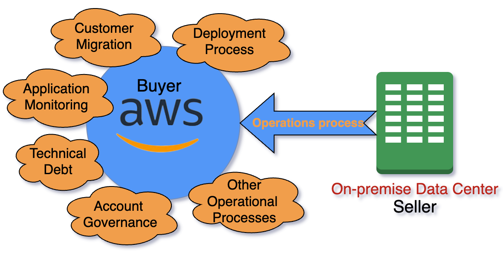
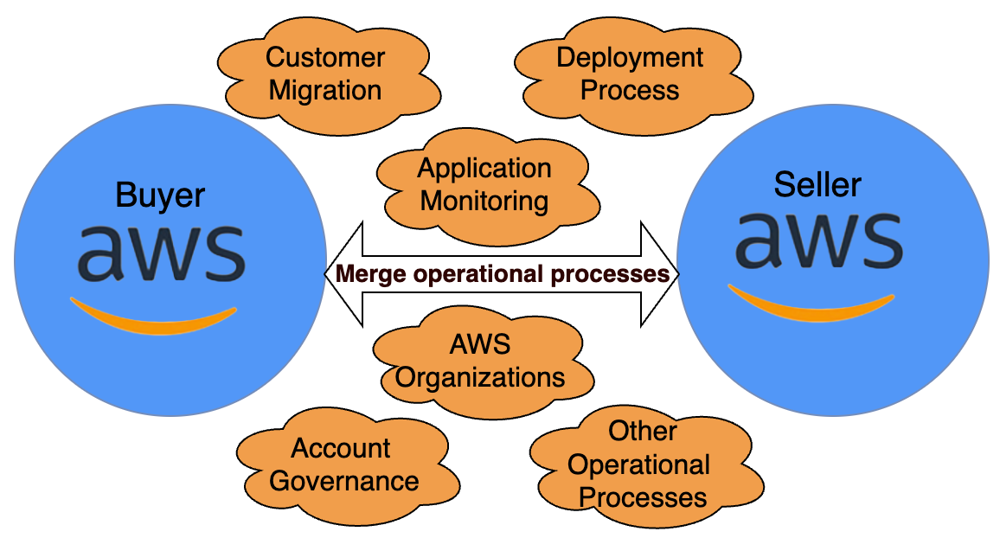

# Operational excellence

**Scenario A**

As part of integration, the M&A Lens provides guidance on the
integration of major operational aspects (depicted in Figure 1)
and more. Besides these operational processes, companies should
look at other integration aspects, like project priorities,
resources, skills, and culture. If the acquirer has AWS technical
knowledge, they should lead the integration with AWS services. The
acquirer should create a cost-effective plan for AWS migration
with minimal disturbance to their end customers. The M&A Lens
provides guidance to achieve operation process migration per AWS
prescribed best practices.

_Figure 1: Model for AWS-aware buyer and on-premises seller_

Operational excellence plays integral part during mergers and
acquisition because of the following:

1. It helps identify synergies between the combining companies.
   By analyzing the operational processes of both companies,
   areas of overlap and duplication can be identified.
   Eliminating these can improve efficiency and reduce costs.
   Operational excellence helps quantify the potential synergies
   and cost savings from process integration.
2. It ensures a smooth integration of operations. The merging of
   two companies often involves integrating systems, processes,
   people, and cultures. Operational excellence provides a
   structured approach to identify core processes, standardize
   and optimize them, and implement them across the combined
   organization. This helps avoid disruption and maintain
   business continuity during the integration process.
3. It aligns goals and improves governance. As two companies come
   together, operational excellence helps clarify organizational
   goals, establish key performance metrics, and strengthen
   governance practices. This alignment and improved oversight
   are essential to realizing the potential value from a mergers
   and acquisitions deal.
4. It helps customer migration to the new platform with minimal
   impact to the end customers and extract benefit of cloud
   native technologies.

The M&A Lens guides customer regarding all of the preceding
aspects, as well as specifics like:

- Management of application inventory
- Processes to mitigate and recover from AWS scheduled and
  unscheduled events
- Process implementation for security events
- Best practices for an AWS CI/CD pipeline
- Configuration management

In summary, operational excellence brings discipline, rigor, and a
continuous improvement mindset to the mergers and acquisition
process. This helps identify and capture synergies, integrate
smoothly, reduce costs, align goals, strengthen governance, and
sustain ongoing optimization.

In case the seller is AWS-integrated and the buyer is on a non-AWS platform, a similar approach can work. In this case, the AWS team
can work with seller, who can take the lead for cloud integration.

**Scenario B**

In the case that both the buyer and seller are on AWS, we
recommend best practices for multi-account governance, including
setting up AWS Organizations. Consider setting up AWS Control Tower, which orchestrates multiple AWS services on your behalf
while maintaining the security and compliance needs of combined
organization. Additionally, consider resource tagging and
integrating workloads to support end customers of the combined
organization.

_Figure 2: Buyer and seller are both on AWS_

Here are some best practices for integrating operational
excellence when conducting a mergers and acquisitions deal
involving companies on AWS:

- Consolidate or organize AWS accounts and reduce redundancy.
  Merge separate AWS accounts and resources from the acquired
  company into centralized accounts controlled by the parent
  company. Eliminate duplicate services and resources.
- Standardize infrastructure as code (IaC) and configuration
  management. Both companies should be using AWS tools and
  processes like AWS CloudFormation templates, AWS Code
  Pipeline, and configuration repositories to deploy and manage
  infrastructure.
- Integrate monitoring, logging, and alerting. Unify monitoring
  systems, logging pipelines, and alerting mechanisms into a
  single platform that provides visibility across both
  companies.
- Consolidate support models, including Control Tower service
  control policies (SCPs) by using alerting, and then
  enforcement. Determine how responsibility for supporting the
  combined infrastructure and applications are handled across
  development and operations, site reliability engineering
  (SRE), and support engineering teams to remove redundancies.
  The goal is to drive operational efficiency by standardizing
  across people, processes, and tools as much as possible during
  integration.
