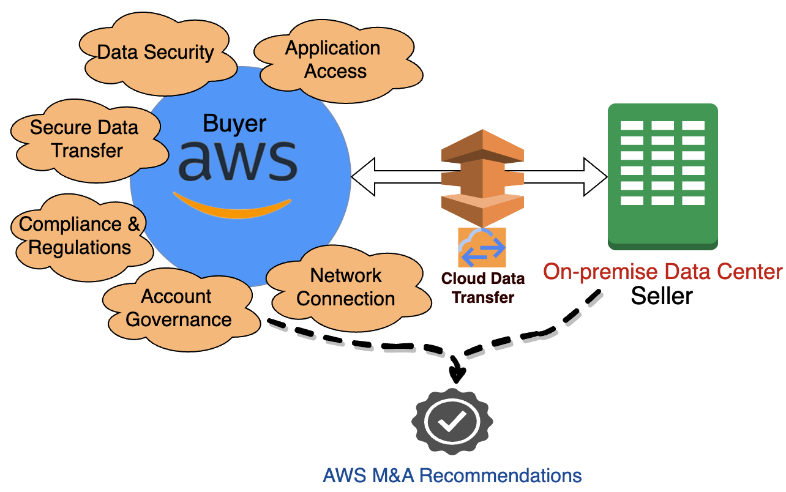
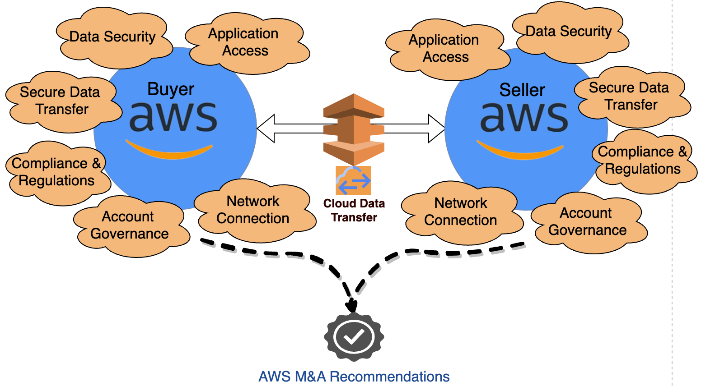

# Security

In mergers and acquisitions, the security pillar focuses on the
security capabilities that are required to protect the
application, identities, and data as they move between systems
during integration. It is important to assess the security posture
of the target organization and identify any gaps or
vulnerabilities that may exist. This includes a review of the
network infrastructure, applications, privileged access,
monitoring, protection of data, security policies and procedures.
There are several important security considerations during a
mergers and acquisitions integration:

1. **Protect sensitive data**:
   During mergers and acquisitions, sensitive data is exchanged
   between the companies, including intellectual property,
   customer data, financial information, and employee records. It
   is important to protect this data through encryption and
   access controls. Any data breach during this phase can have
   major consequences.
2. **Integrate security policies and
   controls:** The merging companies likely have
   different security policies, controls, and technologies in
   place. It is important to review these and integrate them into
   a consistent and comprehensive set of policies and controls
   that meet compliance and regulatory requirements for the
   combined organization.
3. **Assess risks from new network
   connections**: New network, system and devices
   connections are established between the companies during
   integration. It is important to assess the security risks from
   these new connections and set up proper controls (like
   firewall rules and vulnerability scanning). Ensure new
   processes are developed for threat detection and incident
   response mechanisms and breach notification. Ensure privacy
   preserving mechanisms and strong data governance is in place
   against unauthorized access.
4. **Train employees**: Employees
   need to be trained on the new integrated security policies,
   controls, and processes to ensure compliance. Phishing
   simulations and security awareness training are especially
   important to reduce risks from social engineering attacks
   during transition.
5. **Monitor closely**: Mergers
   and acquisitions integrations significantly expand attack
   surface and risks. It is critical to closely monitor and act
   on any critical security findings, like unauthorized access,
   potential credential leaks, violation of least privilege
   access, data breaches, and malware infections. Security
   operations teams need to be on high alert and ready to respond
   quickly to any issues.
6. **Include security in mergers and
   acquisitions planning**: Security needs to be part of
   the planning and integration process from the beginning.
   Waiting until after a deal is signed to involve security teams
   can expose both companies to risk. Security requirements and
   risks need to be evaluated before the deal, and a
   comprehensive security, privacy and compliance integration
   plan should be part of the overall mergers and acquisitions
   plan.

Best practices for data and application access, network
connectivity, and data security are critical to ensure privacy and
compliance for the combined organizations. This lens provides
security guidance on best practices like:

- Establish security standards across combined organization
- Secure network communication for application integration
  across companies
- Monitor, detect and protect against security vulnerabilities
  workloads across combined companies
- Establish mitigation process to respond and recover from
  security incidents
- Define process to ensure privacy compliance as per combined
  company requirement

_Figure 3: Security considerations for an AWS buyer and
on-premises seller_

Network connectivity is utmost to ensure data security and
optimize data transfer cost. Design secure, cost-optimized network
architecture using AWS services like AWS Direct Connect, AWS Transit Gateway, or AWS Site-to-Site VPN. We also recommend
securing workloads and protecting applications from security
attacks like DDoS, malware, and ransomware using AWS services.

_Figure 4: Security considerations for AWS to AWS mergers
and acquisitions_

In this scenario (as shown in Figure 4), customer should use AWS
technologies for integration. Both buyer and seller have adopted
AWS as their primary cloud provider. They need to establish secure
network communication between multiple AWS accounts that may be
within a single Region or between multiple Regions. AWS Organizations allows you to consolidate multiple AWS accounts into
a single organization. This can be beneficial for a number of
reasons, including:

- **Centralized management and
  governance:** Manage all AWS resources from a single
  console, making it easier to track and manage your spending,
  security, and compliance.
- **Security and compliance:** You
  can apply security policies and controls to all of your accounts
  from a single location, ensuring that your resources are protected
  and compliant with industry standards. You can easily securely
  share resources and services across multiple accounts, making it
  easier for your team to work together and collaborate on projects.
- **Cost savings:** By consolidating
  accounts, you can take advantage of bulk pricing discounts and
  optimize your resource usage to reduce costs.

One of the key challenges of integrating security systems and
controls from different organizations is the potential for
conflicts between different security policies and procedures. It
is important to identify and address these conflicts before they
become a problem. This may involve developing a unified security
policy that applies to all organizations, or it may involve
implementing AWS control tower that provides centralized
management and monitoring of security systems and controls.
Another challenge of integrating security systems and controls is
the potential for data breaches and other security incidents. It
is important to implement robust security measures, such as
encryption, firewalls, and intrusion detection and prevention
systems, to protect sensitive data and prevent unauthorized
access.

By developing a comprehensive plan for integration and
implementing robust security measures using
[AWS Cloud Adoption Framework](../../../whitepapers/latest/overview-aws-cloud-adoption-framework/security-perspective.md "../../../whitepapers/latest/overview-aws-cloud-adoption-framework/security-perspective.md") approach, companies can uncover
business requirements and securely integrate two disparate
companies. This helps minimize the security risks during
mergers and acquisitions and optimize overall integration time and cost.
