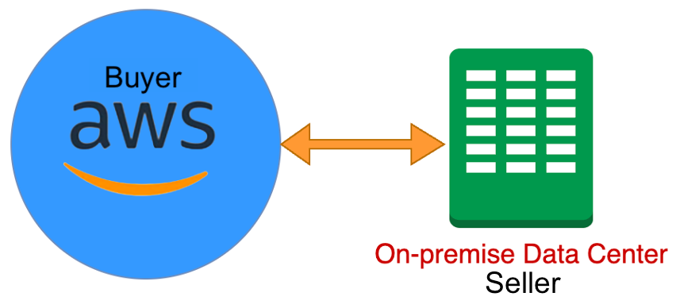
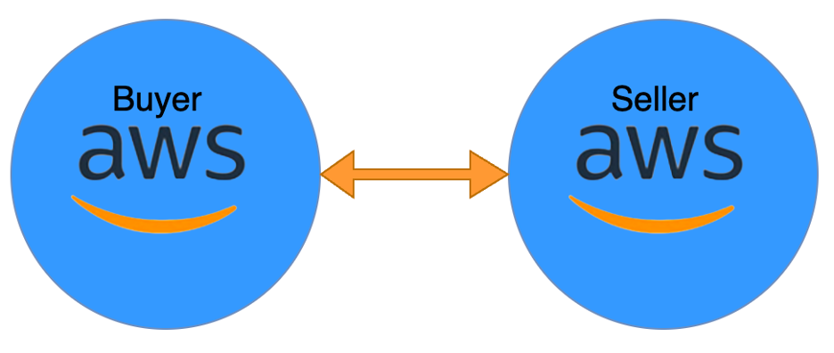
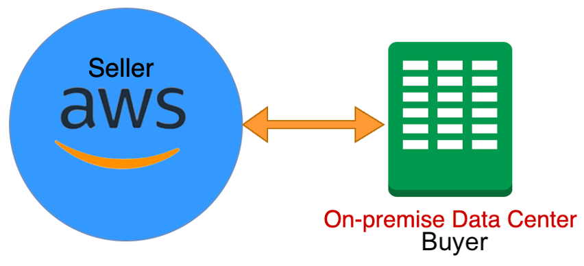

# Overview

This lens helps with workload discovery and analysis for migration
to AWS. We also provide a questionnaire to identify third-party
integrations and any impact they may have (like licensing) in case
of migration to AWS. This lens provides guidance on region
selection, data transfer cost, workload costs, and usage patterns,
as well as best practices for choosing saving plans for combined
organizations and setting up a common payer account for optimized
governance.

In this whitepaper, we focus on the following business integration scenarios. The Mergers and Acquisitions Lens provides guidance for each scenario based on the AWS Well-Architected Framework.

**Business integration scenario A**

The buyer's workloads are running on AWS, and the seller is either on-premises or on a different cloud provider.

**Business integration scenario B**

Both the buyer and seller are running on AWS.

**Business integration scenario C**

The buyer is running an on-premises data center, and the seller is running on AWS.

The following sections provide an overview of the lens guidance, as well as potential use case scenarios and architecture models.

###### Overview sections

- [Operational excellence](o-operational-excellence.md "o-operational-excellence.md")
- [Security](o-security.md "o-security.md")
- [Performance efficiency and reliability](o-performance-efficiency-and-reliability.md "o-performance-efficiency-and-reliability.md")
- [Cost optimization](o-cost-optimization.md "o-cost-optimization.md")
