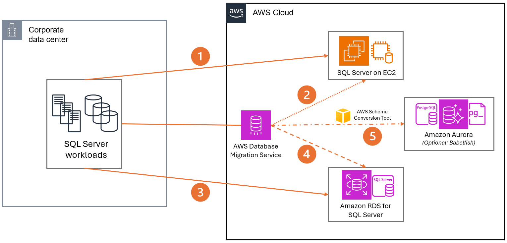

# Scenario 1: Microsoft SQL Server Migration to AWS

Organizations running business-critical SQL Server workloads often
face challenges with hardware lifecycle management, licensing
costs, and operational overhead. Migrating SQL Server to AWS
offers opportunities for improved scalability, reduced maintenance
burden, and potential cost savings through various deployment
options. This scenario covers approaches from lift-and-shift to
complete modernization, helping organizations choose the right
path based on their specific requirements.

## Characteristics

- Organizations are dealing with SQL Server workloads that are
  essential for business operations.
- Current challenges include managing hardware lifecycles, SQL
  Server licensing expenses, and operational maintenance.
- The scenario spans different migration approaches, from
  basic lift-and-shift to full modernization.
- The focus is on helping organizations select migration
  strategies based on their unique needs.

## Reference architecture

1. **Self-Managed SQL Server on
   EC2:** This approach transfers SQL Server workloads
   from on-premises servers to self-managed EC2 instances using
   native SQL Server tools or full server replication methods.
   It's ideal for organizations needing detailed control or
   preserving complex configurations. Migration options include
   database-level methods (for example, backup and restore, log shipping)
   or server-level replication using tools like AWS Application
   Migration Service.
2. **Self-Managed SQL Server on EC2 (AWS DMS):** This approach migrates SQL Server workloads
   from on-premises servers to self-managed EC2 instances using
   AWS Database Migration Service. DMS facilitates data
   migration and synchronization, offering a streamlined
   process for transferring database contents while minimizing
   downtime. It's suitable for organizations seeking a managed
   migration tool with replication capabilities.
3. **Amazon RDS for SQL Server (Windows
   Methods):** This strategy replatforms SQL Server
   workloads from on-premises servers to Amazon RDS using
   native SQL Server migration tools. Methods like
   backup/restore or log shipping are employed to transfer
   databases to the managed RDS environment, balancing familiar
   SQL Server native capabilities with the benefits of a
   managed service.
4. **Amazon RDS for SQL Server (AWS DMS):** This approach replatforms SQL Server
   workloads to Amazon RDS using AWS Database Migration Service. DMS manages data migration and synchronization from
   on-premises servers to RDS, combining the advantages of a
   managed migration process with the operational benefits of
   RDS for ongoing database management.
5. **Modernize to Amazon Aurora:** This path transforms SQL Server workloads
   to Amazon Aurora, leveraging AWS Schema Conversion Tool for
   schema conversion to PostgreSQL and AWS DMS for data
   migration. For applicable use cases, Babelfish for Aurora
   PostgreSQL can be employed to minimize application code
   changes, offering a balance between modernization and
   compatibility.

## Configuration notes

- Migrating to self-managed SQL Server on Amazon EC2 is often
  an effective strategy for projects with tight deadlines.
  This approach allows for a quick lift-and-shift migration
  while maintaining full control over the database
  environment. Depending on their existing licensing
  agreements, organizations can potentially reduce costs by
  using a bring your own license (BYOL) option, subject to
  Microsoft's licensing terms and conditions.
- Replatforming to Amazon RDS for SQL Server offers the
  benefits of a managed service without requiring changes to
  existing schema or application code. This option reduces
  operational overhead while maintaining SQL Server
  compatibility. For specific use cases requiring more
  control, Amazon RDS Custom for SQL Server allows a hybrid
  approach between fully-managed and self-managed services.
  Additionally, the Bring Your Own Media (BYOM) feature in RDS
  Custom can provide potential license cost savings for
  eligible customers.
- Modernizing to Amazon Aurora (or another purpose-built
  database service) typically yields the greatest long-term
  benefits. This approach frees organizations from SQL Server
  licensing constraints and allows them to fully use
  cloud-based, managed database services. While it may require
  more upfront effort for schema conversion and potential
  application changes, it often results in improved
  performance, scalability, and cost-effectiveness over time.
  The choice of target database (for example, Aurora
  PostgreSQL with Babelfish for SQL Server compatibility, or a
  completely different database type) should align with the
  organization's specific requirements and future technology
  strategy.
