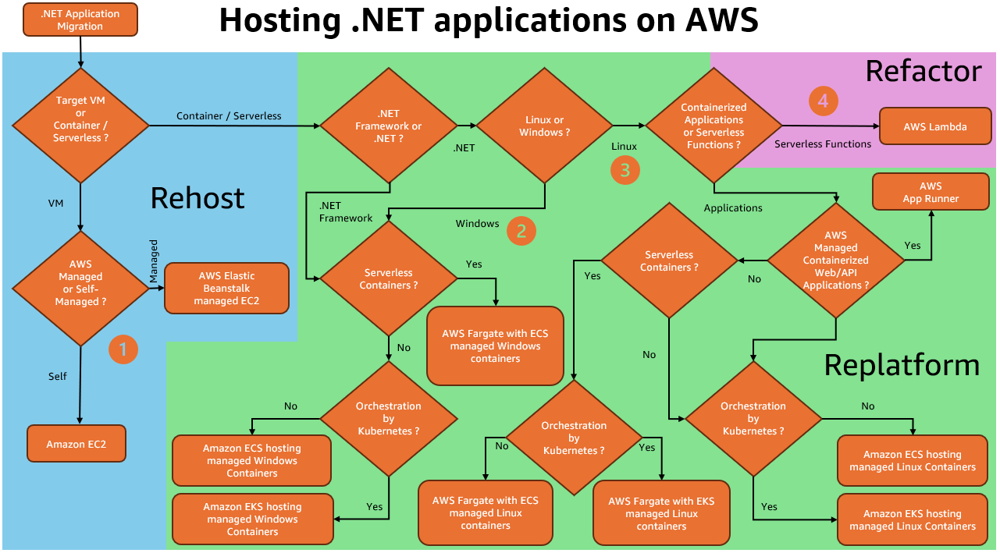

# Scenario 2: .NET Application Modernization on AWS

As organizations seek to modernize their legacy .NET applications,
AWS provides a comprehensive platform for transformation. This
scenario addresses the journey from traditional monolithic .NET
applications to cloud-based architectures, enabling organizations
to use modern development practices, improve scalability, and
reduce operational costs while maintaining familiarity with
Microsoft technologies.

## Characteristics

- **Development evolution:**
  Evolution from traditional .NET Framework monoliths to
  cloud-based .NET Core/6+ microservices, maintaining familiar
  Microsoft tooling while enabling modern development
  practices and improved team productivity.
- **Architectural
  transformation:** Shift from tightly-coupled
  monolithic architectures to loosely-coupled microservices,
  adopting API-first approaches and enabling independent
  service scaling and maintenance.
- **Infrastructure
  modernization:** Migration from on-premises Windows
  servers to container-based deployments on AWS, using
  infrastructure as code and automated deployment pipelines
  for improved operational efficiency.
- **Technology stack update:**
  Comprehensive modernization of the technology stack,
  including runtime (.NET Framework to .NET Core/6+),
  databases, authentication, storage, and monitoring solutions
  to align with cloud-based capabilities.
- **Business benefits:**
  Achievement of tangible business outcomes including reduced
  operational costs, faster deployment cycles, improved
  scalability, enhanced innovation capabilities, and
  simplified maintenance processes.

## Reference architecture

This .NET hosting decision guide helps customers choose the best
AWS service for their applications based on their specific
requirements, whether they need full control, simplified
management, or zero infrastructure overhead. This flowchart
considers factors such as development team expertise,
operational preferences, and application characteristics to
recommend the most suitable hosting option on AWS:

1. Rehost .NET Framework or cross-platform .NET to AWS (Windows
   or Linux-based)
   - **Managed service:** AWS Elastic Beanstalk
   - **Self-managed:** Amazon Elastic Compute Cloud (EC2)

2. Replatform .NET Framework or cross-platform .NET to AWS
   (Windows-based)
   - **Serverless
     containers:** AWS Fargate with Amazon Elastic Container Service (ECS)
   - **AWS containers
     orchestration:** Amazon Elastic Container Service (ECS)
   - **Kubernetes
     orchestration:** Amazon Elastic Kubernetes Service (EKS)

3. Replatform cross-platform .NET to AWS (Linux-based)
   - **AWS serverless
     containers:** AWS Fargate with Amazon Elastic Container Service (ECS)
   - **Kubernetes serverless
     containers:** AWS Fargate with Amazon Elastic Kubernetes Service (EKS)
   - **AWS containers
     orchestration:** Amazon Elastic Container Service (ECS)
   - **Kubernetes
     orchestration:** Amazon Elastic Kubernetes Service (EKS)
   - **AWS fully-managed
     containers:** AWS App Runner

4. Refactor cross-platform .NET to AWS (Linux-based)
   - **Serverless functions:**
     AWS Lambda

## Configuration notes

- **EC2 Windows Server
  configuration:** Best suited for legacy
  applications requiring full control or specific Windows
  Server features. Implement across multiple Availability
  Zones using Auto Scaling groups, configure Systems Manager
  for automated patching and management, and use Amazon CloudWatch Application Insights for .NET-specific
  monitoring. Common challenges include licensing optimization
  and Windows authentication - address through proper instance
  sizing and Active Directory integration. Security involves
  network ACLs, security groups, and regular vulnerability
  assessments.
- **Elastic Beanstalk implementation
  strategy:** A managed service ideal for traditional
  .NET applications requiring minimal infrastructure
  management. Best suited for organizations starting their
  cloud journey. Implement with blue-green deployments for
  zero-downtime updates, configure enhanced health monitoring,
  and use environment variables for configuration management.
  Common challenges include deployment timeouts and Windows
  updates, which can be addressed through appropriate capacity
  planning and maintenance windows. Security is managed
  through security groups and IAM roles.
- **Container services approach (Amazon ECS or Amazon EKS):** Recommended for microservices
  architectures and modern .NET applications. Amazon ECS
  offers simpler management while Amazon EKS provides broader
  orchestration capabilities. Implement service mesh for
  inter-service communication, use AWS Secrets Manager for
  sensitive data, and configure auto scaling based on
  application metrics. Key considerations include container
  image security scanning, network segmentation, and proper
  task sizing. Troubleshoot using CloudWatch Container
  Insights and AWS X-Ray.
- **Serverless architecture
  pattern:** Optimal for event-driven workloads and
  APIs. Lambda with .NET requires careful attention to cold
  starts and memory allocation. Implement API Gateway with
  custom authorizers, use Step Functions for complex
  workflows, and configure dead-letter queues for error
  handling. Security focuses on IAM roles and API
  authentication. Monitor execution times and memory usage to
  optimize cost and performance.
