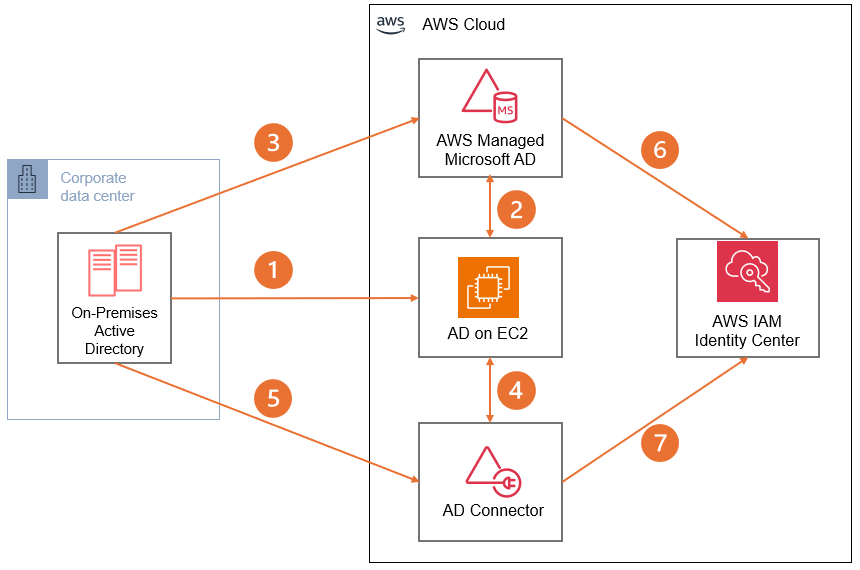

# Scenario 3: Active Directory integration with AWS

For organizations heavily invested in Microsoft Active Directory,
extending their identity and access management to AWS is crucial
for maintaining security and operational consistency. This
scenario outlines how to create a holistic identity management
experience across on-premises and AWS environments, enabling
single sign-on and unified access controls.

## Characteristics

- **Identity integration:**
  Extension of on-premises Active Directory to AWS through Directory Service options (AWS Managed Microsoft AD or AD
  Connector), enabling consistent identity management across
  hybrid environments.
- **Authentication framework:**
  Implementation of unified authentication mechanisms allowing
  users to access both on-premises and AWS resources with
  existing AD credentials, supporting single sign-on (SSO)
  capabilities through AWS IAM Identity Center.
- **Access control strategy:**
  Centralized management of security policies and access
  permissions, using existing AD groups and security policies
  while integrating with AWS IAM roles and policies for cloud
  resource access.

## Reference architecture

1. Self-managed Active Directory on EC2 is a common approach
   for organizations needing full control over their AD
   infrastructure. This brings authentication and authorization
   closer to AWS workloads, addressing network and security
   requirements effectively.
2. Extending self-managed AD on EC2 to Directory Services
   can be achieved by creating a trust with AWS Managed
   Microsoft Active Directory. This enables AWS services
   reliant on Managed AD to use the existing self-managed AD
   identity source.
3. Alternatively, a trust between on-premises AD and AWS
   Managed AD can be established using VPN or Direct Connect,
   meeting specific networking and security needs. This also
   opens the possibility of migrating the entire forest to AWS
   Managed AD, potentially decommissioning self-managed AD.
4. AD Connector serves as a simple gateway solution for
   extending self-managed AD running on EC2 to AWS services,
   offering an alternative integration approach.
5. For on-premises scenarios, AD Connector can also be utilized
   over a secure VPN or Direct Connect connection, providing
   flexibility in network design.
6. AWS IAM Identity Center can integrate with AWS Managed AD as
   an identity source, with the capability to expand to
   multiple self-managed AD forests or domains if required.
7. Alternatively, AD Connector can be used to connect
   self-managed AD as the identity source for AWS IAM Identity Center, though this is limited to one forest or domain.

## Configuration notes

- **Self-managed AD
  infrastructure:** When implementing AD on EC2,
  deploy Domain Controllers across multiple Availability Zones
  for high availability. Configure security groups to allow
  only necessary AD ports, implement appropriate site-to-site
  replication, and use AWS Backup for automated system state
  backups. Common challenges include DNS configuration and
  replication latency, which are addressed through proper
  subnet design and monitoring. Set up CloudWatch alerts for
  DC health and performance metrics.
- **AWS managed Microsoft AD
  integration:** Establish two-way trust
  relationships with appropriate security filtering. Configure
  DNS conditional forwarders between environments, implement
  selective authentication if needed, and use AWS Managed Microsoft AD delegated administration. Key considerations
  include password policies synchronization and Group Policy
  Object strategy. Monitor trust health through Directory Service console and CloudWatch metrics.
- **Network connectivity
  configuration:** Design redundant connectivity
  using both AWS Direct Connect and VPN as backup. Implement
  appropriate route tables and network ACLs, maintain proper
  DNS resolution between networks, and configure bandwidth
  allocation for AD traffic. Common issues include asymmetric
  routing and DNS resolution failures, which can be resolved
  through proper route configuration and DNS forwarding setup.
- **Identity Center and SSO
  setup:** Configure AWS IAM Identity Center with
  appropriate directory integration (either Managed AD or AD
  Connector). Implement attribute-based access control (ABAC)
  using AD group membership, set up permission sets aligned
  with security policies, and establish user portal access.
  Monitor authentication failures and implement appropriate
  remediation processes for access issues.
