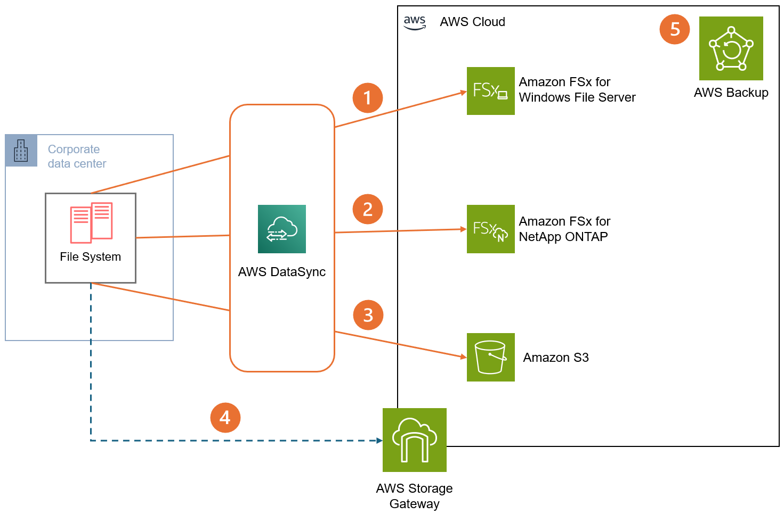

# Scenario 4: Windows server and file services migration

Many organizations struggle with growing file storage needs,
backup complications, and the management overhead of traditional
Windows file servers. This scenario demonstrates how to modernize
Windows-based file services using AWS services, providing better
scalability, availability, and reduced operational complexity
while maintaining compatibility with existing Windows-based
workflows.

## Characteristics

- **Storage architecture
  evolution:** Transformation from traditional
  Windows file servers to cloud-based solutions like Amazon FSx for Windows File Server or Amazon FSx for NetApp ONTAP,
  providing Windows compatibility while using AWS's
  scalability and availability.
- **Backup modernization:**
  Replacement of traditional backup systems with AWS backup
  solutions, enabling automated, consistent backup policies,
  simplified recovery processes, and integration with existing
  backup retention requirements.
- **Access control
  integration:** Preservation of existing NTFS
  permissions and Active Directory integration while
  implementing AWS security features, improving the user
  experience and maintaining security requirements.
- **Operational efficiency:**
  Reduction in management overhead through AWS managed
  services, automated maintenance, patching, and monitoring,
  while maintaining familiar Windows administrative tools and
  processes.

## Reference architecture

1. **Amazon FSx for Windows File Server:** This managed service offers a Windows
   file system experience in AWS. Configure it to join your
   Active Directory for authentication and access control.
   Implement appropriate file share permissions and NTFS ACLs.
   Use AWS DataSync for efficient data migration from
   on-premises systems.
2. **Amazon FSx for NetApp ONTAP:** Use this versatile managed file system for
   both SMB and NFS access, with added iSCSI support for
   Windows environments. Configure AD integration for
   authentication and implement appropriate export policies and
   NTFS permissions.
3. **Amazon S3 for cold
   storage:** While usually not suitable for primary
   Windows file systems, Amazon S3 is excellent for cold
   storage in Windows environments. Implement S3 Lifecycle
   policies to automatically transition data to lower-cost
   storage classes.
4. **AWS Storage Gateway (Volume
   Gateway):** Use Volume Gateway for hybrid cloud
   storage with local caching. Configure in cache mode for
   frequently accessed data or stored mode for full local
   copies. Implement appropriate iSCSI initiator configurations
   on Windows servers and use Chap authentication for enhanced
   security.
5. **Backup and recovery
   strategy:** Use the default daily backups for FSx
   services and extend with AWS Backup for a comprehensive
   strategy. Configure backup plans with appropriate retention
   policies and implement cross-region backup copies for
   disaster recovery.

## Configuration notes

- **FSx implementation
  strategy:** Configure FSx for Windows File Server
  with Multi-AZ deployment for high availability. Size storage
  and throughput based on performance analysis of existing
  file servers. Implement DFS namespaces for transparent
  client access and potential migration phases. Common
  challenges include DNS resolution and permission migration,
  addressed through proper DNS configuration and data
  replication. Monitor performance through CloudWatch metrics,
  focusing on storage capacity, IOPS, and throughput. Security
  implementation should include encryption at rest using KMS
  keys, in-transit encryption, and regular security audits of
  share permissions.
- **Migration and data transfer
  framework:** Establish a structured migration
  approach using AWS DataSync with appropriate bandwidth
  throttling. Create detailed inventory of shares,
  permissions, and DFS configurations before migration.
  Implement staged migration starting with smaller,
  non-critical shares. Common issues include network
  throttling and permission mapping, addressed through
  appropriate scheduling and thorough testing. Monitor
  migration progress using DataSync metrics and implement
  verification procedures.
- **Backup and recovery
  architecture:** Design comprehensive backup
  strategy using AWS Backup with appropriate retention
  policies. Implement daily backups with custom schedules for
  critical shares. Configure cross-region backup copies for
  disaster recovery scenarios. Common challenges include
  backup window management and restoration testing, addressed
  through appropriate scheduling and regular DR exercises.
  Monitor backup success rates and storage costs through AWS Backup reports. Implement automated cleanup of old backups
  based on retention policies.
