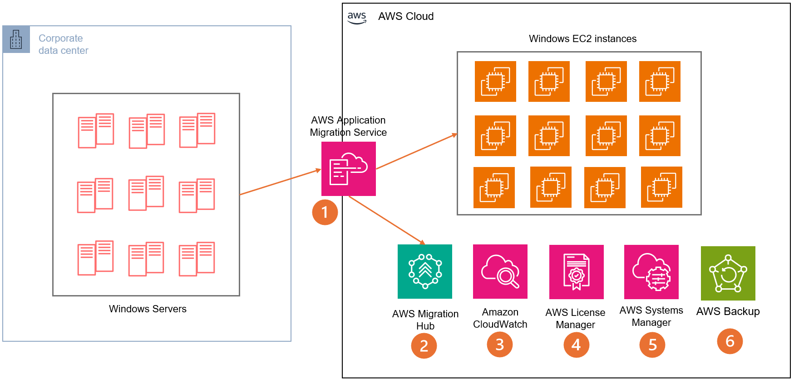

# Scenario 5: Windows-based infrastructure modernization

As Windows Server workloads approach end-of-support or hardware
refresh cycles, organizations need a strategic approach to
infrastructure modernization. This scenario provides a framework
for assessing, migrating, and optimizing Windows workloads on AWS,
enabling automated management, improved security, and operational
efficiency while maximizing existing Microsoft investments.

## Characteristics

- **Lifecycle management:**
  Strategic approach to Windows Server modernization focusing
  on end-of-support deadlines and hardware refresh cycles,
  incorporating assessment tools and migration planning to
  optimize timing and resource allocation.
- **Migration strategy:**
  Systematic workload evaluation and migration approach using
  tools like AWS Application Migration Service (MGN) and AWS
  Migration Hub, enabling both migration and modernization
  paths based on workload requirements.
- **Infrastructure
  optimization:** Implementation of AWS automation
  for Windows Server management, including patching (AWS Systems Manager), monitoring (Amazon CloudWatch), and
  infrastructure provisioning (AWS CloudFormation), reducing
  operational overhead.
- **Security enhancement:**
  Integration of AWS security services with Windows Server
  security features, implementing improved access controls,
  network security, and compliance monitoring while
  maintaining existing security policies.
- **Cost management:**
  Optimization of Windows Server licensing and infrastructure
  costs through right-sizing, automation, and AWS pricing
  models (Reserve Instances, Savings Plans), while using
  existing Microsoft licensing benefits like BYOL.

## Reference architecture

1. AWS Application Migration Service (MGN) facilitates
   block-level migration to Amazon EC2. It allows
   synchronization and transition of servers to EC2, regardless
   of their original location (on-premises or elsewhere).
2. AWS Migration Hub serves as a centralized platform for
   efficiently planning and managing your migration process,
   offering a comprehensive overview of your migration
   projects.
3. Amazon CloudWatch provides robust monitoring capabilities
   for Windows-based servers and workloads, enabling real-time
   tracking and analysis of performance metrics.
4. AWS License Manager streamlines the management of
   third-party licenses, helping organizations maintain
   adherence and optimize license utilization across their AWS
   environment.
5. AWS Systems Manager automates various aspects of operating
   system management, including but not limited to inventory
   tracking, patching, and other essential maintenance tasks,
   enhancing operational efficiency.
6. AWS Backup provides centralized protection for Windows-based
   workloads by automating backup processes, enabling
   consistent data protection, and offering secure storage of
   backups across multiple AWS services and resources.

## Configuration notes

- **Initial assessment and
  planning:** Establish migration readiness using AWS
  Migration Evaluator, Migration Hub, and Application
  Discovery Service. Implement security best practices and
  define migration waves based on deadlines, dependencies, and
  compliance. Troubleshoot by monitoring agent health and
  reviewing logs.
- **Migration setup and
  execution:** Use AWS Application Migration Service
  for workload migration. Configure replication settings and
  prepare the target environment. Test with non-production
  workloads first. Monitor replication lag and network
  throughput, and verify connectivity for troubleshooting.
- **Monitoring and management
  configuration:** Set up CloudWatch for performance
  metrics, Systems Manager for patch management, and License Manager for tracking. Implement security controls, use
  parameter store for configurations, and enable audit
  logging. Configure backup and recovery procedures for
  comprehensive system management.
- **Cost optimization and
  compliance:** Optimize costs and maintain adherence
  using License Manager, Cost Explorer, and budget alerts.
  Implement auto scaling and scheduled resource management.
  Regularly review instance sizing and conduct compliance
  assessments. Establish procedures for license consolidation
  and non-compliance responses.
- Configure AWS Backup to provide centralized data protection
  for Windows workloads across AWS services. Set up backup
  policies with appropriate retention periods and scheduling.
  Implement automated backup monitoring through CloudWatch and
  establish recovery time objectives (RTOs). Regular backup
  testing and validation maintains business continuity and
  disaster recovery readiness.
