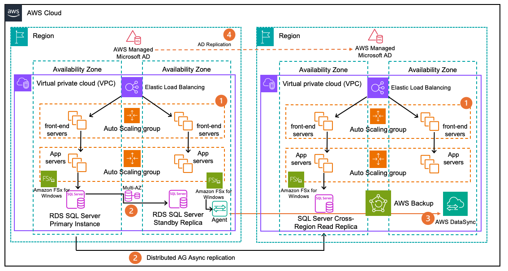

# Scenario 6: High availability and disaster recovery for Windows workloads on AWS

## Characteristics

- Need to maintain critical Windows-based services highly
  available with minimal downtime.
- Requirements for rapid recovery in the event of disasters
  (like natural disasters or infrastructure failures).
- Regulatory needs around Recovery Point Objective (RPO) and
  Recovery Time Objective (RTO).

## Reference architecture

1. Multi-AZ deployment of Windows Servers using Amazon EC2:
   - Auto Scaling groups for automatic scaling and
     replacement.
   - Use of Amazon FSx for Windows File Server or Amazon EFS
     for shared storage.
   - Implement Windows Server Failover Clustering for
     application-level high availability (HA).

2. Database high availability with Amazon RDS for SQL Server:
   - Multi-AZ deployment for automatic failover.
   - Use RDS SQL Server cross-Region read replica hosted in a
     different AWS Region.
   - Use of Amazon S3 and AWS Backup for offsite backups.

3. Cross-Region data replication using AWS DataSync:
   - Replicate file shares, databases, and other critical
     data to secondary AWS Region.
   - Use RPO-based scheduling and throttling for optimal
     performance.

4. Multi-Region Active Directory replication:
   - Enables AD Multi-Region replicas to keep AuthN and AuthZ
     during failovers.

5. Automated failover and recovery using AWS Systems Manager
   and AWS Lambda:
   - Define recovery plans and runbooks for easier failover.
   - Implement CloudWatch alarms and automated remediation
     workflows.
   - Regularly test failover procedures and validate RTO and
     RPO.

## Configuration notes

- **EC2 instance design:** Size
  instances appropriately based on workload requirements. Use
  Instance Metadata Service and Systems Manager for automatic
  configuration. Implement security best practices like JIT
  access, Network ACLs, and Security Groups.
- **FSx and EFS
  configuration:** Enable Multi-AZ deployment and
  configure replication settings. Implement NTFS permissions
  and access control integration with AD. Monitor capacity,
  throughput, and latency using Amazon CloudWatch.
- **SQL Server HA on RDS:**
  Configure backup retention, point-in-time recovery, and
  automated backups. Implement cross-Region read replicas for
  geographic redundancy. Use AWS DMS for efficient data
  migration and replication.
- **Disaster recovery
  orchestration:** Define recovery time and point
  objectives (RTO and RPO) based on business requirements.
  Automate failover processes using AWS Systems Manager
  Runbooks and AWS Lambda. Implement alerting, monitoring, and
  regular DR testing procedures.
