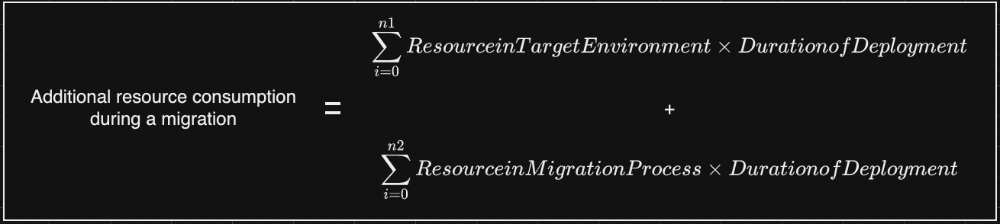

# Migrate

In the migrate phase, we ensure the migration proceeds as planned,
monitor the migration process, and have a plan in place to
rollback in case any issue encountered during the migration.
During migration, you can scale your resources corresponding to
the volume of data to be migrated. Furthermore, you can adopt best
practices that can reduce interim resource consumption during your
migration.

| MIG-SUS-07: Does your on-premises to AWS data migration strategy consider sustainability? |
| ----------------------------------------------------------------------------------------- |
|                                                                                           |

Data makes up the large portion of the scope of many workload
migrations. Identifying and optimizing the data storage with
latest technologies helps improve the power efficiency and
reduce carbon footprint.

## MIG-SUS-BP-7.1: Implement data management practices

This BP applies to the following best practice areas: Data

Data management is a continuous process and should be implemented during and after the migration. With the latest storage technologies, it provides the opportunity to configure and provision sufficient storage without compromising the business needs.

### Implementation guidance

**Suggestion 7.1.1**: Avoid
over-provisioning for storage system to influence your
environmental impact.

- Perform application discovery to identify data
  characteristics and access patterns that can be
  supported by storage technology.
- You can use shared file systems or storage that allows
  for sharing data to one or more consumers without having
  to copy the data. For example, you can have a shared
  drive to store common files instead of copying those
  common files to each VM.
- After migrating the workload, from time to time, analyze
  data access and date movement to identify opportunities
  to become more efficient. When opportunities are found,
  change the lifecycle by moving to other storage classes
  or deleting unneeded data.
- Use technologies that support data access and storage
  patterns. For example, migrating data to other object
  storage types eliminates provisioning the excess
  capacity from fixed volume sizes on block storage. For
  more detail, see
  [SUS04-BP02
  Use technologies that support data access and storage
  patterns](../sustainability-pillar/sus_sus_data_a3.md "../sustainability-pillar/sus_sus_data_a3.md").

**Suggestion 7.1.2**: As part
of your per-migration planning evaluate your current
[recovery
time objective (RTO) and recovery point objective
(RPO](../reliability-pillar/rel_planning_for_recovery_objective_defined_recovery.md "../reliability-pillar/rel_planning_for_recovery_objective_defined_recovery.md")).

- Design your backup strategy based on your actual
  business requirements. Avoid backing up non-critical
  data that has no business value, and detach volumes from
  clients that are not used before considering to migrate
  those workloads. For more detail, see
  [SUS04-BP08
  Back up data only when difficult to recreate](../sustainability-pillar/sus_sus_data_a9.md "../sustainability-pillar/sus_sus_data_a9.md").
- Use an automated solution or managed service to back up
  business-critical data.
  [AWS Backup](../../../aws-backup/latest/devguide/whatisbackup.md "../../../aws-backup/latest/devguide/whatisbackup.md") is a fully-managed service that
  makes it easy to centralize and automate data protection
  across AWS services, in the cloud, and on-premises. Next
  to other capabilities, AWS Backup helps you become more
  sustainable. For example, you can use Backup to set an
  expiration on your manual snapshots.
- Set automated lifecycle policies to enforce lifecycle
  rules for the migrated data. For more detail, see
  [SUS04-BP03
  Use policies to manage the lifecycle of your
  datasets](../sustainability-pillar/sus_sus_data_a4.md "../sustainability-pillar/sus_sus_data_a4.md").
- If you are setting up disaster recovery for your
  migrating workload, evaluate your RTO and RPO, and see
  if you could meet the requirement using the backup data
  instead of replicating the entire data to the recovery
  site. For more detail, see
  [AWS Elastic Disaster Recovery](https://aws.amazon.com/de/disaster-recovery/ "https://aws.amazon.com/de/disaster-recovery/").

**Suggestion 7.1.3:** Choose
the right migration tool, and scale your resources
corresponding to the volume of data to be migrated.

- AWS provides migration services like
  [AWS Database Migration Service](https://aws.amazon.com/dms/ "https://aws.amazon.com/dms/") and

[AWS Application Migration Service](https://aws.amazon.com/application-migration-service/ "https://aws.amazon.com/application-migration-service/"). You may
be able to scale down the replication instance type
selected if the amount and velocity of the ongoing data
is much smaller than the amount of historical data.

- Another alternative is to use a serverless migration
  tool like
  [AWS DMS Serverless](https://aws.amazon.com/blogs/aws/new-aws-dms-serverless-automatically-provisions-and-scales-capacity-for-migration-and-data-replication/ "https://aws.amazon.com/blogs/aws/new-aws-dms-serverless-automatically-provisions-and-scales-capacity-for-migration-and-data-replication/").
- Here are some other options to choose from to migrate
  your storage with their key characteristics.

| Migrate your storage                                                                                             | Key Characteristic                                                                                                                                                                                                                                                                                                                                                                                     |
| ---------------------------------------------------------------------------------------------------------------- | ------------------------------------------------------------------------------------------------------------------------------------------------------------------------------------------------------------------------------------------------------------------------------------------------------------------------------------------------------------------------------------------------------ |
| [AWS DataSync](https://aws.amazon.com/datasync/ "https://aws.amazon.com/datasync/")                              | Simplify, automate, and accelerate data movement to and from AWS Storage, as well as between AWS Storage. Easily manage data movement workloads with bandwidth throttling, migration scheduling, task filtering, and task reporting with a fully managed service that seamlessly scales as data loads increase.                                                                      |
| [AWS Transfer Family](https://aws.amazon.com/aws-transfer-family/ "https://aws.amazon.com/aws-transfer-family/") | Simply and seamlessly move your files to Amazon S3 and Amazon Elastic File System (Amazon EFS) using SFTP, FTPS and FTP protocol. Store information in Amazon S3 or Amazon EFS, manage workflows, and initiate automated, event-driven tasks with a fully-managed, low-code service. Quickly scale your business-to-business (B2B) file transfers for each line-of-business user. |
| [AWS Snow Family](https://aws.amazon.com/snow/ "https://aws.amazon.com/snow/")                                   | Collect and process data at the edge, and migrate data into and out of AWS through physical devices and capacity points. Device options range to optimize for space • or weight-constrained environments, portability, and flexible networking options.                                                                                                                              |

For more detail, see the following:

- [Data lifecycle management](../../../whitepapers/latest/best-practices-building-data-lake-for-games/data-lifecycle-management.md "../../../whitepapers/latest/best-practices-building-data-lake-for-games/data-lifecycle-management.md")
- [Amazon S3 Intelligent-Tiering](../../../AmazonS3/latest/userguide/intelligent-tiering.md "../../../AmazonS3/latest/userguide/intelligent-tiering.md")
- [I/O characteristics and monitoring](../../../AWSEC2/latest/WindowsGuide/ebs-io-characteristics.md "../../../AWSEC2/latest/WindowsGuide/ebs-io-characteristics.md")
- [Optimizing your AWS Infrastructure for Sustainability, Part III: Networking](https://aws.amazon.com/blogs/architecture/optimizing-your-aws-infrastructure-for-sustainability-part-iii-networking/ "https://aws.amazon.com/blogs/architecture/optimizing-your-aws-infrastructure-for-sustainability-part-iii-networking/")
- [Top 10 Data Migration Best Practices](https://pages.awscloud.com/rs/112-TZM-766/images/2020_0124-STG_Slide-Deck.pdf "https://pages.awscloud.com/rs/112-TZM-766/images/2020_0124-STG_Slide-Deck.pdf")
- [AWS Summit SF 2022 - Optimizing your AWS infrastructure for sustainability](https://www.youtube.com/watch?v=9WJv2re6hlE "https://www.youtube.com/watch?v=9WJv2re6hlE")
- [Amazon EBS and Snapshot Optimization Strategies for Better Performance and Cost Savings](https://www.youtube.com/watch?v=h1hzRCsJefs "https://www.youtube.com/watch?v=h1hzRCsJefs")

| MIG-SUS-08: Are you adopting practices that can reduce interim resource consumption during the migration? |
| --------------------------------------------------------------------------------------------------------- |
|                                                                                                           |

During a migration, your consumption of resources may increase due to the provisioning of resources in both the source and target environments. The increase in consumption is often referred to as a _double bubble_. In addition, your consumption may also increase due to provisioning of migration resources, such as the networking between your source and target environments, SFTP servers, AWS Application Migration Service (MGN), or AWS Database Migration Service (DMS).

_Typical migration process flow_

You can reduce the resource consumption during the migration either by reducing the resources deployed or by reducing the duration of their deployment.

_Additional resource consumption equation_

## MIG-SUS-BP-8.1: Adopt methods that can reduce interim resource consumption during the migration

This BP applies to the following best practice areas: Process
and culture

### Implementation guidance

**Suggestion 8.1.1**: Reduce
interim resources created in the target environment.

- Reconsider the migration of development and other
  non-production environments, as these can be rebuilt
  when required in AWS. If you decide on migrating your
  non-production environments, revisit the portions of the
  environment that need to be migrated. For example, you
  may choose to migrate only some of the databases in a
  database server.
- If you decide to migrate your build environment,
  [increase
  the utilization of these environments](../sustainability-pillar/sus_sus_dev_a4.md "../sustainability-pillar/sus_sus_dev_a4.md").
- [Use
  managed device farms to test](../sustainability-pillar/sus_sus_dev_a5.md "../sustainability-pillar/sus_sus_dev_a5.md") new
  features on a representative set of hardware.
- During the migration, consider the impact on
  sustainability of day-to-day operations. For example,
  consider avoiding frequent backups of the target
  environment and setting up HA or DR during the
  migration. You can also reduce the retention period of
  logs or backup snapshots taken during the migration.

**Suggestion 8.1.2**: Reduce
interim resources used in the migration process.

- During a migration, you typically have to migrate
  historical and on-going data. Historical data refers to
  the data that was created prior to the start of the
  migration. On-going data refers to the new data that is
  generated in the source environment at the time of the
  migration until the cutover. The resource needs for the
  migration of historical data may differ from that of the
  on-going data. Choose the right migration process and
  tool, and also scale your resources corresponding to the
  data to be migrated. For example, in the case of AWS DMS
  and AWS MGN, you may be able to scale down the
  replication instance type selected if the volume and
  velocity of the ongoing data is significantly less to
  volume of historical data. Another alternative is to use
  a serverless migration tool like
  [AWS DMS Serverless](https://aws.amazon.com/blogs/aws/new-aws-dms-serverless-automatically-provisions-and-scales-capacity-for-migration-and-data-replication/ "https://aws.amazon.com/blogs/aws/new-aws-dms-serverless-automatically-provisions-and-scales-capacity-for-migration-and-data-replication/") that can automatically
  scale based on the volume of data being migrated.
- Share your migration resources if possible. Some
  migration tools let you share migration resources. An
  example of this is AWS MGN, which automatically shares
  the replication instance with multiple source servers
  being migrated.
- For migration resources that cannot be scaled easily,
  such as the networking resources between your data
  center and AWS Cloud, consider
  [flattening
  the demand curve](../sustainability-pillar/sus_sus_user_a7.md "../sustainability-pillar/sus_sus_user_a7.md") using buffering and
  throttling to reduce the required provisioned capacity
  for the workload. For example, you can throttle your
  network in AWS MGN when migrating your servers to AWS.
- Review the need to include migration resources in your
  day-to-day operations. For example, avoid including AWS
  MGN replication servers in your backup strategy. If you
  are capturing logs for migration resources, you can
  consider reducing the retention period for these logs.

**Suggestion 8.1.3**: Reduce
duration of deployment for the interim resources created
during the migration.

- Consider selecting a partner who has the technical
  expertise and experience migrating to AWS
- Create a cross-functional
  [cloud-enablement
  team](https://d1.awsstatic.com/whitepapers/cloud-enablement-engine-practical-guide.pdf "https://d1.awsstatic.com/whitepapers/cloud-enablement-engine-practical-guide.pdf") to implement the governance, best
  practices, training, and architecture needed for cloud
  adoption. The team will define tools, processes, and
  architectures that establish the organizations cloud
  operating model. In addition, it will coordinate with
  stakeholders across different units such as
  infrastructure, security, applications, and business to
  alleviate obstacles in a migration.
- Explore tooling that can facilitate your migration and
  can automate and expedite aspects of the migration such
  as discovery, project management, and testing.
- Train staff on tools and processes early in the
  migration to give them the required skillset.
- Build a robust migration factory consisting of people,
  tools, and processes that help streamline your
  migration. Operate in an agile fashion increases the
  velocity of the applications being moved to AWS.
- Assess the application to be migrated and satisfy all
  prerequisites a few weeks prior to the migration.
- Start small to build experience, find patterns, and
  create blueprints. Prioritize workloads and run the
  migration in waves with short migration cycles. Create
  reusable blueprints for common workload patterns that
  increase the velocity of the migration. Empower your
  team to automate the migration steps.

For more detail, see the following:

- [Strategy and best practices for AWS large migrations](../../../prescriptive-guidance/latest/strategy-large-scale-migrations/welcome.md "../../../prescriptive-guidance/latest/strategy-large-scale-migrations/welcome.md")
- [A beginners' guide for Finance and Operations teams in their cloud migration journey](https://aws.amazon.com/blogs/mt/a-beginners-guide-for-finance-and-operations-teams-in-their-cloud-migration-journey/ "https://aws.amazon.com/blogs/mt/a-beginners-guide-for-finance-and-operations-teams-in-their-cloud-migration-journey/")
