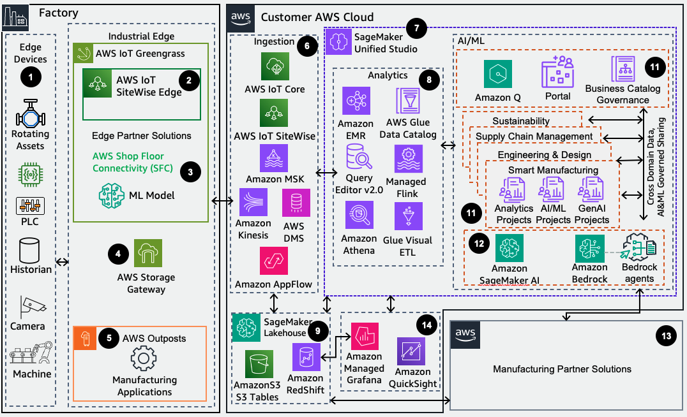

# MFGSCE1: Modern Industrial Data Architecture (MIDA)

AWS industrial customers serving multiple industries have production facilities across
the globe. They generate massive amounts of data from the various industrial machines,
sensors, and equipment on their factory floors. This includes real-time telemetry data on
equipment performance, quality control measurements, maintenance logs, and supply chain
information.

In the past, this data was siloed across disparate systems and locations, making it
extremely challenging for the manufacturer to gain a unified view of their operations.
Engineers and analysts struggled to access the data they needed to drive process
improvements, predict equipment failures, and optimize production. The lack of a cohesive
data strategy hindered the manufacturer's ability to make informed, data-driven decisions
and stay competitive.

MIDA by AWS services and ISV Industrial DataOps solutions address this problem. MIDA
helps customers break down data silos while preserving their investments in purpose-built
data stores. It creates an integrated environment of data lakes, data warehouses, and other
specialized data stores, while enabling unified governance and seamless data movement across
the architecture.

## Core architectural characteristics

The well-architected MIDA supports the following characteristics.

**Performance and scalability:** The architecture should
deliver high-performance data management capabilities that scale with manufacturing
operations:

- Efficient ingestion and storage of petabyte-scale industrial data
- Support for billions of daily sensor readings and machine values
- Seamless scaling from single-plant pilots to multi-site deployments
- Cost-effective storage and processing optimization

**Data services and integration:** MIDA should implement
purpose-built services to meet diverse manufacturing requirements:

- Real-time monitoring through streaming analytics and time-series databases
- Regulatory compliance through secure data warehousing
- Integration with standard industrial protocols (MQTT, OPC-UA)
- Support for open data formats like Parquet

**Operational architecture:** The framework must provide
reliable operations across distributed manufacturing environments:

- Hybrid edge-cloud deployment for mission-critical operations
- High availability and local processing at the edge
- Flexible data movement patterns (inside-out, outside-in, perimeter)
- Decoupled storage and compute for optimal resource utilization

**Security and governance:** MIDA must have built-in controls
for data integrity and compliance:

- Comprehensive data lifecycle management
- End-to-end security and access controls
- Data quality monitoring and observability
- Clear governance policies and procedures

**Industrial service bus**: The MIDA also incorporates an
industrial service bus to enable seamless integration and data exchange between OT and IT
systems. The industrial service bus acts as a middleware layer that standardizes
communication protocols like OPC UA, MQTT, and AMQP, providing a unified messaging backbone
for data flow between sensors, control systems, enterprise applications, and cloud
environments. This standardization is essential for real-time monitoring, control, and
optimization of industrial processes.

AWS IoT Core serves as a cloud-based industrial service bus, supporting protocols like
MQTT, HTTPS, and WebSockets to enable secure, low-latency, and reliable bi-directional
communication between industrial equipment and cloud services. This architecture is further
enhanced by AWS IoT SiteWise, which uses OPC UA to collect, structure, and analyze data from
multiple sensors and industrial assets in near real-time, providing a unified data model for
analytics and machine learning workloads.

This architecture enables manufacturers to:

- Accelerate digital transformation initiatives
- Scale analytics across global operations
- Provide operational reliability and compliance
- Drive continuous improvement through data-driven insights

The MIDA provides the foundation for manufacturers to build data capabilities while
maintaining operational excellence and security. Its flexible, scalable design supports both
current needs and future innovation in manufacturing analytics and automation.

_ADD FIGURE CAPTION HERE_

1. Identify information related to industrial activities from on-premises equipment.
2. Collect real-time data from edge devices using AWS IoT SiteWise Edge and transmit
   data streams securely to AWS IoT SiteWise in the cloud. Using partners like Litmus,
   Domatica's EasyEdge, Siemens, and Belden accelerates your integration with AWS IoT SiteWise Edge.
3. Connect to your edge devices through AWS Shop Floor Connectivity (SFC) Framework,
   an open-source solution from AWS, using multiple industrial protocols to securely stream
   data to AWS Cloud services. Deploy and run your cloud-developed machine learning models
   at the edge through AWS IoT Greengrass for defect detection and anomaly inference.
4. Connect your on-premises applications to Amazon S3 through AWS Storage Gateway
   using NFS and SMB file shares.
5. Extend AWS infrastructure and services to your premises with AWS Outposts, a fully
   managed service. Run your manufacturing-specialized applications on AWS services locally
   at your plant and integrate with AWS cloud infrastructure.
6. Process diverse data types through the data ingestion layer using AWS services.
   Stream real-time data through AWS IoT SiteWise, AWS IoT Core, Amazon Kinesis, and Amazon MSK. Transfer structured data from legacy on-premises systems and data warehouses using
   AWS DMS and AWS Glue. Store and process unstructured and semi-structured data with
   Amazon S3 and Amazon AppFlow. You can use AppFlow to extract, create and update data
   with ERPs, like SAP.
7. Access functionality and tools from AWS Analytics and AI/ML services through Amazon SageMaker AI Unified Studio's single development environment. Find, access, and query data
   and AI assets across your organization. Collaborate on projects to build and share
   analytics and AI artifacts, including data, models, and generative AI applications, in a
   secure environment.
8. Process, model, and analyze your combined OT and IT data through AWS analytics
   services accessed using Amazon SageMaker AI Unified Studio's Portal. Catalog your data
   using AWS Glue Data Catalog, transform it with Glue Visual ETL, and run SQL analytics through
   Amazon Athena. Process streaming data with Managed Flink and perform distributed data
   processing using Amazon EMR to generate business insights.
9. Unify your data across Amazon S3 data lakes, including S3 Tables and Amazon Redshift data warehouses with Amazon SageMaker AI Lakehouse. Build powerful analytics and
   AI/ML applications on a single copy of data using the Apache Iceberg–compatible tools
   and engines.
10. Organize your assets, users, and projects within Amazon SageMaker AI Unified Studio
    domains. Create single or multiple domains to match your enterprise structure.
    Collaborate in projects to manage data assets, analyze data, develop ML models, and
    build generative AI applications for specific business needs.
11. Enrich metadata from your technical catalogs with business context using Amazon SageMaker AI Catalog. Discover and access approved data and models through semantic search
    powered by generative AI. Monitor data quality, track lineage, and enforce access
    policies centrally in Amazon SageMaker AI Unified Studio.
12. Build, train, and deploy machine learning models and generative AI capabilities
    using Amazon SageMaker AI AI and Amazon Bedrock. Use agentic AI to improve manufacturing,
    optimize supply chain, and acquire digital twin agents for engineering and design, which
    all impact your sustainability.
13. Integrate with cloud-hosted manufacturing partner solutions (ERP, supply chain,
    maintenance), including MCP servers for industrial knowledge sources.
14. Visualize your data with Amazon Managed Grafana natively from Amazon RedShift or
    from Amazon S3 using Amazon Athena. Build dashboards with Quick Suite and Amazon Athena.
