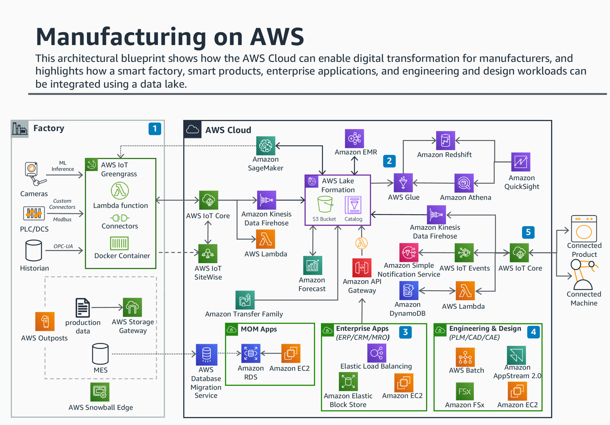

# MFGSCE2: Industrial data catalog

In modern manufacturing (industry 4.0), organizations collect massive volumes of data
from disparate sources, like IoT sensors and control systems on the shop floor, MES and ERP
applications, and even vision systems. Without a unified catalog and governance, this data
often ends up in silos, making it difficult for engineers and analysts to find, trust, and
use the right data. An industrial data catalog addresses this challenge by cataloging the
data assets (with metadata) in one place so that OT and IT professionals can discover what
data exists, understand its context, and access it for analytics or machine learning. In an
Industry 4.0 data environment, the data requires cataloging so that consumers can identify
what is available.

A data catalog functions as a critical metadata management solution, centralizing data
assets from disparate sources such as ERP, MES, and SCADA systems, as well as industrial
internet of things (IIoT) devices. It enables comprehensive data governance by automating
the ingestion, classification, and indexing of structured and unstructured data across the
enterprise. This central repository allows for efficient metadata tagging, lineage tracking,
and semantic search capabilities so that engineers, data scientists, and analysts can
quickly locate, access, and utilize data for advanced analytics, digital twin modeling, and
process optimization. The data catalog supports standardized data definitions and
taxonomies, enhancing data interoperability and compliance with industry frameworks like
[ISO 8000](https://www.iso.org/standard/81745.html "https://www.iso.org/standard/81745.html") for data
quality and

[ISO 10303](https://www.iso.org/standard/38039.html "https://www.iso.org/standard/38039.html") for
product data representation.

Data catalogs in manufacturing integrate with advanced analytics tools and machine
learning systems, enabling automated anomaly detection, predictive maintenance, and
real-time process monitoring. Data catalogs also facilitate data lineage and impact
analysis, which are essential for root cause analysis and continuous improvement
initiatives. They support data security through role-based access controls (RBAC), improving
compliance with data privacy regulations such as GDPR and CCPA while maintaining operational
agility.

## Industrial data cataloging on AWS

An AWS-based industrial data catalog solution centers on the [AWSAWS Glue Data Catalog](../../../glue/latest/dg/catalog-and-crawler.md "../../../glue/latest/dg/catalog-and-crawler.md"), which is a fully-managed metadata repository. The AWS Glue Data Catalog stores technical metadata for datasets (for example, schemas, locations, and data
formats) and acts as an index for data in your data lake and warehouses. It is serverless
and integrated with many AWS analytics services (like Amazon Athena, Amazon Redshift, and
Amazon EMR), enabling those tools to discover and query data using a common catalog. Key
AWS components include:

- **AWS AWS Glue Data Catalog and crawlers:** Core service to
  store dataset metadata and automatically discover data schemas. Glue crawlers can scan
  data stored in Amazon S3 (or other sources) and update the catalog with new tables and
  partitions. This is crucial for industrial data lakes, where new sensor files or log
  batches land frequently. The cataloged metadata allows tools like Amazon Athena to
  query raw IoT data in Amazon S3 using standard SQL.
- **AWS Lake Formation:** Builds on the Glue catalog to
  add data lake governance and fine-grained security. Lake Formation helps establish a
  secure data lake on Amazon S3 with controlled access policies. It allows defining who
  (which roles or IAM principals) can access specific databases, tables, or even columns
  and rows. This is important on the shop floor where certain sensitive process data or
  quality information may be restricted. On the backend, Lake Formation uses the AWS Glue Data Catalog to store metadata and security tags. With Lake Formation, the industrial
  data catalog can enforce data governance (for example, only authorized analytics users
  can see quality test results, or PII data from production logs can be masked).
- **Amazon DataZone (business data catalog):** Amazon
  DataZone provides a higher-level data catalog and portal for data discovery across the
  enterprise. You can use DataZone to publish data assets (from AWS or on-premises
  sources) to a business data catalog accessible with a web portal. This adds a
  business-friendly layer on top of the technical Glue catalog: data producers can
  enrich assets with business context (like descriptions, owners, and quality scores),
  and consumers can search and request access through DataZone. In manufacturing,
  DataZone can help catalog datasets like assembly line sensor readings or KPI by shift.
  Notably, DataZone integrates natively with the AWS AWS Glue Data Catalog and Lake Formation for metadata and access control.

Other relevant AWS services include Amazon S3 (the storage layer for data lakes), AWS Identity and Access Management (IAM) for security, and tools like Amazon SageMaker AI for
data classification (for example, detecting sensitive data) which can complement your
catalog governance. AWS Glue also provides a DataBrew tool for data profiling and Glue
Data Quality to measure data quality, which can feed information into your catalog (for
example, DataZone can display Glue Data Quality metrics for each data asset).

## Integrating industrial data sources into the catalog

To implement an industrial data catalog, we must ingest and catalog data from diverse
OT and IT sources. AWS offers scalable ingestion services to collect factory data into a
central data lake, where it can be cataloged. The following diagram illustrates a
reference architecture for an Industry 4.0 data environment on AWS, highlighting how data
flows from edge devices to the cloud data lake and into the AWS AWS Glue Data Catalog:

_ADD FIGURE CAPTION HERE_

Data ingestion from the factory floor can be achieved using multiple services,
depending on data type and latency requirements:

- **Real-time IoT streams**: Use AWS IoT services at the
  edge and cloud to collect IIoT telemetry. For example, deploy AWS IoT Greengrass on
  plant floor gateways to preprocess data, then send sensor streams through AWS IoT Core. From IoT Core, you can route data to Amazon Data Firehose, which
  reliably buffers and delivers the streaming data into Amazon S3 (your data lake) in
  near real-time. This path is ideal for high-volume telemetry (like vibration or
  temperature) from PLCs or CNC machines that needs to be stored for analysis.
- **Industrial protocols and asset data**: AWS IoT SiteWise can be used to model industrial assets and collect time-series data from
  historians or OPC UA servers. SiteWise computes metrics and can stream data to the
  cloud. While SiteWise itself stores asset data in a managed time-series database, you
  can configure SiteWise to export data to your S3 data lake for long-term retention or
  advanced analytics. In such cases, the AWS Glue Data Catalog can register the exported
  SiteWise data (using a crawler or ETL job) so that it's queryable alongside other
  datasets​. SiteWise's asset metadata (like equipment hierarchy or attributes) can also
  be extracted through scripts and stored as JSON or CSV in an S3 bucket. A Glue crawler
  then creates tables for this metadata, making it queryable through Amazon Athena. This
  enriches your catalog by linking each asset's sensor data with its contextual info
  (like location or type).
- **Batch and file data**: Many manufacturing systems
  output files (like CSV reports or log dumps) on a schedule. AWS Transfer Family (SFTP)
  or AWS Storage Gateway can ingest these files into Amazon S3. For example, a historian
  might dump a daily CSV of batch results to an S3 bucket through Transfer Family. A
  Glue crawler can be scheduled to run after file arrival, updating the catalog with a
  new table partition (for example, DailyBatchResults for that date). This process
  tracks file-based datasets in the catalog even when they are created on the fly.
- **Enterprise application data**: Data from MES, ERP, or
  quality systems (often stored in relational databases) can be ingested using AWS Database Migration Service (DMS) to continually replicate tables into Amazon S3 or
  Amazon RDS in the cloud. Another method is to expose APIs and use Amazon API Gateway
  with AWS Lambda to pull data from on-premises systems into the cloud. Once these
  datasets are in Amazon S3 or a cloud database, they can be cataloged. For example,
  Glue can crawl the Amazon S3 data or directly catalog the Amazon RDS schema through a
  Java database connectivity (JDBC) connection.

All ingested data lands in the Amazon S3 data lake, which is the central storage
tier. At this point, the AWS AWS Glue Data Catalog performs metadata ingestion. It's a best
practice to automate schema discovery for new data. For instance, configure AWS Glue
Crawlers to run on the raw-data S3 buckets. As new IIoT data files arrive (for example,
hourly sensor JSON from Firehose or daily CSVs from SCADA dumps), the crawler will infer
their schema (data types and columns), register the data, and update corresponding tables
in the AWS Glue Data Catalog. Each table in the catalog represents a dataset (for example, a
table for PressMachine_Telemetry linked to the JSON files in s3://data-lake/press1/ path).
The catalog captures details like the S3 location, file format (like JSON or Parquet), and
schema and abstracts these implementation details for users.

Now consumers can discover and query this data uniformly. For example, an engineer
can use Amazon Athena to run SQL queries on raw sensor data in S3 through the Glue Catalog
(Athena automatically uses the Glue Catalog's metadata to parse the data). Data scientists
can find a curated historical sensor readings dataset in the catalog and load it into a
Jupyter notebook for ML modeling. If using Amazon Redshift, the Redshift Spectrum feature
can directly query the S3 data using the Glue Catalog as well. In effect, the AWS Glue Data Catalog becomes the system of record for data schemas across your industrial data estate.

Organize the AWS Glue Data Catalog with a clear database and table naming convention for
your industrial datasets. For instance, you might have an AWS Glue database called
factory_production with tables like press1_telemetry, press1_maintenance_logs, and
assembly_line_yield. This logical grouping makes it straightforward for users to navigate
the catalog. Consider tagging catalog entries with business-relevant tags (AWS Glue
supports tagging datasets) such as Line=Assembly4 or Criticality=High, as these tags can
be used later for search or governance.

## Metadata management and governance

Implementing a data catalog is a key part of capturing technical metadata, managing
business metadata and enforcing governance rules. AWS's catalog and governance tools help
verify that the industrial data is understandable and accessible without compromising
security or compliance.

From a metadata perspective, the AWS Glue Data Catalog primarily contains technical
metadata (like database and table names, schemas, data location, size, and last update).
You can augment this with business metadata by using AWS Glue Schema Registry or Data
Catalog tags or by publishing the data to Amazon DataZone with rich descriptions.
According to AWS, a data governance catalog revolves around metadata categorized as
technical and business, the technical details (for example, file format and schema), and
the business context (for example, data classification, owner, and retention policy).

Make sure to capture both technical and business details. For example, document that
the press1_telemetry table contains vibration sensor readings from press machine A sampled
every minute, and link it to an asset ID or digital twin ID. This context helps end users
trust and correctly use the data.

Industrial data often benefits from standardized taxonomies. For example, use asset
hierarchy names in your catalog or apply ISO 14224 or ISA-95 naming conventions for
equipment and process data so that OT experts can align catalog entries with real-world
devices.

For governance, AWS Lake Formation is the primary service to configure. When setting
up your data lake, you'll register your S3 buckets with Lake Formation and define data
permissions at a fine grain.

For instance, you could allow the DataScienceTeam to query the factory_production.
press1_telemetry table but deny access to press1_maintenance_logs if it contains sensitive
maintenance records. Lake Formation will enforce these rules for access through Amazon Athena, Amazon Redshift, or AWS Glue. It even supports column-level security and row-level
filters, so you might mask a column operator_name or restrict rows where defect_flag =
true to certain users.

This granular security is crucial in manufacturing environments that have trade
secrets or privacy concerns in the data. For example, an OEM collecting operational data
from customer sites can verify that each customer's analysts only see their own machines'
data. AWS's data lake approach allows data retrieved from the Data Lake to be restricted
at both the column-level and row-level, providing a granular approach to security.

Another aspect of governance is data quality and lifecycle. It's wise to store data
quality metrics as part of your metadata. AWS Glue Data Quality can compute scores (for
example, the percentage of missing values or anomalies in a dataset), and these can be
stored or surfaced in Amazon DataZone. You could also maintain a golden dataset
designation in the catalog. For example, if multiple sources provide production counts,
mark one table as the authoritative source. In terms of lifecycle, S3 Object Lifecycle
policies can tier older data to cheaper storage (Glacier), and the Glue Catalog will still
retain the metadata (you might mark such tables with a tag like Archived=true). You can
help users determine if data is current or historical by verifying that the catalog
reflects data freshness and retention (through attributes or naming).

Finally, consider auditing and lineage. AWS Glue itself doesn't automatically store
detailed data lineage, but you can use AWS Glue jobs or AWS Step Functions workflows to
track processing pipelines. Storing information about data provenance (for example, that
table daily_yield is derived using the ETL from press1_telemetry and press1_quality) can
be done by adding descriptions in the catalog or using third-party tools. Amazon DataZone
features for tracking data usage and lineage across the catalog, like Purview's lineage
functionality. AWS CloudTrail logs and Lake Formation audit logs will record access
events, which is important for compliance (you can see who accessed what data when).

## Best practices

Building an industrial data catalog on AWS involves stitching together data
ingestion, storage, cataloging, and governance in a seamless way. By using AWS AWS Glue Data Catalog with Lake Formation, you create a central source of truth for the manufacturing
data assets, from raw sensor feeds to processed analytics datasets. This catalog underpins
the larger Industry 4.0 architecture: it feeds AI/ML models, drives live digital twin
visualizations, and powers analytical dashboards, all while enforcing security and data
quality.

To successfully implement this in practice, follow these best practices:

1. **Start with a strong data lake foundation:** Establish
   an Amazon S3 data lake and enable AWS Lake Formation. Ingest data from OT sources
   (like AWS IoT Core and SiteWise) and IT sources (like databases and files) into S3 in
   as raw a form as reasonable. Catalog from a single repository.
2. **Automate data cataloging:** Configure AWS Glue
   Crawlers or scheduled ETL jobs to continuously update the AWS Glue Data Catalog as new
   data arrives. Maintain logical databases (by plant or domain) and clear naming for
   tables. Verify that each critical data source has an entry in the catalog (no hidden
   datasets).
3. **Enrich metadata:** Don't treat the catalog as a
   passive registry, and actively add documentation. Use the data catalog's description
   field for tables and columns to document meaning (you can do this in the AWS Glue
   Console). Add tags to capture business metadata. If you use Amazon DataZone, curate
   the business catalog so that each dataset has an owner, description, and optional
   links to business glossary terms or data quality scores.
4. **Implement fine-grained security early:** Use Lake Formation to set up data access rules for various roles (like engineering, operations,
   data science, and third-party partners). Test these permissions with Athena to block
   unauthorized access. Also consider integrating your corporate identity and access
   management and single sign-on with Lake Formation (for example, through AWS IAM Identity Center) so that access can map to real-world teams. This helps prevent data
   mishaps and builds trust in the system.
5. **Use your catalog in your analytics:** Train your
   teams and build your tools to use the AWS Glue Data Catalog when accessing data. Whether
   it's an SQL query, a Python ETL script, or an ML pipeline, use the unified catalog
   references instead of one-off S3 paths. This not only simplifies code (since the
   schema is stored centrally) but also improves compliance with governance. If a dataset
   is removed or access revoked, it's handled through the catalog.
6. **Monitor and evolve:** Treat the data catalog as a
   living asset. Use Amazon CloudWatch or AWS CloudTrail logs to monitor Glue crawler
   runs and catalog changes. Implement alerts if a crawler fails or if a critical schema
   changes. Periodically review the catalog with domain experts to deprecate stale
   datasets and identify gaps (for example, if there is a new sensor that isn't yet
   cataloged). Also, as AWS releases new features (like automated lineage in DataZone or
   improved crawlers), integrate those to continuously improve your industrial data
   catalog.

By adhering to these practices, an industrial enterprise can create a robust data
catalog that aligns IT and OT data management with Industry 4.0 principles. The result is
greater visibility into data, improved governance, and faster insights, all of which
compel data-driven manufacturing excellence​.

**References:**

- Forrester, 'The Forrester Wave™: Machine Learning Data Catalogs, Q4 2022.
- ISO, 'ISO 8000: Data Quality' and 'ISO 10303: Industrial Automation Systems and
  Integration—Product Data Representation and Exchange.
- [Getting Started with the Industrial Data Platform on AWS](https://aws.amazon.com/blogs/industries/getting-started-with-the-industrial-data-platform-on-aws/ "https://aws.amazon.com/blogs/industries/getting-started-with-the-industrial-data-platform-on-aws/")

For more information, see [Manufacturing Reference Architecture](https://d1.awsstatic.com/architecture-diagrams/ArchitectureDiagrams/manufacturing-data-lake-ra.pdf "https://d1.awsstatic.com/architecture-diagrams/ArchitectureDiagrams/manufacturing-data-lake-ra.pdf").
