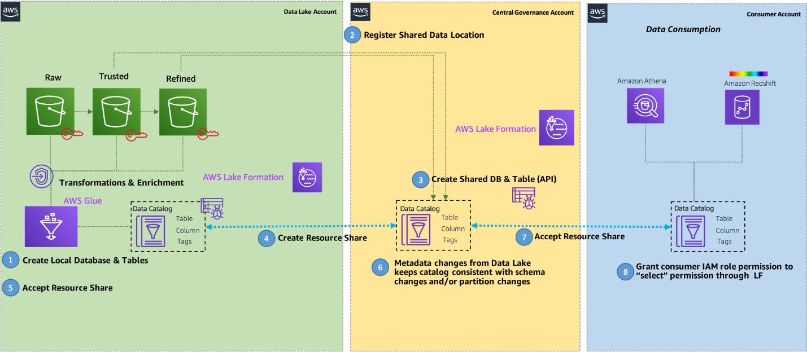
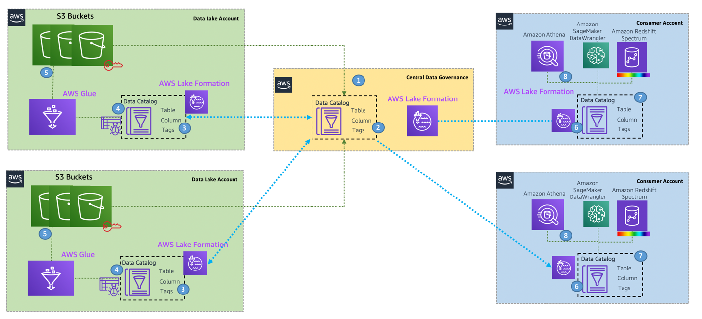
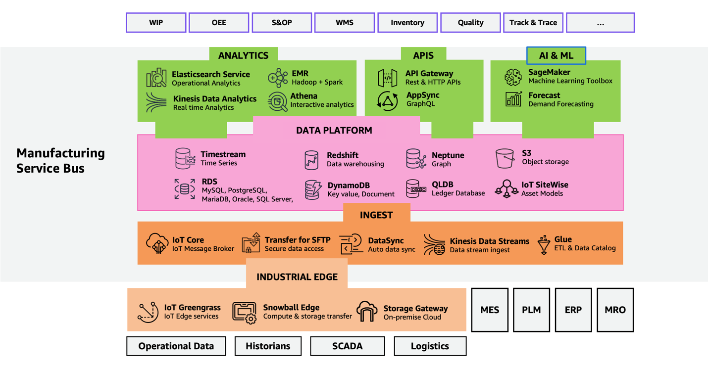

# MFGSCE3: Industrial data mesh

Industrial data mesh is an architectural concept that provides decentralized ownership
and governed sharing of data across the disparate data sources. Data meshes are natively
supported by multiple AWS Services. For large-scale organizations, using multiple AWS accounts and sharing data across them is a common approach.

AWS natively supports the data mesh pattern today:

- AWS Lake Formation supports cross account permissions and resource shares for data
  registered in the AWS Glue and Lake Formation catalog.
- Amazon Redshift supports cross account data sharing.
- AWS analytics services, including Amazon Athena, Glue, and Amazon EMR, natively
  support Lake Formation permissions that implement data mesh concepts of producers,
  consumers, shares, and central catalog.
- Amazon DataZone is a data management service that helps you catalog, discover,
  share, and govern data stored across AWS, on-premise, and third-party sources. With
  Amazon DataZone, administrators and data stewards who oversee an organization's data
  assets can manage and govern access to data using fine-grained controls.
- AWS account services like AWS Control Tower and AWS Organizations have service
  control policies (SCPs), which allow for decentralized governance of data and analytics
  accounts.
- The [data lakehouse architecture](https://aws.amazon.com/big-data/datalakes-and-analytics/data-lake-house/ "https://aws.amazon.com/big-data/datalakes-and-analytics/data-lake-house/") is ideally
  suited to help teams build data domains, and you can use the data mesh approach to bring
  domains together to enable data sharing and federation across business units. This
  approach can improve autonomy and speed up innovation while building on top of a proven
  and well-understood architecture and technology stack, maintaining high standards for
  data security and governance.
  The following are key points when considering a data mesh design:

- Data mesh is a pattern for defining how organizations can organize around data
  domains with a focus on delivering data as a product. However, it may not be the right
  pattern for every customer.
- A lakehouse approach and the data lake architecture provide technical guidance and
  solutions for building a modern data system on AWS.
- The lakehouse approach with a foundational data lake serves as a repeatable
  blueprint for implementing data domains and products in a scalable way.
- The way you use AWS analytics services in a data mesh pattern may change over time
  but remains consistent with the technological recommendations and best practices for
  each service.

## Data mesh design goals

- **Data as a product**: Each organizational domain owns
  their data entirely. They're responsible for building, operating, serving, and
  resolving issues arising from the use of their data. Data accuracy and accountability
  lies with the data owner within the domain.
- **Federated data governance**: Data governance verifies
  that data is secure, accurate, and not misused. The technical implementation of data
  governance such as collecting lineage, validating data quality, encrypting data at
  rest and in transit, and enforcing appropriate access controls can be managed by each
  of the data domains. However, central data discovery, reporting, and auditing is
  required to make it simple for users to find data and for auditors to verify
  compliance.
- **Common access**: Data must be consumable by subject
  matter personas like data analysts and data scientists, as well as purpose-built
  analytics and machine learning (ML) services like [Amazon Athena](https://aws.amazon.com/athena "https://aws.amazon.com/athena"),

[Amazon Redshift](https://aws.amazon.com/redshift "https://aws.amazon.com/redshift"), and

[Amazon SageMaker AI AI](https://aws.amazon.com/sagemaker/ "https://aws.amazon.com/sagemaker/"). To do that, data domains must expose a set of
interfaces that make data consumable while enforcing appropriate access controls and
audit tracking.

## Data mesh end to end workflow

A data mesh design organizes around data domains. Each data domain owns and operates
multiple data products with its own data and technology stack, which is independent from
others. Data domains can be purely producers, such as a finance domain that only produces
sales and revenue data for domains to consumers, or a consumer domain, such as a product
recommendation service that consumes data from other domains to create the product
recommendations displayed on an ecommerce website. In addition to sharing, a centralized
data catalog can provide users with the ability to more quickly find available datasets
and allows data owners to assign access permissions and audit usage across business units.

_ADD FIGURE CAPTION HERE_

With this design, you can connect multiple data lakehouses to a centralized
governance account that stores the metadata from each environment. The strength of this
approach is that it integrates the metadata and stores it in one meta model schema that
can be accessed through AWS services for various consumers. You can extend this
architecture to register new data lake catalogs and share resources across consumer
accounts. The following diagram illustrates a cross-account data mesh architecture.

_ADD FIGURE CAPTION HERE_

## Access patterns

Each consumer obtains access to shared resources from the central governance account
in the form of resource links. These are available in the consumer's local Lake Formation
and AWS AWS Glue Data Catalog, allowing database and table access that can be managed by
consumer admins. After access is granted, consumers can access the account and perform
different actions with the following services:

- Amazon Athena acts as a consumer and runs queries on data registered using AWS Lake Formation. AWS Lake Formation verifies that the workgroup [AWS Identity and Access Management](https://aws.amazon.com/iam "https://aws.amazon.com/iam")
  (IAM) role principal has the appropriate Lake Formation permissions to the database,
  table, and Amazon S3 location as appropriate for the query. If the principal has
  access, AWS Lake Formation vends temporary credentials to Amazon Athena, and the query
  runs. Authentication is granted through IAM roles or users, or web federated
  identities using SAML or OIDC. For more information, see [How
  Athena accesses data registered with Lake Formation](../../../athena/latest/ug/lf-athena-access.md "../../../athena/latest/ug/lf-athena-access.md").
- [Amazon SageMaker AI
  Data Wrangler](https://aws.amazon.com/sagemaker/data-wrangler/ "https://aws.amazon.com/sagemaker/data-wrangler/") helps you quickly select data from multiple data sources, such
  as Amazon S3, Amazon Athena, Amazon Redshift, AWS Lake Formation, and [Amazon SageMaker AI
  Feature Store](https://aws.amazon.com/sagemaker/feature-store/ "https://aws.amazon.com/sagemaker/feature-store/"). You can also write queries for data sources and import data
  directly into Amazon SageMaker AI AI from various file formats, such as CSV files,
  Parquet files, and database tables. Authentication is granted through IAM roles in the
  consumer account. For more information, see [Prepare ML Data with Amazon SageMaker AI Data Wrangler](../../../sagemaker/latest/dg/data-wrangler.md "../../../sagemaker/latest/dg/data-wrangler.md").
- You can use [Amazon Redshift Spectrum](../../../redshift/latest/dg/c-getting-started-using-spectrum.md "../../../redshift/latest/dg/c-getting-started-using-spectrum.md") to register external schemas from AWS Lake Formation and provide a hierarchy of permissions to control access to Amazon Redshift
  databases and tables in a data catalog. If the consumer principal has access, AWS Lake Formation vends temporary credentials to Redshift Spectrum tables, and the query runs.
  Authentication is granted through IAM roles or users or web federated identities using
  SAML or OIDC. For more information, see [Redshift Spectrum and AWS Lake Formation](../../../redshift/latest/dg/spectrum-lake-formation.md "../../../redshift/latest/dg/spectrum-lake-formation.md").
- [Quick Suite](https://aws.amazon.com/quicksight "https://aws.amazon.com/quicksight") with
  Amazon Athena integrates with AWS Lake Formation permissions. If you're querying data
  with Amazon Athena, you can use AWS Lake Formation to simplify how you secure and
  connect to your data from Quick Suite. AWS Lake Formation adds to the IAM
  permissions model by providing its own permissions model that is applied to AWS
  analytics and ML services. Authentication is granted through IAM roles that are mapped
  to Quick Suite user permissions. For more information, see [Authorizing connections through AWS Lake Formation](../../../quicksight/latest/user/lake-formation.md "../../../quicksight/latest/user/lake-formation.md").
- [Amazon EMR
  Studio](https://aws.amazon.com/emr/features/studio/ "https://aws.amazon.com/emr/features/studio/") and EMR notebooks allow running Spark SQL against AWS Lake Formation's
  tables backed by a SAML authority. Beginning with [Amazon EMR](https://aws.amazon.com/emr "https://aws.amazon.com/emr") 5.31.0, you can launch a
  cluster that integrates with AWS Lake Formation. Authentication is granted through IAM
  roles or users or web federated identities using SAML or OIDC. For more information,
  see [Integrate Amazon EMR with AWS Lake Formation](../../../emr/latest/ManagementGuide/emr-lake-formation.md "../../../emr/latest/ManagementGuide/emr-lake-formation.md").

Customers can benefit from both data mesh and the lakehouse (modern data
architecture), as they address different aspects of data management:

- All customers at a certain level of complexity already build multi-account data
  architectures.
- Building data lakes on S3 with purpose-built data and analytics services for
  processing is still the best architecture practice that customers should use to
  implement a data domain in a data mesh architecture.
- Data mesh is an advanced architecture which is appropriate for those customers
  who already have multiple data lakes or lakehouses. If you are just getting started
  with data lakes on AWS, the modern data architecture on AWS is the right way to build
  a data lake on S3 and integrate it with Redshift (data warehouse). AWS' purpose-built
  data store, AWS Lake Formation provides unified governance and seamless data access
  when you have multiple accounts. Data mesh and lakehouse architectures are
  complementary, and customers should start with a lakehouse and over time adopt a data
  mesh architecture if required.

## Industrial service bus

Manufacturing organizations are increasingly using industrial service buses (ISBs) to
enable seamless integration, data exchange, and interoperability across diverse systems,
applications, and devices in both OT and IT environments.

An ISB functions as a middleware layer that standardizes communication protocols such
as OPC UA, MQTT and AMQP, providing a unified messaging backbone for data flow between
sensors, control systems, enterprise applications, and cloud environments. This
standardization is essential for real-time monitoring, control, and optimization of
industrial processes, as it allows diverse equipment and software from multiple vendors to
interoperate efficiently.

General industry solutions for ISBs also involve edge computing frameworks that
extend processing capabilities closer to the source of data, reducing latency and
minimizing bandwidth requirements for time-sensitive applications. For example, deploying
lightweight edge gateways that support ISB protocols enables local data aggregation,
filtering, and preprocessing before sending selected data to the cloud for further
analysis.

This approach allows manufacturers to perform predictive maintenance, enhance
operational efficiency, and improve decision-making by using real-time data analytics and
machine learning. By integrating ISBs with both on-premises and cloud environments,
manufacturers can achieve scalable, flexible, and secure data integration, paving the way
for digital transformation initiatives such as smart factories and the Industry 4.0.

_ADD FIGURE CAPTION HERE_

As an example, AWS IoT Core serves as a cloud-based ISB, supporting protocols like
MQTT, HTTPS, and WebSockets to enable secure, low-latency, and reliable bi-directional
communication between industrial equipment and cloud services.

This architecture is further enhanced by AWS IoT SiteWise, which uses OPC UA to
collect, structure, and analyze data from multiple sensors and industrial assets in near
real-time, providing a unified data model for analytics and machine learning workloads.

This edge computing capability reduces latency, optimizes bandwidth usage, and
verifies that critical operations can continue uninterrupted in case of network
disruptions.

**Resources**

- [Design a data mesh architecture using AWS Lake Formation and AWS Glue](https://aws.amazon.com/blogs/big-data/design-a-data-mesh-architecture-using-aws-lake-formation-and-aws-glue/ "https://aws.amazon.com/blogs/big-data/design-a-data-mesh-architecture-using-aws-lake-formation-and-aws-glue/")
- [AWS Data Mesh
  Helper Library](https://github.com/aws-samples/aws-data-mesh-utils "https://github.com/aws-samples/aws-data-mesh-utils")
