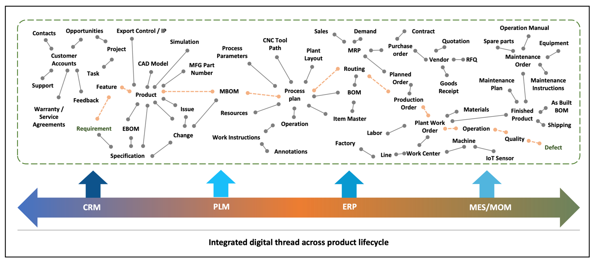
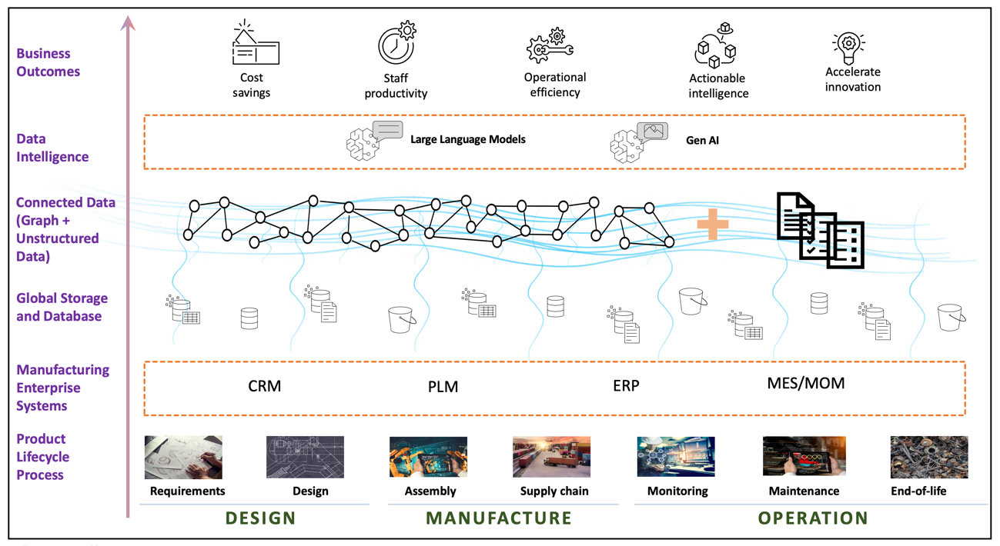
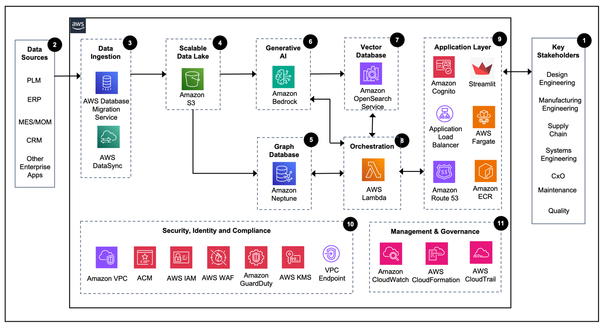

# MFGSCE4: Digital thread: contextualization and knowledge graph

In most manufacturing organizations, the product lifecycle data is typically stored in
enterprise systems such as Product Lifecycle Management (PLM), Enterprise Resource Planning
(ERP), Manufacturing Execution Systems (MES) and Customer Relationship Management (CRM). Due
to the disconnected nature of enterprise infrastructure, the generated data is often
fragmented and unused.

Managing and contextualizing data across the product lifecycle is challenging due to
variations in data usage depending on the specific stakeholder interacting with it.
Manufacturing organizations continuously aim to address the connected enterprise outcomes
through various strategic initiatives. One notable initiative is the digital thread for
connected enterprise.

_Digital thread_ refers to the seamless flow of data across the entire
product lifecycle, from requirements, design, production, and eventually to service and
disposal. This data-driven approach enables manufacturers to contextualize information and
gain insights for better decision-making.

A comprehensive digital thread should incorporate the requirements of various
stakeholders, offering enhanced contextualization and knowledge integration capabilities,
both structured and unstructured, to unlock the potential of manufacturing data.

Knowledge graphs provide a great way to represent and connect data from various
sources, contextualizing and improving the understanding of complex relationships between
entities. They provide a structured way to organize and link data entities, making it simple
to find and traverse relationships between information from various sources.

Contextualization is the process of adding relevant context to data, which can help
derive meaningful insights. By contextualizing data, manufacturers can better understand the
context and conditions surrounding specific events or data points, which better informs
their decision-making.

_ADD FIGURE CAPTION HERE_

A well-architected manufacturing digital thread with contextualization and knowledge
graph capabilities should support the following characteristics:

1. **Data integration and ingestion:** The ability to ingest
   and integrate data from various sources, such as requirements, design, planning, supply
   chain, manufacturing execution data along with the unstructured data, is crucial for
   building a comprehensive digital thread.
2. **Contextualization:** Incorporating contextualization
   enables manufacturers to enrich their data with meaningful context and uncover hidden
   relationships and patterns.
3. **Scalability and availability:** The digital thread
   should be built on a scalable and highly available infrastructure, capable of handling
   variable data volumes and workloads without compromising performance or reliability.
   By contextualizing in the manufacturing digital thread, manufacturers can better
   understand their data, gain deeper insights, and drive continuous improvement across the
   product lifecycle. This data-driven approach improves decision making, increases efficiency,
   enhances product quality, and helps you innovate within your organization.

## Digital thread solution framework

Data from various product lifecycle processes forms the foundation of this digital
thread solution framework. The subsequent layer encompasses core enterprise systems,
including PLM, ERP, and MES, which manage specific aspects such as people, processes,
engineering, and manufacturing data within the enterprise.

The next layer is the connected data, which involves both knowledge graph and
unstructured data. Together, they uncover insights and provide a comprehensive
understanding of the interconnected manufacturing enterprise data.

Finally, large language models are integrated with the knowledge graph and
unstructured data, creating advanced queries and accessing natural language capabilities.

_ADD FIGURE CAPTION HERE_

The solution aims to accelerate innovation by seamlessly connecting data from various
systems and generate insights through the manufacturing digital thread framework. This
framework establishes an intelligent structure where data is interconnected, empowering
manufacturing stakeholders in their decision-making processes.

## Digital thread reference architecture

The manufacturing digital thread solution architecture is implemented through the
strategic integration of Amazon Neptune graph database, Amazon OpenSearch Service, and
Amazon Bedrock, a fully managed generative AI service. The components are further enhanced
by various AWS services, creating a comprehensive solution for the digital thread.

_ADD FIGURE CAPTION HERE_

1. Identify key stakeholders in the manufacturing organization and understand the
   business needs.
2. Identify data sources to build a digital thread on AWS
3. Ingest data into AWS using [AWS Data Migration Service](https://aws.amazon.com/dms/ "https://aws.amazon.com/dms/") for database migrations and

[AWS DataSync](https://aws.amazon.com/datasync/ "https://aws.amazon.com/datasync/") for large dataset
movement. 4. Upload ingested data into [Amazon S3](https://aws.amazon.com/s3/ "https://aws.amazon.com/s3/") for secure storage for further processing and analysis. 5. Use Amazon Neptune [bulk loader](../../../neptune/latest/userguide/bulk-load.md "../../../neptune/latest/userguide/bulk-load.md") capability to ingest the data from

[Amazon S3](https://aws.amazon.com/s3/ "https://aws.amazon.com/s3/") to

[Amazon Neptune](https://aws.amazon.com/neptune/ "https://aws.amazon.com/neptune/") graph database. 6. Create chunks from unstructured documents stored in [Amazon S3](https://aws.amazon.com/s3/ "https://aws.amazon.com/s3/"), embed using Amazon Titan
Text Embeddings V2, and store them in

[Amazon OpenSearch Service](https://aws.amazon.com/opensearch-service/ "https://aws.amazon.com/opensearch-service/") vector database. 7. Select foundation models in [Amazon Bedrock](https://aws.amazon.com/bedrock/ "https://aws.amazon.com/bedrock/"). 8. Link [Amazon Bedrock](https://aws.amazon.com/bedrock/ "https://aws.amazon.com/bedrock/"),

[Amazon Neptune](https://aws.amazon.com/neptune/ "https://aws.amazon.com/neptune/"), and

[Amazon OpenSearch Service](https://aws.amazon.com/opensearch-service/ "https://aws.amazon.com/opensearch-service/"), and integrate with

[AWS Lambda](https://aws.amazon.com/lambda/ "https://aws.amazon.com/lambda/") and Langchain. The orchestrator coordinates the process of
generating the opencypher query using [Amazon Bedrock](https://aws.amazon.com/bedrock/ "https://aws.amazon.com/bedrock/") Foundation
models, runs the query against the

[Amazon Neptune](https://aws.amazon.com/neptune/ "https://aws.amazon.com/neptune/") graph, converts the graph query results into natural language
using

[Amazon Bedrock](https://aws.amazon.com/bedrock/ "https://aws.amazon.com/bedrock/") ,
extracts the unstructured information from

[Amazon OpenSearch Service](https://aws.amazon.com/opensearch-service/ "https://aws.amazon.com/opensearch-service/"), and returns the relevant message to the user. 9. Create an application layer using [AWS Fargate](https://aws.amazon.com/fargate/ "https://aws.amazon.com/fargate/") for container
orchestration,

[Amazon Elastic Container Registry](https://aws.amazon.com/ecr/ "https://aws.amazon.com/ecr/") for managing container images,

[Elastic Load Balancing](https://aws.amazon.com/elasticloadbalancing/ "https://aws.amazon.com/elasticloadbalancing/") for efficient traffic distribution,

[Amazon Route 53](https://aws.amazon.com/route53/ "https://aws.amazon.com/route53/")  for DNS, and

[Amazon Cognito](https://aws.amazon.com/cognito/ "https://aws.amazon.com/cognito/") for
authentication. 10. Use [Amazon VPC](https://aws.amazon.com/vpc/ "https://aws.amazon.com/vpc/") to operate
the application in a secure and isolated network.

[AWS Identity and Access Management](https://aws.amazon.com/iam/ "https://aws.amazon.com/iam/")
enhances access control, while

[AWS Certificate Manager](https://aws.amazon.com/certificate-manager/ "https://aws.amazon.com/certificate-manager/") manages certificates and

[AWS WAF](https://aws.amazon.com/waf/ "https://aws.amazon.com/waf/") provides web application
security. Malicious activity is constantly monitored by

[Amazon GuardDuty](https://aws.amazon.com/guardduty/ "https://aws.amazon.com/guardduty/"). The data at
rest is encrypted with

[AWS Key Management Service](https://aws.amazon.com/kms/ "https://aws.amazon.com/kms/") and can be integrated with other third-party KMS
solutions. 11. Use [AWS CloudTrail](https://aws.amazon.com/cloudtrail/ "https://aws.amazon.com/cloudtrail/")
to enhance transparency by tracking activities,

[Amazon CloudWatch](https://aws.amazon.com/cloudwatch/ "https://aws.amazon.com/cloudwatch/") to monitor
resources, and

[AWS CloudFormation](https://aws.amazon.com/cloudformation/ "https://aws.amazon.com/cloudformation/") for automated resource deployment of digital thread
application.
