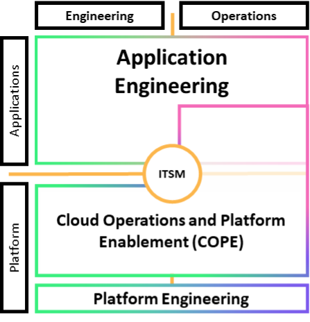

# Cloud operations and platform enablement (COPE)

This cloud operations and platform enablement (COPE) model seeks to establish a _you build it, you run it_ methodology by supporting application teams to perform the engineering and operations activities for their workloads, adopting a DevOps culture.

Your application teams may be tasked with migrating, adopting the cloud, or modernizing your workloads, but might not have the existing skills to adequately support cloud architecture and operations. This lack of application team capabilities and familiarity is likely to slow down your organization’s agility and impact business outcomes.

To address this concern, use your existing operational expertise from within your organization to support application teams on their journey to cloud operations. This can be a dedicated team of experts or a virtual team with participants selected from across your organization. However, the goal remains the same, which is to provide operational support that builds the capability of the workload team, using cloud first principles of automation, removing undifferentiated heavy lifting, providing standardized patterns, and promoting autonomy. The aim is to build sufficient maturity across cloud capabilities and lower the barrier of operational responsibilities so that application teams no longer need additional support.

The COPE model focuses on the workload level. If this approach is needed across multiple teams at once, if you are performing a complex, large-scale, multi-year migration project, or if you are building a platform to support these initiatives, consider using a Cloud Center of Excellence (CCoE). This is a mechanism that many have found successful when seeking to accelerate their migrations to the cloud and broadly transform their organization.

_Cloud Operations and Platform Enablement (COPE)_

Your platform engineering team builds a thin layer of core shared platform capabilities, which are based on predefined standards for application teams to adopt and are provided by the COPE team. The platform engineering team codifies the enterprise reference architectures and patterns that are provided to the application teams through a self-service mechanism. Using a service such as AWS Service Catalog, the application teams can deploy approved reference architectures, patterns, services, and configurations, compliant by default with the centralized governance and security standards.

The platform engineering team also provides a standardized set of services (for example, development tools, observability tools, backup and recovery tools, and networking) to the application teams.

The COPE team manages and supports the standardized services and provides assistance to application teams establishing their cloud presence based on the reference architectures and patterns. They work with the application teams to help them establish baseline operations. During this process, the application teams progressively take more responsibility for their systems and resources over time. The COPE team drives continual improvement together with the platform engineering team and acts as proponents for the application teams.

The application teams get assistance setting up environments, CI/CD pipelines, change management, observability and monitoring, and establishing incident and event management processes, with the COPE team integrated as required. The COPE team participates with the application teams in the performance of these operations activities, phasing out the COPE team engagement over time as the application teams take ownership.

The application team gains the benefit of the skills of the COPE team and the lessons learned by the organization. They are protected by the guardrails established through centralized governance. The application team builds upon recognized successes and gains the benefit of continuing development of the organizational standards they have adopted. They gain greater insight to the operation of their workload through the process of establishing observability and monitoring and are better able to understand the impact of changes they make to their workloads.

The COPE team may also retain the access necessary to support operations activities, provide an enterprise-operations view spanning application teams, and offer critical incident management support. The COPE team retains responsibility for activities considered as undifferentiated heavy lifting, which they satisfy through standard solutions supportable at scale. They also continue to manage well-understood programmatic and automated operations activities for the application teams so that they can focus on differentiating their applications.

You gain the advantage of your organization’s standards, best practices, processes, and expertise, derived from the successes of your teams. You establish a mechanism to replicate these successful patterns for new teams adopting or modernizing in the cloud. This model places emphasis on the COPE team’s ability to help application teams get established and transition knowledge and artifacts. It reduces the operational burdens of the application teams, with the risk that application teams can fail to become independent. It establishes relationships between platform engineering, COPE, and application teams, creating a feedback loop to support further evolution and innovation.

Establishing your platform engineering and COPE teams, while defining organization wide standards, can facilitate cloud adoption and support modernization efforts. By providing the additional support of a COPE team acting as consultants and partners to your application teams, you can remove workload level barriers that slow application team adoption of beneficial cloud capabilities.
