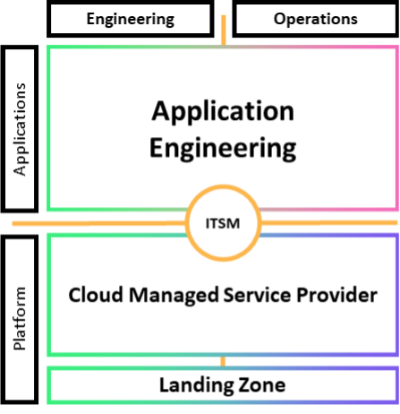

# DevOps with cloud-managed service provider

The DevOps with cloud-managed service provider model follows a _you build it, you run it_ methodology for application teams. However, your organization may not have the existing skills or team members to support a dedicated platform engineering and operations team, or you may not be in a position to make the time and effort investments to do so.

Alternatively, you may wish to have a platform team that is focused on creating capabilities that differentiate your business, but you want to outsource the undifferentiated day-to-day operations.

Managed services providers such as [AWS Managed Services](http://aws.amazon.com/managed-services/ "http://aws.amazon.com/managed-services/") or providers in the [AWS Partner Network](http://aws.amazon.com/partners/find/results/?keyword=Managed+Service+Provider "http://aws.amazon.com/partners/find/results/?keyword=Managed+Service+Provider") provide expertise implementing cloud environments, and support your security and compliance requirements and business goals.

_DevOps with cloud managed service provider_

For this variation, we treat governance as centralized and managed by the platform team, with account creation and policies managed with AWS Organizations and AWS Control Tower.

This model requires you to modify your mechanisms to work with those of your service provider. It does not address the bottlenecks and delays created by transition of tasks between teams, including your service provider, or the potential rework related to the late identification of defects.

You gain the advantage of your providers’ standards, best practices, processes, and expertise. You also gain the benefits of their ongoing development of their service offerings.

Adding managed services to your operating model can save you time and resources and keeps your internal teams lean and focused on strategic outcomes that differentiate your business, rather than developing new skills and capabilities. It can also provide time for you to build and mature your own platform capabilities without slowing down your cloud migration programs.
