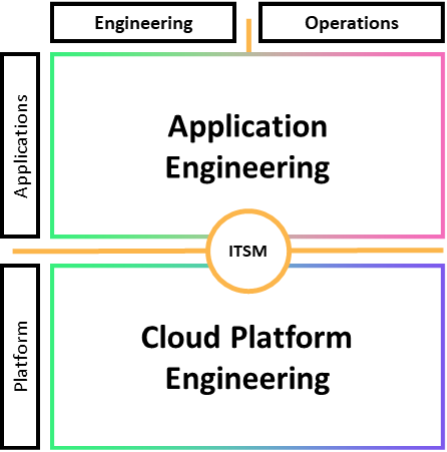

# Distributed DevOps

The distributed DevOps model separates (or distributes) the application engineering operations and infrastructure engineering operations responsibilities across the engineering teams, following the [COPE methodology](cloud-operations-and-platform-enablement.md "cloud-operations-and-platform-enablement.md").

Your application engineers perform both the engineering and the operation of their workloads. Similarly, your infrastructure engineers perform both the engineering and operation of the platforms they use to support application teams.

_Distributed DevOps_

For this example, we treat governance as centralized elsewhere within the organization. Standards are distributed, provided, or shared to the application and platform teams.

Use tools or services that help you centrally govern your environments across accounts, such as [AWS Organizations](https://aws.amazon.com/organizations/ "https://aws.amazon.com/organizations/"). Services like [AWS Control Tower](https://aws.amazon.com/controltower/features/ "https://aws.amazon.com/controltower/features/") expand this management capability by helping you define blueprints (supporting your operating models) for the setup of accounts, apply ongoing governance using AWS Organizations, and automate provisioning of new accounts.

_You build it, you run it_ does not mean that the application team is responsible for the full stack, tool chain, and platform.

The platform engineering team provides a standardized set of services (for example, development tools, monitoring tools, backup and recovery tools, and networking) to the application team. The platform team may also provide the application team access to approved cloud provider services, specific configurations of the same, or both.

Mechanisms that provide a self-service capability for deploying approved services and configurations, such as Service Catalog, can help limit delays associated with fulfillment requests while enforcing governance.

The platform team activates full stack visibility so that application teams can differentiate between issues with their application components and the services and infrastructure components their applications consume. The platform team may also provide assistance configuring these services and guidance on how to improve an application team's operations.

As discussed previously, it is critical that mechanisms exist for application teams to request additions, changes, and exceptions to standards in support of activities and innovation of their application.

The distributed DevOps model provides strong feedback loops to application teams. Day-to-day operations of a workload increase contact with customers, either through direct interaction or indirectly through support and feature requests. This heightened visibility allows application teams to address issues more quickly. The deeper engagement and closer relationship provides insight to customer needs and creates more rapid innovation.

All of this is also true for the platform team supporting the application teams, as the platform team should view these application teams as their customers.

Adopted standards may be pre-approved for use, reducing the amount of review necessary to enter production. Consuming supported and tested standards provided by the platform team may reduce the frequency of issues with those services. Adoption of standards helps application teams focus on differentiating their workloads.
