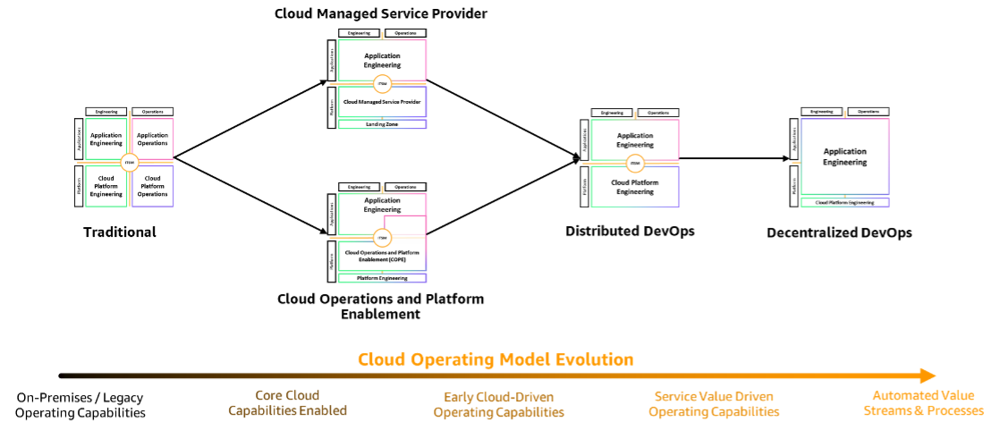

# Evolving your operating model

The models provided progressively move towards more autonomy at the workload level, matching the two-pizza team principle. It is important to understand that this journey from a traditional approach to decentralized DevOps (as a foundation for continued evolution to a two-pizza team model) is likely to take time and require building maturity across a number of capabilities. Therefore, we have provided an example of how you may transition between models as your team and organization move along the enterprise transformation journey. In each change or model, you are evolving towards a more autonomous, but still organizationally-aligned team.

_Cloud operating model evolution_

When evaluating how your team can support your organizations evolution, examine the trade-offs between models, where your individual teams exist within the models (as they transition and evolve), how your team's relationship and responsibilities could change, and if the benefits merit the impact on your organization. Keep in mind that change is never linear. Some models are more appropriate for specific use cases or points in the journey, and some of these models may provide advantages over the ones in your environment.
