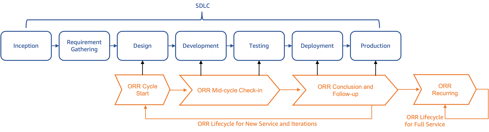

# Gaining adoption

While the ORR name may imply on the surface that it is a “pre-launch” checklist, the
process is actually built into the entire Software Development Lifecycle (SDLC). To be the
most effective, ORRs should be integrated with, and adopted across that lifecycle. The
following diagram demonstrates how AWS views the adoption spectrum for ORRs.

_Figure 2: The ORR adoption and implementation lifecycle tied to the
SDLC_

Figure 2 shows that the **ORR Lifecycle for New Service and
Iterations** is initiated when a new service, new feature, or architecture change
is proposed. The **ORR Cycle Start** phase begins during the
_Design_ phases of the SDLC process. Teams start to answer the design and
architecture questions. At the same time, the team has a holistic view of all ORR questions
that are associated with the upcoming stages of the SDLC. During the **Mid-Cycle Check-in** phase teams start to answer _Development_
and _Testing_ related questions. Finally, in the **ORR
Conclusion and Follow-up** phase, the team wraps up the ORR checklist and develops
their risk mitigation and follow-up plan.

In addition to the ORR performed through the SDLC process, at least annually, teams are
expected to perform an ORR on their full service using a checklist tailored to that event.
This helps verify that they stay up to date with new or updated best practices, and also that
nothing has changed within their systems.

To support adoption of the tool across these different phases, AWS uses different
checklists for different occasions and workload types. A few examples are:

- Launching a new public service
- Launching a new major feature
- Launching a new minor feature
- Recurring annual review
- Serverless workload
- User console
- Server agent

## Customer recommendations

Once you have established a working mental model for the tool, identify stakeholders who
will be impacted by it. You might ask questions like: "Who needs to contribute to it?" or
"What do they need to do in order to adopt and implement the tool?"

One way to drive adoption is to start small and expand. Find a new workload that is
being built or one that is targeted for migration to AWS. Pilot the ORR process with that
workload and generate lessons learned. Another approach would be to conduct ORRs on your
most critical workloads first. An important lesson in driving adoption of anything is to
“make it easy to do the right thing”. The simpler it is for teams to consume and use the
tool as part of their day-to-day business, the easier it is to gain broad adoption.

One of the most important factors to gaining adoption is ensuring the checklists are
aligned with the outcome you want to achieve. As mentioned previously, keep the checklist
questions to the minimum required to address critical risks. Verify that the checklists
align with the type of workload being evaluated. Minimize the possibility for “not
applicable” answers to make sure the process doesn’t introduce unnecessary overhead and take
additional time from your builders.
