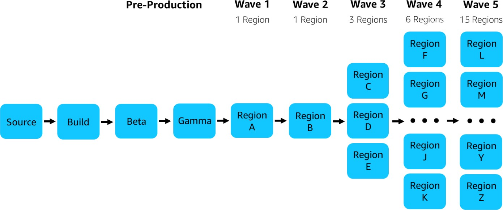
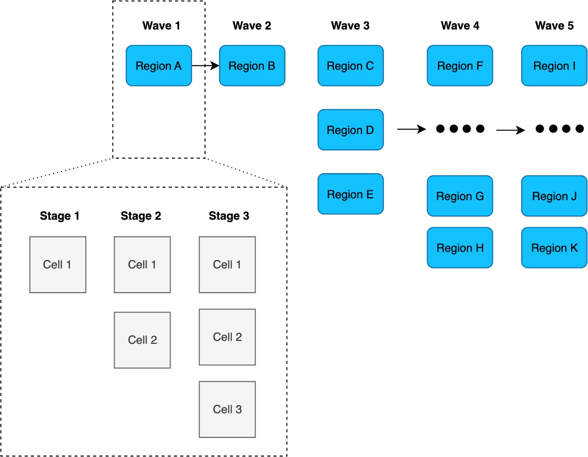

# Cell deployment

Unless you are already working on a workload that is multi-Region, you currently have one
instance of your workload to develop, deploy and operate. Now with your workload using a
cell-based architecture, you have tens, hundreds or even thousands of instances of your
workload to deploy and operate, depending on the limits, scale units, and cell size you set.
In summary, it is a very complex challenge to deploy in a production environment.

Cell-based architecture brings a new dimension to its context, which is not trivial for
development. If today you have to deploy your source code in an environment (development,
pre-production, and production) in an Availability Zone or Region, now you have to deploy a
cell on all these aspects as well. To avoid problems, it is essential to have an automated
CI/CD pipeline from the beginning. At Amazon, we have a strong culture of continuous delivery,
which you can find out more about in [My CI/CD pipeline is my release captain](https://aws.amazon.com/builders-library/cicd-pipeline/ "https://aws.amazon.com/builders-library/cicd-pipeline/").

In the following diagram, we have an Amazon service pipeline type, where each service is
deployed in phases until it reaches general availability for all Regions

_Amazon service deployment_

This is a great way to reduce the impacts of infrastructure failures, bugs, and other
errors that can impact customers. With cell-based architecture, these are also deployed in
phases, as in the example in the following diagram:

_Cell deployment_

The benefits of fault isolation and blast radius reduction with cell-based architecture
are not only when processing customer traffic, but also when deploying new features and fixing
bugs. With your customers or in the partitioning model you chose, your deployment model will
also follow this same concept, deploying one or more cells at a time, and when identifying any
sign of failure, you can rollback, thus reducing the number of clients that were exposed to
this failure.

The previous example was given based on the Amazon deployment model, but the important
point here is to deploy in waves, cell by cell or set of cells. It doesn't matter if the cell
strategy you chose is non-AZ independency or AZ independency. To delve into other important
issues, a good starting point is the Reliability and Operational Excellence best practices of
the Well-Architected Framework:

- [REL08-BP05 Deploy changes with automation](../reliability-pillar/rel_tracking_change_management_automated_changemgmt.md "../reliability-pillar/rel_tracking_change_management_automated_changemgmt.md")
- [OPS05-BP10 Fully automate integration and deployment](../operational-excellence-pillar/ops_dev_integ_auto_integ_deploy.md "../operational-excellence-pillar/ops_dev_integ_auto_integ_deploy.md")
- [OPS06-BP01 Plan for unsuccessful changes](../operational-excellence-pillar/ops_mit_deploy_risks_plan_for_unsucessful_changes.md "../operational-excellence-pillar/ops_mit_deploy_risks_plan_for_unsucessful_changes.md")
- [OPS06-BP07 Fully automate integration and deployment](../operational-excellence-pillar/ops_mit_deploy_risks_auto_integ_deploy.md "../operational-excellence-pillar/ops_mit_deploy_risks_auto_integ_deploy.md")
- [OPS06-BP08 Automate testing and rollback](../operational-excellence-pillar/ops_mit_deploy_risks_auto_testing_and_rollback.md "../operational-excellence-pillar/ops_mit_deploy_risks_auto_testing_and_rollback.md")
  AWS services that can help you with this implementation are:

- [AWS CodeCommit](https://aws.amazon.com/codecommit/ "https://aws.amazon.com/codecommit/")
- [AWS CodeBuild](https://aws.amazon.com/codebuild/ "https://aws.amazon.com/codebuild/")
- [AWS CodePipeline](https://aws.amazon.com/codepipeline/ "https://aws.amazon.com/codepipeline/").
