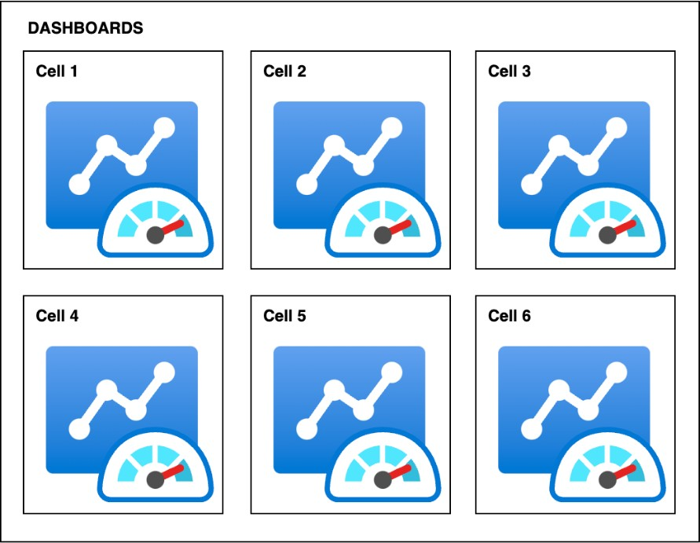

# Cell observability

Doing cell-based requires a lot of automation and a set of very specific tools. As the
composition of a cell itself can vary from business to business, many things will have to be
built around your business. Observability is one of them. If you had a stack before, now you
have many stacks, and to take advantage of all the benefits of a cell-based architecture it is
necessary to have some ideas in mind.

_Dashboards to observe cells_

Your entire observability stack needs to be cell-aware. Best practices like [How do you
design telemetry](../operational-excellence-pillar/design-telemetry.md "../operational-excellence-pillar/design-telemetry.md") now need to give you a view of each cell in its individuality. It
is important to be able to track each request and identify which cell it is destined for. For more
information on how we do this on Amazon (though, generally not
cell-based) see:

- [Amazon Builders' Library: Instrumenting distributed systems for operational visibility](https://aws.amazon.com/builders-library/instrumenting-distributed-systems-for-operational-visibility "https://aws.amazon.com/builders-library/instrumenting-distributed-systems-for-operational-visibility")
- [Amazon Builders' Library: Building dashboards for operational visibility](https://aws.amazon.com/builders-library/building-dashboards-for-operational-visibility/?did=ba_card&trk=ba_card "https://aws.amazon.com/builders-library/building-dashboards-for-operational-visibility/?did=ba_card&trk=ba_card")
  There is also a great [hands-on experience lab](https://catalog.workshops.aws/observability/en-US "https://catalog.workshops.aws/observability/en-US") for you on the wide variety of tools that AWS offers to
  set up monitoring and observability in general on your applications. The main point here is
  that you do this on a cell-by-cell level, so that you have a new dimension to observe and
  react to accordingly.
