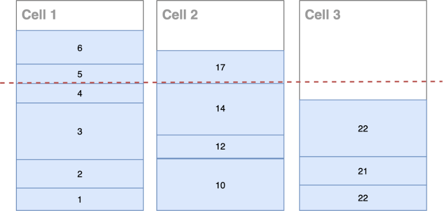

# Cell placement

Cell placement it is another responsibility of the control plane and refers to the
activities of onboarding new tenants and customers and also creating the cells themselves. To
do these activities some level of observability is required such as:

- Capacity of each cell
- Used capacity of each cell
- Percentage of usage of each tenant or customer
- Quotas and limits of each cell in their respective AWS account

_Cell placement_

In an ideal world, it is important to find the percentage of utilization and the limit
that each of your cells will work with the greatest possible predictability and stability. It
is not because your cell supports 10K TPS that you must constantly be operating [on the threshold of this limit, as already recommended in REL01-BP06](../reliability-pillar/rel_manage_service_limits_suff_buffer_limits.md "../reliability-pillar/rel_manage_service_limits_suff_buffer_limits.md"). Ensure that a
sufficient gap exists between the current quotas and the maximum usage to accommodate
failover.

For data and state heavy workloads, the problem of allocation becomes a core competency.
This is classically a pretty deep area of allocation, scheduling, and forecasting, that is, it
is your strategy to evenly distribute your traffic among the cells. For example, when a
customer or partitioned key starts to dominate a cell, you need to migrate some tenants or
customers to other cells. In addition to the entry of new tenants or clients, there are other
scenarios where a placement strategy is necessary:

- The dimensions of each cell (might change over time, or might be fixed).
- The dimensions of each partition key (changes over time).
- The cost of moving a partition key between cells.
- The benefit of co-tenanting certain partition keys or having affinity.
