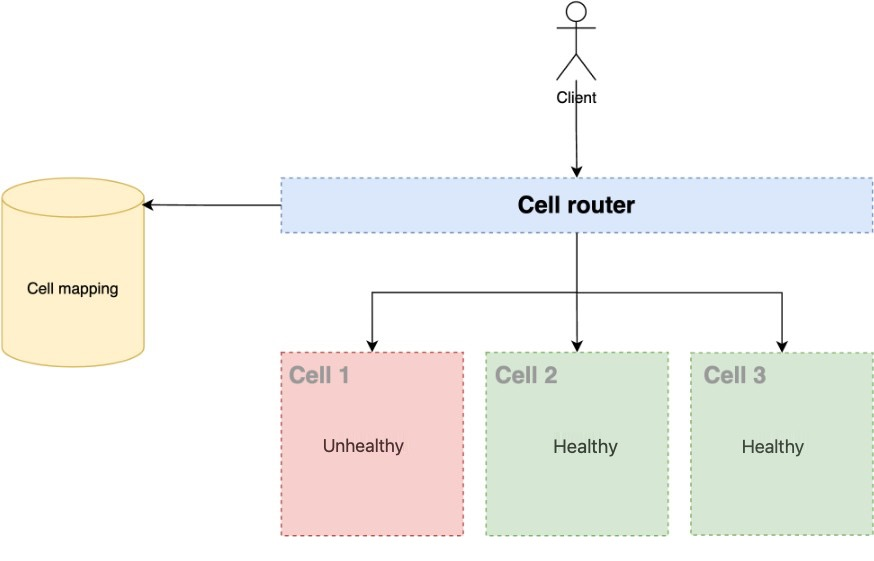

# Cell routing

The router layer is a shared component between cells, and therefore cannot follow the
same compartmentalization strategy as with cells.

For the router layer, it's recommended that you distribute requests to individual cells
using a partition mapping algorithm in a computationally efficient manner, such as combining
cryptographic hash functions and modular arithmetic to map partition keys to cells.

To avoid multi-cell impacts, the routing layer must remain as simple and horizontally
scalable as possible, which necessitates avoiding complex business logic within this layer.
This has the added benefit of making it easy to understand its expected [behavior at all
times, allowing for thorough testability.](https://aws.amazon.com/builders-library/reliability-and-constant-work/ "https://aws.amazon.com/builders-library/reliability-and-constant-work/") As explained by Colm MacCárthaigh in
[Reliability,
constant work, and a good cup of coffee](https://aws.amazon.com/builders-library/reliability-and-constant-work/ "https://aws.amazon.com/builders-library/reliability-and-constant-work/"), simple designs and constant work patterns
produce reliable systems and reduce anti-fragility.

_Avoiding multi-cell impacts_

Cell router features to keep in mind:

- Be simple as possible, but not simpler.
- Have request dispatching isolation between cells.
- Minimize the amount of business logic in this layer.
- Abstract underlying cellular implementation and complexity from clients.
- Fast and reliable.
- Continue operating normally in other cells even when one cell is unreachable.
  Although the previous diagram symbolizes the cell router seeking information, this is not
  necessarily the only approach that can be taken. There are several options for designing a
  cell router with their advantages and disadvantages. The objective is that the cell router has
  the mapping state of each partition key for its respective cell. The following is a
  non-exhaustive list of design that can be applied to design a cell router.

###### Topics

- [Using Amazon Route 53](using-amazon-route-53.md "using-amazon-route-53.md")
- [Using Amazon API Gateway as cell
  router](using-aws-api-gateway-as-cell-router.md "using-aws-api-gateway-as-cell-router.md")
- [Using a compute layer like Amazon EC2, Amazon ECS or Amazon EKS and Amazon S3 for cell mapping as cell
  router](using-a-compute-layer-like-ec2-ecs-or-eks-and-s3-for-cell-mapping-as-cell-router.md "using-a-compute-layer-like-ec2-ecs-or-eks-and-s3-for-cell-mapping-as-cell-router.md")
- [Routing no-HTTP requests](routing-no-http-requests.md "routing-no-http-requests.md")
- [About resilience of the cell
  router](about-resilience-of-the-cell-router.md "about-resilience-of-the-cell-router.md")
