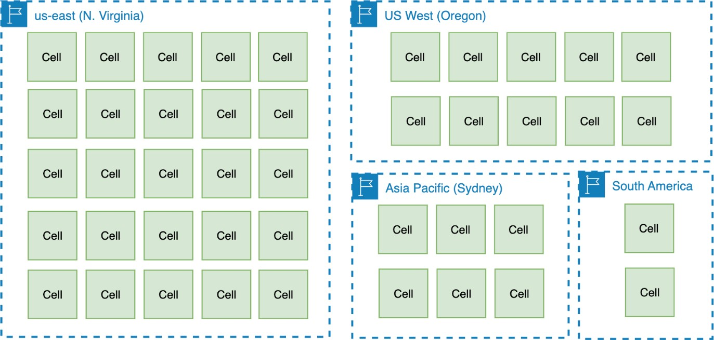

# Cell sizing

Cell-based architectures benefit from capping the maximum size of a cell, and using
consistent cell sizes across different installations (for example, AZ or Regions). When
thinking about small or large cells there are three opposing forces on choosing a cell size:

- Big enough to fit the largest workloads.
- Small enough to test at full scale (and to operate efficiently) that is equal lower
  risk of scaling cliffs, below the AWS account limits, etc.
- Big enough to gain economies of scale benefits.

_Cell sizing_

The maximum cell size will vary per-service. The optimum point will depend on the service
and customer behavior, but needn't be extremely large for any service. There are tradeoffs to
be considered in how to select the maximum size of a cell:

| **Smaller cells**                                                                                                                                                                                                                                                                                                                                                                     | **Larger cells**                                                                                                                                                                                                                                                                                                                                                  |
| ------------------------------------------------------------------------------------------------------------------------------------------------------------------------------------------------------------------------------------------------------------------------------------------------------------------------------------------------------------------------------------- | ----------------------------------------------------------------------------------------------------------------------------------------------------------------------------------------------------------------------------------------------------------------------------------------------------------------------------------------------------------------- |
| \*_Will have more cells –_ • By having smaller cells, there is a need to deploy more cells to operate in general. The smaller the cells, the more replicas of your workload you will have to manage.                                                                                                                                                                         | \*_Will have fewer cells –_ • By having larger cells, you need to deploy fewer cells to operate. The larger the cells, the less replicas of your application you need to manage                                                                                                                                                                          |
| \*_Cell outage or drain impacts small percentage of compute fleet –_ • As in the example, with a smaller number of cells. any event that affects them, will also be affecting a smaller portion of their infrastructure                                                                                                                                                      | \*_Cell outage or drain impacts large percentage of compute fleet –_ • As an effect of having large cells, any event affects a larger portion of your infrastructure                                                                                                                                                                                     |
| \*_Less likely to hit scaling limitation –_ • In AWS all resources have limits and quotas by Region and account. With smaller cells, the probability of a single cell reaching these limits is reduced. There are often unseen/unknown limitations in implementations that manifest themselves at size and scale and with cells, these also have their impact reduced. | \*_More likely to reach scaling limitation –_ • Larger cells will use more computational power, being more likely to reach Region and account limits.                                                                                                                                                                                                    |
| \*_Reduced scope of impact –_ • If with 10 cells, each one has 10% with their customers, with 100 each one has 1%. Naturally when a cell fails, the scope of impact will be smaller.                                                                                                                                                                                         | \*_Reduced splits –_ • According to your partition key, isolating client workloads to individual cells rather than having to split individual client workloads across cells.                                                                                                                                                                             |
| \*_Easier to test –_ • As a good practice, cells should have stipulated limits and quotas and tests should be implemented to test these limits. With smaller cells it is easier and even cheaper to test the cells.                                                                                                                                                          | \*_Easier to operate –_ • Considering that each cell is a complete replica of its workload, Operate 5 for example is easier than operating 10, 20 or 30 workloads. Even so, it is important to build the necessary tools to automate the operation of cells, even environments with "large" cells, which can grow to tens, hundreds or more cells. |
| \*_Less idle resources –_ • Smaller cells have less computational capacity, so the probability of having idle resources is lower.                                                                                                                                                                                                                                               | \*_Better capacity utilization –_ • Larger cells will support more clients and more traffic, thus having greater economy of scale in resources.                                                                                                                                                                                                          |

The benefit of a cell having high scalability or being treated as a scale unit, comes
from the ability to have its maximum limit known as recommended in [REL01-BP01 Aware of service quotas and constraints](../reliability-pillar/rel_manage_service_limits_aware_quotas_and_constraints.md "../reliability-pillar/rel_manage_service_limits_aware_quotas_and_constraints.md"), that is, according to your
business:

- How many transactions per second can a cell handle?
- How many customers or tenants does it support?
- How many GB of transfer per second or stored capacity does it support?
