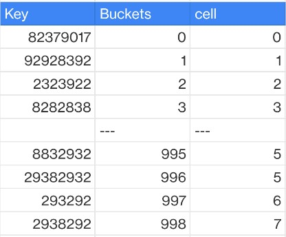

# Consistent hashing

Consistent hashing is a family of algorithms that map keys to buckets (cells) with a
small amount of fairly stable state and a minimal amount of churn when adding or removing
buckets.

The [Ring Consistent Hash (Karger,
et. al.)](http://dl.acm.org/citation.cfm?id=258660 "http://dl.acm.org/citation.cfm?id=258660") is the consistent hashing scheme used in the Chord Distributed Hash
Table, and is probably the best known. It can suffer from significant high peak-to-average
ratios (uneven spread), although this can be offset with the tradeoff of additional state.

More recent algorithms improve upon the peak-to-average ratio and state requirements of
the Ring Consistent Hash:

- [A Fast, Minimal Memory, Consistent Hash
  Algorithm (Lamping and Veach)](https://arxiv.org/abs/1406.2294 "https://arxiv.org/abs/1406.2294")
- [Multi-probe consistent hashing (Appleton
  and O'Reilly)](https://arxiv.org/abs/1505.00062 "https://arxiv.org/abs/1505.00062")
  A general use of consistent hash in cell mapping is a system that is configured with a
  fixed large number (for example, tens of thousands) of logical buckets which are explicitly mapped
  to much smaller number of physical cells. Mapping a key to a cell is a two-step process.
  First, the key is mapped to its logical bucket using naïve module mapping. Then the cell for
  that bucket is located using a bucket to cell mapping table.

_Consistent hashing_

Advantages:

- Changing the number of cells does not requires rebalancing all cells and their
  customers and tenants
- Simple to implement.
  Disadvantages:

- Can suffer from significant high peak-to-average ratios (uneven spread).
