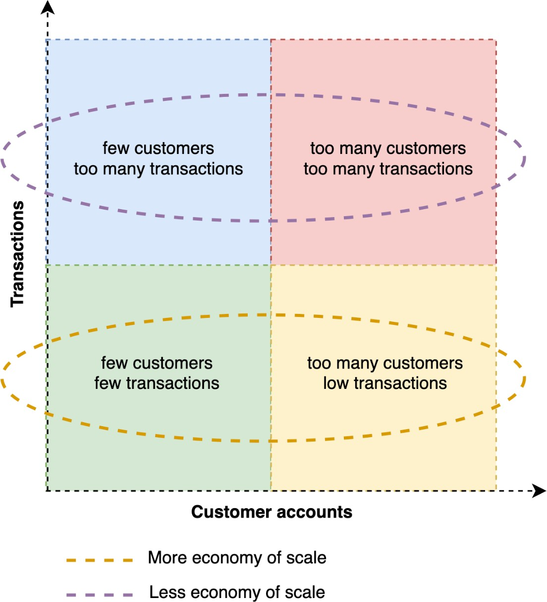

# Define your scaling dimensions

This subject of cell sizing is closely related to your partition key, it is what will
define in which cell the workload traffic will be directed and stored. In cell sizing, we
are focusing on _how much_ of this factor a cell will support before it
needs to scale. Remember that in this case, your architecture does scale-out, it scales by
adding more cells that have the same limit capacity.

It's good to keep in mind the most granular and independent unit in your system. The
most obvious choice might be the `client ID`. But let's say, for example, that
you define that a cell in your workload can handle 10K TPS, and a single client of your
workload starts to grow beyond that number. In this scenario, your system becomes unable to
scale-out, being forced to scale-up (if possible) or simply making the system unable to
serve this large customer.

Defining more than one scale unit dimension will help you handle clients that are much
larger than most, true outliers, having a dedicated cell for them or even more than one.
However, the latter can still cause other problems, such as the need to have a
scather/gather router. _Dedicated cells_ are important for the enterprise
because the architecture opens up a market for dedicated single tenancy. If a customer
really wants it, and is willing to pay for it (and a surprising number are), you can
dedicate a cell totally to them. This could be a lot of additional revenue and also could
make customers happier, and safer.

_Scaling dimensions_

One last factor that cannot be overlooked is cost. When defining the size of your
cells, also calculate how much each cell will cost you. This calculation can help you decide
how multi-tenant your system is, which can increase or decrease the economies of scale and
margin advantage that your business might have.
