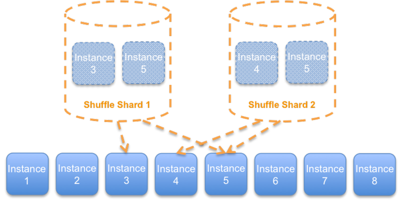

# FAQ

## What about shuffle-sharding?

A question often asked is whether shuffle-sharding is the same as cell-based or how
they are related. Although shuffle-sharding is an excellent fault-isolating mechanism, they
are not the same thing. The basic idea of shuffle-sharding is to generate shards as we might
deal hands from a deck of cards. Take the eight instances example. Previously, we divided it
into four shards of two instances. With shuffle-sharding, the shards contain two random
instances, and the shards, just like our hands of cards, might have some overlap.

_Shuffle-sharding_

In a cell-based architecture, a cell should be self-contained, not share its state. We
can use shuffle-sharding within a cell, but cross-cells should not be used by definition.
Shuffle-sharding can also be a bit trickier for stateful components. To learn more about
shuffle-sharding, here are two great articles:

- [Workload isolation using shuffle-sharding](https://aws.amazon.com/builders-library/workload-isolation-using-shuffle-sharding/ "https://aws.amazon.com/builders-library/workload-isolation-using-shuffle-sharding/")
- [Shuffle Sharding: Massive and Magical Fault Isolation](https://aws.amazon.com/blogs/architecture/shuffle-sharding-massive-and-magical-fault-isolation/ "https://aws.amazon.com/blogs/architecture/shuffle-sharding-massive-and-magical-fault-isolation/")
