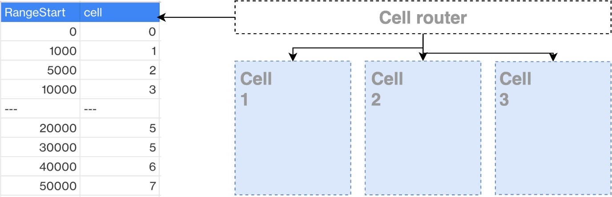
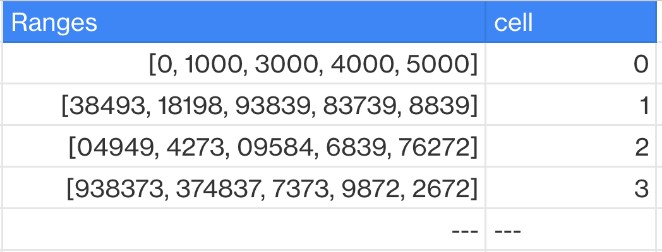

# Prefix and range-based mapping

Prefix and range-based mapping map ranges of keys (or hashes of keys) to cells, and
serves to offset the downsides of the full mapping approach while providing flexibility.

_Prefix and range-based mapping_

Depending on the granularity of your service, you can further reduce the cardinality by
making ranges of groups of keys.

_Ranges as groups of keys_

Advantages:

- Reduces the performance issue of full mapping, by grouping key and reducing the
  total cardinality.
  Disadvantages:

- More likely to have a hot cell, as there is no control over which keys within each
  range might have the most traffic.
