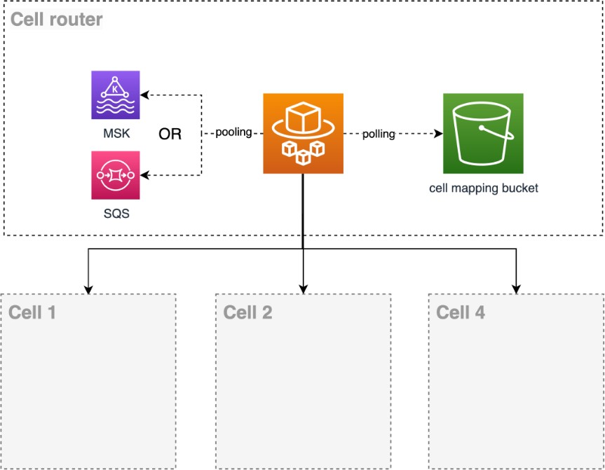

# Routing no-HTTP requests

According to each business, we can have APIs of different types as an input interface
for your workload. The examples so far have been routers based on HTTP requests. But nothing
limits that your cellular router cannot be an event or messaging broker. You can have a
payments API, where you offer your customers an asynchronous API using Amazon SQS queues. Where
you have a queue to request a payment and a queue to process the response to that payment.
In this example, the cell router consumes the payment request topic and delivers it to the
correct cell to carry out the transaction.

_Routing no-HTTP requests_

In this example the entry point is an Events/Messages API which could be an Amazon SQS or an
Amazon MSK. As in the previous example, cell mapping lives in memory in the router. With each
change in the S3 bucket, another process or thread is in listener mode and updates the
memory map when necessary.
