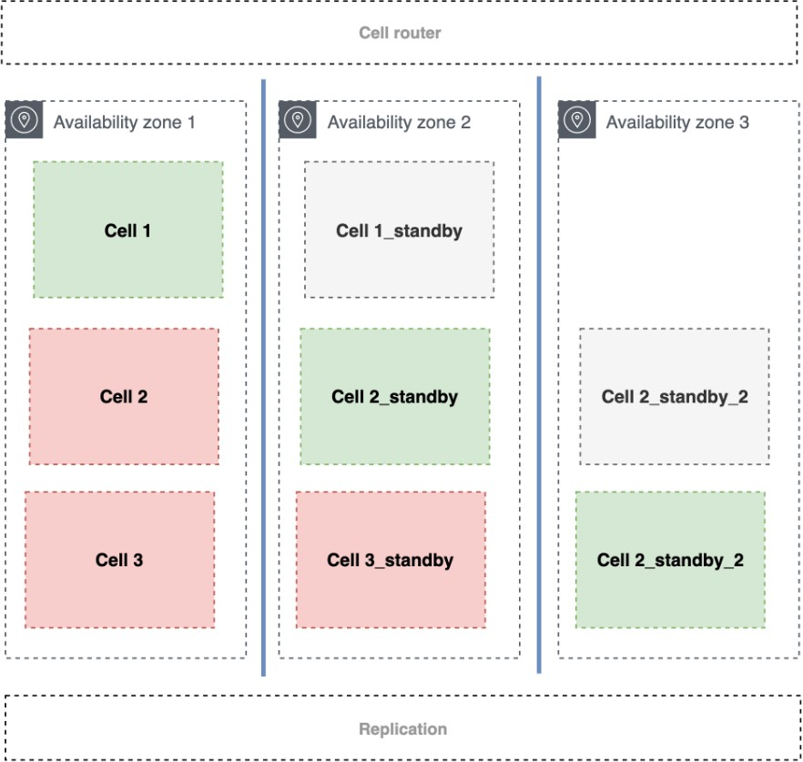

# Should a Single-AZ cell fail over if an AZ becomes unavailable? Or in the event of a gray

failure?

Cells are implemented primarily to limit the scope of a failure's impact. The failures
this mainly helps with are those that cause cascading failures. Mainly, they are excessive
load of resources and deployments with problems or bugs. This means that the cells isolate
failure from deficiencies caused by single or multiple client load or an incorrect
deployment in that cell. Cells were not intended to mitigate dependency failures or single
points of failure. Therefore, they were not designed as failover domains.

Even so, we often get this question and the following scenario. As in the previous
example, what happens if an AZ becomes unavailable? We will have four cells down, with their
respective customers impacted. In the proportion of the example, it would be a third of your
customers having your services unavailable. This will vary according to your defined cell
size.

With this scenario you have a few options:

- Cells are implemented primarily to limit the scope of a failure's impact and not as
  failover domains. Soon the fault will be tolerated according to its isolation scope.
- Use more traditional [Disaster Recovery](../../../whitepapers/latest/disaster-recovery-workloads-on-aws/disaster-recovery-workloads-on-aws.md "../../../whitepapers/latest/disaster-recovery-workloads-on-aws/disaster-recovery-workloads-on-aws.md") mechanisms combined with cells that are Single-AZ.

_Impact of an AZ failure_

In this scenario, each cell that is Single-AZ has one or more replicas of itself in
other Availability Zones. But as the word itself indicates, a replica demands a replication
layer. This replication layer can vary according to the type of stateful component your cell
is using. It could be an Amazon RDS data service, it could be a DynamoDB database, Amazon ElastiCache, an
event service like Kinesis or Amazon SQS. Each service will have a different replication strategy as
well as the DR approach you take as pilot-light, warm-standby or active-active, as described
in the [Disaster Recovery of Workloads on AWS whitepaper](../../../whitepapers/latest/disaster-recovery-workloads-on-aws/disaster-recovery-workloads-on-aws.md "../../../whitepapers/latest/disaster-recovery-workloads-on-aws/disaster-recovery-workloads-on-aws.md").

In the event that a zone becomes unavailable, the same cell replicated in another AZ can
take over the work and continue processing customer traffic. But this can also happen in the
case of gray failures in one or more components, when an evacuation of a cell is more
beneficial than living with the failure until it is detected and corrected.

This second approach is more complex and driven by a much higher cost in terms of
infrastructure. You are responsible for creating the mechanisms that will ensure high
availability for the cell at a higher layer, as well as data replication issues to mitigate
the cases where a zone might fail. If your workload is not offering a service that has the
scope of execution inside an Availability Zone to your customers, the Multi-AZ cell is a
better approach to consider.
