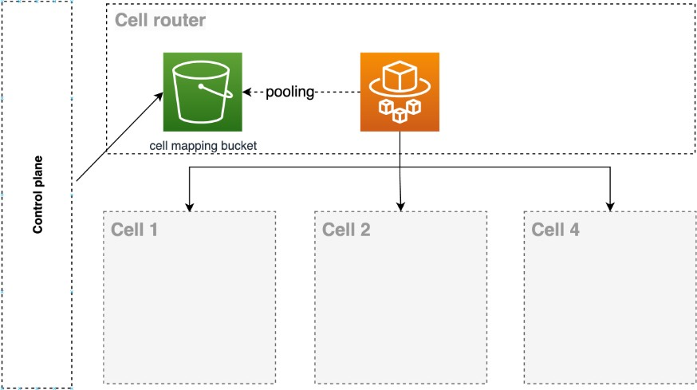

# Using a compute layer like Amazon EC2, Amazon ECS or Amazon EKS and Amazon S3 for cell mapping as cell

router

Another approach to designing your cell router is to have the control plane write the
cell mapping to an S3 bucket and a computer layer, whatever it is, it could be an EC2
instance, an Amazon ECS or Amazon EKS cluster, or AWS Lambda, whichever fits best. It is worth
emphasizing that at this cellular router layer, the only responsibility should be to inspect
the request data and identify which cell the request should be forwarded to.

The complexity of the access pattern, the cardinality of your partition key, the number
of cells, all these factors can influence [what is the best approach to keep your cell router up to date with cell mapping.](https://aws.amazon.com/builders-library/avoiding-overload-in-distributed-systems-by-putting-the-smaller-service-in-control/?did=ba_card&trk=ba_card "https://aws.amazon.com/builders-library/avoiding-overload-in-distributed-systems-by-putting-the-smaller-service-in-control/?did=ba_card&trk=ba_card")
Avoiding overload in distributed systems by putting the smaller service in control is a good
article with some more alternatives on how we do this synchronization between data plane and
control plane in AWS. It can be a basis for the synchronization process of your cell
router.

_Using a compute layer_

In this example, the cell mapping lives in memory on the router. With each change in
the S3 bucket, another process or thread is in listener mode and updates the memory map when
necessary.
