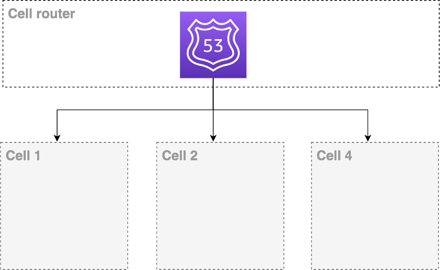

# Using Amazon Route 53

[Amazon Route 53](https://aws.amazon.com/route53/ "https://aws.amazon.com/route53/") is a highly available and scalable
Domain Name System (DNS) web service. You can use Route 53 to perform the functions of cell
router in your architecture, doing DNS routing, and health checking. Route 53 is a service that
offers a SLA of 100% for the data plane and can be used to redirect the traffic to correct cell, or even
failover in case of an impairment at an Availability Zone or Region. Give each tenant a custom DNS record
they use to reach your service, then configure the DNS record to point at a specific cell to
which the tenant has been assigned.

_Using Amazon Route 53_

Amazon Route 53 can also be combined with [Route 53 application recovery](https://aws.amazon.com/route53/application-recovery-controller/ "https://aws.amazon.com/route53/application-recovery-controller/"). The
Application Recovery Controller also helps you manage and coordinate recovery for your
applications across AWS Availability Zones (AZs) or Regions. The features made available
by it can help in case of unavailability of an AZ, Region, or even in case of gray failures,
where an evacuation of the AZ is a better alternative until the problem is found.
