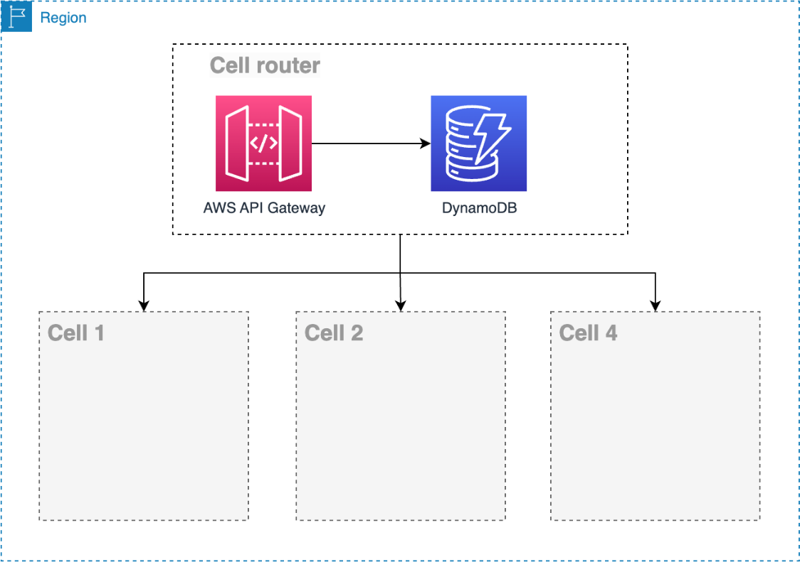

# Using Amazon API Gateway as cell

router

[Amazon API Gateway](../../../apigateway/latest/developerguide/welcome.md "../../../apigateway/latest/developerguide/welcome.md") is an AWS service for creating, publishing, maintaining, monitoring,
and securing REST, HTTP, and WebSocket APIs at any scale. It's a serverless regional service
and has a good fit to be your cell router. It has native integration with many AWS
services, caching support, throttling, rate limit, canary deployments, usage plan
configuration and many other features. [DynamoDB](../../../dynamodb/index.md "../../../dynamodb/index.md") is a fully managed NoSQL database service that provides fast and
predictable performance with seamless scalability com latency single digit in milliseconds
and with an SLA of 99.99% and 99.999% with global tables enabled.

_Using Amazon API Gateway_

DynamoDB also features the [Amazon DynamoDB Accelerator (DAX)](https://aws.amazon.com/dynamodb/dax/?ref=wellarchitected "https://aws.amazon.com/dynamodb/dax/?ref=wellarchitected") is a fully managed, highly available in-memory cache
for Amazon DynamoDB that delivers up to a 10X performance improvement from milliseconds to
microseconds, even at millions of requests per second.

DynamoDB is a powerful serverless and regional NoSQL database, but according to your
workload needs, any database can be used in this model of cell router architecture.
