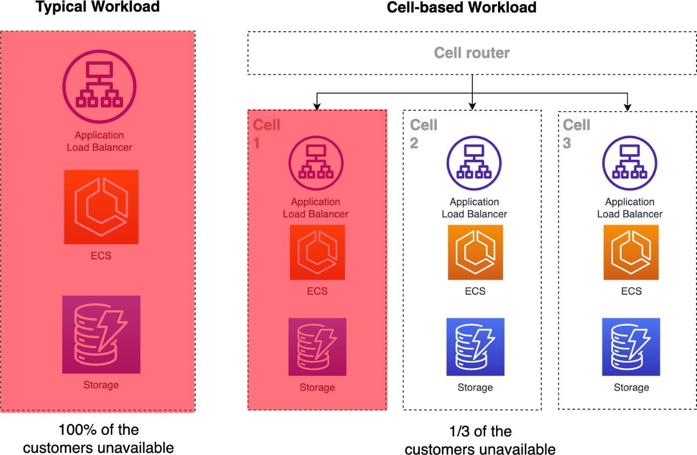
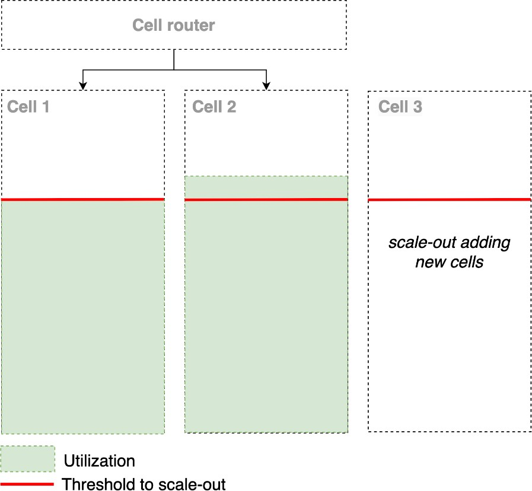

# Why use a cell-based architecture?

These are the main advantages of a cell-based architecture.

## Scale-out over scale-up

Scaling up, or accommodating growth by increasing the size of a system's component
(such as a database, server, or subsystem) is a natural and straightforward way to scale.
Scaling out, on the other hand, accommodates growth by increasing the
_number_ of system components (such as databases, servers, and
subsystems), and dividing the workload such that the load on any component stays bounded over
time despite the overall increase in workload. The task of dividing the workload can make
scaling out more challenging than scaling up, particularly for stateful systems, but has
well-understood benefits:

- **Workload isolation:** Dividing the workload across
  components means workloads are isolated from each other. This provides failure containment
  and narrows the impact of issues, such as deployment failures, poison pills, misbehaving
  clients, data corruption, and operational mistakes.
- **Maximally-sized components:** Accommodating growth by
  increasing the number of components rather than increasing component size means that the
  size of each component can be capped to a maximum size. This reduces the risk of surprises
  from non-linear scaling factors and hidden contention points present in scale-up systems.
- **Not too big to test:** With maximally-sized components, the
  components are no longer too big to test. These components can be stress tested and pushed
  past their breaking point to understand their safe operating margin. This approach does
  not address testing the overall scaled out system composed of these components, but if the
  majority of the complexity and risk of the system sits in stress-tested components (and it
  should), the level of test coverage and confidence should be significantly higher.

Cells change our approach from scaling up to scaling out. Each cell, a complete
independent instance of the service, has a fixed maximum size. Beyond the size of a single
cell, regions grow by adding more cells. This change in design doesn't change the customer
experience of your services. Customers can continue to access the services as they do today.

## Lower scope of impact

Breaking a service up into multiple cells reduces the scope of impact. Cells represent
bulkheaded units that provide containment for many common failure scenarios. When properly
isolated from each other, cells have failure containment similar to what we see with Regions.
It's highly unlikely for a service outage to span multiple Regions. It should be similarly
unlikely for a service outage to span multiple cells.

_Cell-based architectures can reduce scope of impact_

## Higher scalability or cells as a

unit scale

As recommended in [Manage service quotas and constraints](../reliability-pillar/manage-service-quotas-and-constraints.md "../reliability-pillar/manage-service-quotas-and-constraints.md") in the Well-Architected Framework, for your
workloads, defining, testing, and managing the limits and capacity of a cell is also
essential. Knowing and monitoring this capacity, it's possible to define limits, and scale
your workload by adding new cells to your architecture, thus scaling it out.

_Scale-out with multiple cells_

Cell-based architectures scale-out rather than scale-up, and are inherently more
scalable. This is because when scaling up, you can reach the resource limits of a particular
service, instance, or AWS account. However, scaling out your workload within an Availability
Zone, Region, and AWS account, you can avoid reaching the limits of a specific service or
resource. When building cells with a fixed size and known and testable limits, it is possible
to add new cells that are in accordance with the limits of the same cited resources.

## Higher testability

Testing distributed systems is a challenging task and is amplified as the system grows.
The capped size of cells allows for well-understood and testable maximum scale behavior. It is
easier to test cells as compared to bulk services since cells have a limited size. It is
impractical for cost reasons for large-scale services to regularly simulate the entire
workload of all their tenants, but it is reasonable to simulate the largest workload that can
fit into a cell, which should match the largest workload that a single customer can send to
your application.

## Higher mean time between failure

(MTBF)

Not only is the scope of impact of an outage reduced with cells, but so is the
probability of an outage. Cells have a consistent capped size that is regularly tested and
operated, eliminating the _every day is a new adventure_ dynamic.

As in day-to-day operations, your customers are distributed among the cells and a problem
can be identified locally. The same goes for new versions of applications that can only be
applied to a small number of cells (up to just one) and when a failure is identified,
rollback.

With your customers spread across cells, for example, 10, you now have 10% of your
customers in each cell. This, added to a gradual deployment strategy that we will describe
later in this guidance, allows you to better manage system changes, and contain the scope of
failures such as code or traffic spikes in some cells while others remain stable and
unaffected, thus increasing the average time between application failures.

## Lower mean time to recovery (MTTR)

Cells are also easier to recover, because they limit the number of hosts that need to be
analyzed and touched for problem diagnosis and the deployment of emergency code and
configuration. The predictability of size and scale that cells bring also make recovery more
predictable in the event of a failure.

## Higher availability

A natural conclusion is that cell-based architectures should have the same overall
availability as monolithic systems, because a system with `n` cells will have
`n` times as many failure events, but each with
`1/nth` of the impact. But the higher MTBF and lower
MTTR afforded by cells means fewer shorter failures events per cell, and higher overall
availability.

There is also the availability defined by:

`#successful requests / #total requests`

With cells, you can minimize the amount of time the numerator is zero.

## More control over

the impact of deployments and rollbacks

Like [one-box and Single-AZ
deployments](https://aws.amazon.com/builders-library/cicd-pipeline/ "https://aws.amazon.com/builders-library/cicd-pipeline/"), cells provide another dimension in which to phase deployments and
reduce scope of impact from problematic deployments. Further, the first cell deployed to in a
phased cell deployment can be a canary cell, and each cell can have its own canary with
synthetic and other non-critical workloads to further reduce the impact of a failed
deployment.

Applications that do not use cell-based architecture can also benefit from strategies
such as canary deployment. But what the cells bring is the possibility of a combination of a
canary deployment strategy being applied in a context of even lesser impact.
